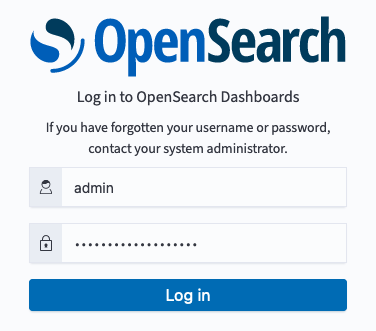
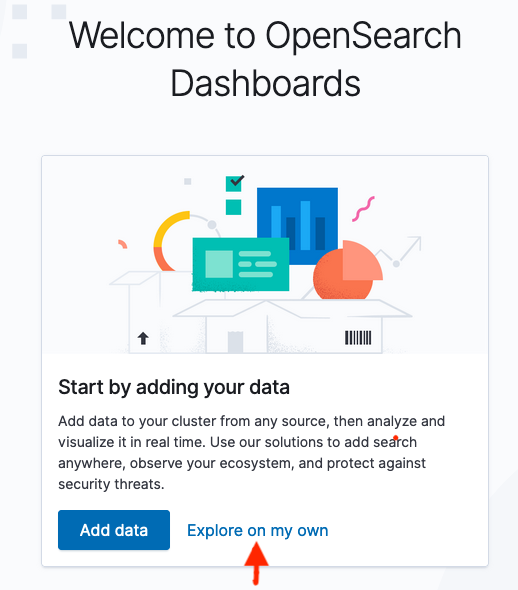
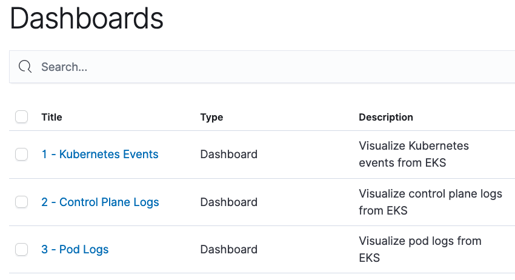

First, we will setup OpenSearch for the upcoming section using these steps: 
1. Retrieve credentials for OpenSearch from the AWS Systems Manager Parameter Store
1. Load an OpenSearch dashboard for Kubernetes events
1. Confirm access to the OpenSearch dashboard

**Step 1:** Credentials for the OpenSearch domain have been saved in the AWS Systems Manager Parameter Store. Retrieve this information and set up the necessary environment variables.

```bash
$ export OPENSEARCH_HOST=$(aws ssm get-parameter \
      --name /eksworkshop/$EKS_CLUSTER_NAME/opensearch/host \
      --region $AWS_REGION | jq .Parameter.Value | tr -d '"')
  
$ export OPENSEARCH_USER=$(aws ssm get-parameter \
      --name /eksworkshop/$EKS_CLUSTER_NAME/opensearch/user  \
      --region $AWS_REGION --with-decryption | jq .Parameter.Value | tr -d '"')
 
$ export OPENSEARCH_PASSWORD=$(aws ssm get-parameter \
      --name /eksworkshop/$EKS_CLUSTER_NAME/opensearch/password \
      --region $AWS_REGION --with-decryption | jq .Parameter.Value | tr -d '"')

```

**Step 2:** Load a pre-created OpenSearch Dashboard to display Kubernetes events. The dashboard is available in [kubernetes-events-dashboard.ndjson](https://github.com/VAR::MANIFESTS_OWNER/VAR::MANIFESTS_REPOSITORY/tree/VAR::MANIFESTS_REF/manifests/modules/observability/opensearch/dashboard)

```bash
$ curl https://$OPENSEARCH_HOST/_dashboards/auth/login \
      -H 'content-type: application/json' -H 'osd-xsrf: osd-fetch' \
      --data-raw '{"username":"'"$OPENSEARCH_USER"'","password":"'"$OPENSEARCH_PASSWORD"'"}' \
      -c dashboards_cookie 
{"username":"admin","tenants":{"global_tenant":true,"admin":true},"roles":["security_manager","all_access"],"backendroles":[]}
 
$ curl -X POST https://$OPENSEARCH_HOST/_dashboards/api/saved_objects/_import?overwrite=true \
        --form file=@~/environment/eks-workshop/modules/observability/opensearch/dashboard/kubernetes-events-dashboard.ndjson  \
        -H "osd-xsrf: true" -b dashboards_cookie | jq .
{
  "successCount": 7,
  "success": true,
  "successResults": [
    {
      "type": "index-pattern",
      "id": "79cc3180-6c51-11ee-bdf2-9d2ccb0785e7",
      "meta": {
        "title": "eks-kubernetes-events*",
        "icon": "indexPatternApp"
      }
    },
    ...
  ]
}
```

**Step 3:** Confirm that the OpenSearch dashboard is accessible

View the OpenSearch server coordinates and credentials that we retrieved earlier.

```bash
$ printf "\nOpenSearch dashboard: https://$OPENSEARCH_HOST/_dashboards \
      \nUsername: $OPENSEARCH_USER \
      \nPassword: $OPENSEARCH_PASSWORD\n\n"
 
OpenSearch dashboard: <OpenSearch Dashboard URL>       
Username: <user name>       
Password: <password>
```

Point your browser to the OpenSearch dashboard URL above and use the credentials to login.  



There is no data in the cluster yet. Click on 'Explore on my own' 



Tenants in OpenSearch can be used to safely share resources such as index patterns, visualizations and dashboards. For this lab we will use the Global tenant that is shared across all users.   


Navigate to the hamburger menu and click on dashboard. You should see the dashboard we loaded in Step 2.  The dashboard is empty since we are yet to configure the events exporter to feed OpenSearch.

