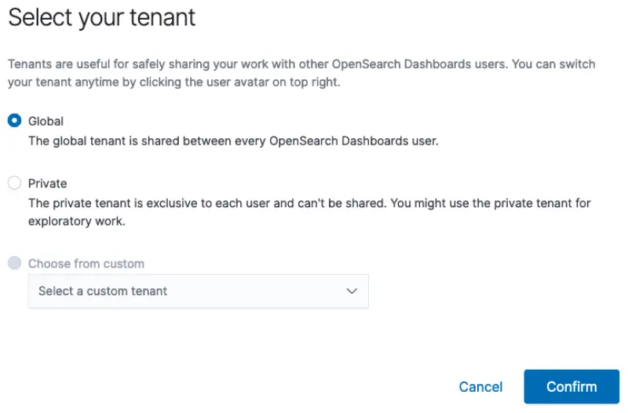

In this section we will retrieve credentials for OpenSearch from the AWS Systems Manager Parameter Store, load pre-created OpenSearch dashboards for Kubernetes events and pod logs and confirm access to OpenSearch.

Credentials for the OpenSearch domain have been saved in the AWS Systems Manager Parameter Store during the provisioning process. Retrieve this information and set up the necessary environment variables.

```bash
$ export OPENSEARCH_HOST=$(aws ssm get-parameter \
      --name /eksworkshop/$EKS_CLUSTER_NAME/opensearch/host \
      --region $AWS_REGION | jq -r .Parameter.Value)
$ export OPENSEARCH_USER=$(aws ssm get-parameter \
      --name /eksworkshop/$EKS_CLUSTER_NAME/opensearch/user  \
      --region $AWS_REGION --with-decryption | jq -r .Parameter.Value)
$ export OPENSEARCH_PASSWORD=$(aws ssm get-parameter \
      --name /eksworkshop/$EKS_CLUSTER_NAME/opensearch/password \
      --region $AWS_REGION --with-decryption | jq -r .Parameter.Value)
$ export OPENSEARCH_DASHBOARD_FILE=~/environment/eks-workshop/modules/observability/opensearch/opensearch-dashboards.ndjson
```

Load pre-created OpenSearch dashboards to display Kubernetes events and pods logs. The dashboards are available in [the file](https://github.com/VAR::MANIFESTS_OWNER/VAR::MANIFESTS_REPOSITORY/tree/VAR::MANIFESTS_REF/manifests/modules/observability/opensearch/opensearch-dashboards.ndjson) which includes the OpenSearch index patterns, visualizations and dashboards for Kubernetes events and pod logs.

```bash
$ curl -s https://$OPENSEARCH_HOST/_dashboards/auth/login \
      -H 'content-type: application/json' -H 'osd-xsrf: osd-fetch' \
      --data-raw '{"username":"'"$OPENSEARCH_USER"'","password":"'"$OPENSEARCH_PASSWORD"'"}' \
      -c dashboards_cookie | jq .
{
  "username": "admin",
  "tenants": {
    "global_tenant": true,
    "admin": true
  },
  "roles": [
    "security_manager",
    "all_access"
  ],
  "backendroles": []
}

$ curl -s -X POST https://$OPENSEARCH_HOST/_dashboards/api/saved_objects/_import?overwrite=true \
        --form file=@$OPENSEARCH_DASHBOARD_FILE \
        -H "osd-xsrf: true" -b dashboards_cookie | jq .
{
  "successCount": 7,
  "success": true,
  "successResults": [
    {
      "type": "index-pattern",
      "id": "79cc3180-6c51-11ee-bdf2-9d2ccb0785e7",
      "meta": {
        "title": "eks-kubernetes-events*",
        "icon": "indexPatternApp"
      }
    },
    ...
  ]
}
```

View the OpenSearch server coordinates and credentials that we retrieved earlier and confirm that the OpenSearch dashboards are accessible.

```bash
$ printf "\nOpenSearch dashboard: https://%s/_dashboards/app/dashboards \nUserName: %q \nPassword: %q \n\n" \
      "$OPENSEARCH_HOST" "$OPENSEARCH_USER" "$OPENSEARCH_PASSWORD"

OpenSearch dashboard: <OpenSearch Dashboard URL>
Username: <user name>
Password: <password>
```

Point your browser to the OpenSearch dashboard URL above and use the credentials to login.


Select the Global tenant as shown below. Tenants in OpenSearch can be used to safely share resources such as index patterns, visualizations and dashboards.



You should see the two dashboards (for Kubernetes events and pod logs) that were loaded in the earlier step. The dashboards are currently empty since there is no data in OpenSearch yet. Keep this browser tab open or save the dashboard URLs. We will return to the dashboards in the next sections.


