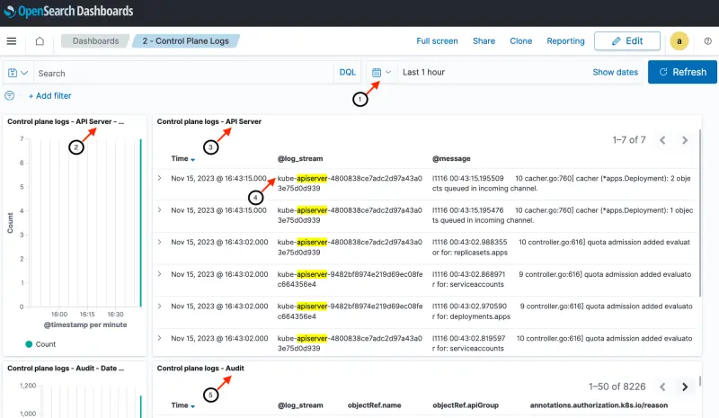
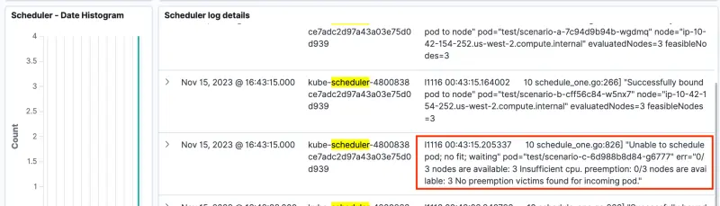
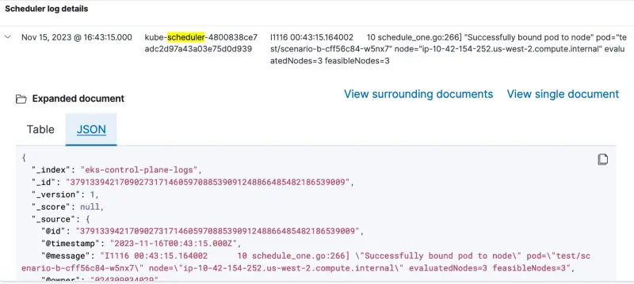

As seen in the earlier section on [Logging in EKS](https://www.eksworkshop.com/docs/observability/logging/cluster-logging/), Amazon EKS control plane logging provides audit and diagnostic logs directly from the Amazon EKS control plane to CloudWatch Logs in your account. We build upon that earlier setup by forwarding these control plane logs from CloudWatch Logs to OpenSearch. A Lambda function to export CloudWatch Logs was setup as part of the `prepare-environment` step for this module. In this section, we will enable all EKS control plane logging, add a CloudWatch Logs subscription filter that will trigger the Lambda function and explore the OpenSearch control plane logs dashboard.

The next two paragraphs provide an overview of control plane logging in EKS. Feel free to skip this overview if you already followed the earlier section on Logging in EKS.

There are five types of control plane logs available. Each log type, which can be individually enabled or disabled, corresponds to a component of the Kubernetes control plane. To learn more about these components, see Kubernetes Components in the [Kubernetes documentation](https://kubernetes.io/docs/concepts/overview/components/) and the [Amazon EKS control plane logging documentation](https://docs.aws.amazon.com/eks/latest/userguide/control-plane-logs.html).

- **Kubernetes API server component logs (api)** – Your cluster's API server is the control plane component that exposes the Kubernetes API
- **Audit (audit)** – Kubernetes audit logs provide a record of the individual users, administrators, or system components that have affected your cluster
- **Authenticator (authenticator)** – Authenticator logs are unique to Amazon EKS. These logs represent the control plane component that Amazon EKS uses for Kubernetes [Role Based Access Control](https://kubernetes.io/docs/reference/access-authn-authz/rbac/) (RBAC) authentication using IAM credentials
- **Controller manager (controllerManager)** – The controller manager manages the core control loops that are shipped with Kubernetes
- **Scheduler (scheduler)** – The scheduler component manages when and where to run pods in your cluster

The following diagram provides an overview of the setup for this section. From left to right, the flow is as follows:

1. Control plane logs are enabled in Amazon EKS, which sends logs to CloudWatch Logs
2. A CloudWatch Logs subscription filter triggers a Lambda function and sends it the log messages
3. The Lambda function writes the control plane logs to an OpenSearch index
4. A single OpenSearch index named `eks-control-plane-logs` stores all the control plane logs. Later in the lab we will see how we can filter the different log types within the OpenSearch dashboard


EKS control plane logs are enabled on a per-cluster basis through the EKS API. This will often be configured using Terraform or CloudFormation, but in this lab we'll use the AWS CLI to enable the functionality. As you can see we can enable each of the cluster log types individually, and in this lab we're enabling everything.

```bash hook=cluster-logging
$ aws eks update-cluster-config \
    --region $AWS_REGION \
    --name $EKS_CLUSTER_NAME \
    --logging '{"clusterLogging":[{"types":["api","audit","authenticator","controllerManager","scheduler"],"enabled":true}]}'
{
    "update": {
        "id": "6d73515c-f5e7-4288-9e55-480e9c6dd084",
        "status": "InProgress",
        "type": "LoggingUpdate",
        "params": [
            {
                "type": "ClusterLogging",
                "value": "{\"clusterLogging\":[{\"types\":[\"api\",\"audit\",\"authenticator\",\"controllerManager\",\"scheduler\"],\"enabled\":true}]}"
            }
        ],
        "createdAt": "2023-05-25T19:33:16.622000+00:00",
        "errors": []
    }
}
$ sleep 30
$ aws eks wait cluster-active --name $EKS_CLUSTER_NAME
```

We can optionally inspect the EKS control plane logging setting using the AWS console:

<ConsoleButton url="https://console.aws.amazon.com/eks/home#/clusters/eks-workshop?selectedTab=cluster-logging-tab" service="eks" label="Open EKS console"/>

The **Logging** tab shows the current configuration for control plane logs for the EKS cluster within the AWS console:

Access the CloudWatch log group named `/aws/eks/eks-workshop/cluster`

<ConsoleButton url="https://console.aws.amazon.com/cloudwatch/home#logsV2:log-groups/log-group/$252Faws$252Feks$252Feks-workshop$252Fcluster" service="cloudwatch" label="Open CloudWatch console"/>

You will find at least one log stream associated with each of the control plane log types:

- `kube-apiserver-*` for Kubernetes API server logs
- `*-audit-*` for audit logs
- `authenticator-*` for authenticator logs
- `kube-controller-manager-*` for controller manager logs
- `kube-scheduler-*` for scheduler logs

Navigate to the Lambda function named [eks-workshop-control-plane-logs](https://console.aws.amazon.com/lambda/home#/functions/eks-workshop-control-plane-logs) to export control plane logs has been pre-provisioned during the `prepare-environment` step. Notice that the Lambda function does not have any triggers setup at the moment.

There are two steps to connect up the Lambda function to CloudWatch Logs and to OpenSearch as shown in the overview diagram above:

1. Setup an OpenSearch role that allows the Lambda function to write to the OpenSearch index named `eks-control-plane-logs`
2. Configure a subscription filter for the CloudWatch log group with the Lambda function as its destination

The Lambda function ARN and its IAM role ARN are already available as environment variables:

```bash
$ echo $LAMBDA_ARN
$ echo $LAMBDA_ROLE_ARN
```

Grant the Lambda exporter function permissions to create the OpenSearch index named `eks-control-plane-logs` and write to it. The first command creates a new role within the OpenSearch domain with the necessary permissions. The second command adds a role mapping specifying the Lambda function's execution role ARN.

```bash
$ curl -s -XPUT "https://${OPENSEARCH_HOST}/_plugins/_security/api/roles/lambda_role" \
    -u $OPENSEARCH_USER:$OPENSEARCH_PASSWORD -H 'Content-Type: application/json' \
    --data-raw '{"cluster_permissions": ["*"], "index_permissions": [{"index_patterns": ["eks-control-plane-logs*"], "allowed_actions": ["*"]}]}' \
    | jq .
{
  "status": "CREATED",
  "message": "'lambda_role' created."
}

$ curl -s -XPUT "https://${OPENSEARCH_HOST}/_plugins/_security/api/rolesmapping/lambda_role" \
    -u $OPENSEARCH_USER:$OPENSEARCH_PASSWORD -H 'Content-Type: application/json' \
    --data-raw '{"backend_roles": ["'"$LAMBDA_ROLE_ARN"'"]}' | jq .
{
  "status": "CREATED",
  "message": "'lambda_role' created."
}
```

Setup a subscription filter for the CloudWatch log group that specifies the Lambda function as its destination. Notice that the command specifies the `/aws/eks/eks-workshop/cluster` log group name and the Lambda function ARN. The first command creates the filter and the second command retrieves the filter details.

```bash
$ aws logs put-subscription-filter \
    --log-group-name /aws/eks/$EKS_CLUSTER_NAME/cluster \
    --filter-name "${EKS_CLUSTER_NAME}-Control-Plane-Logs-To-OpenSearch" \
    --filter-pattern "" \
    --destination-arn $LAMBDA_ARN

$ aws logs describe-subscription-filters \
    --log-group-name /aws/eks/$EKS_CLUSTER_NAME/cluster | jq .
{
  "subscriptionFilters": [
    {
      "filterName": "${EKS_CLUSTER_NAME} EKS Control Plane Logs to OpenSearch",
      "logGroupName": "/aws/eks/eks-workshop/cluster",
      "filterPattern": "",
      "destinationArn": "arn:aws:lambda:us-west-2:1234567890:function:control-plane-logs",
      "distribution": "ByLogStream",
      "creationTime": 1699659802922
    }
  ]
}
```

Return to the Lambda function [eks-workshop-control-plane-logs](https://console.aws.amazon.com/lambda/home#/functions/eks-workshop-control-plane-logs). CloudWatch Logs is now shown as a trigger for the Lambda function after the subscription filter was added.

This completes the steps necessary to feed control plane logs from EKS to OpenSearch.

Access the control plane logs dashboard from the dashboard landing page we saw earlier or use the command below to obtain its coordinates:

```bash
$ printf "\nPod logs dashboard: https://%s/_dashboards/app/dashboards#/view/1a1c3a70-831a-11ee-8baf-a5d5c77ada98 \
        \nUserName: %q \nPassword: %q \n\n" \
        "$OPENSEARCH_HOST" "$OPENSEARCH_USER" "$OPENSEARCH_PASSWORD"

Pod logs dashboard: <OpenSearch Dashboard URL>
Username: <user name>
Password: <password>
```

The dashboard provides a histogram and detailed messages for each of the five control plane logs types (in alphabetical order) - Kubernetes API server component logs, Audit logs, Authenticator logs, Controller Manager logs and Scheduler logs.

1. Date / time range. We can customize the time range that we are exploring with this dashboard (Last hour in this example)
2. Message count per minute for API Server logs
3. Log messages for API Server
4. The log stream field in the dashboard is identical to the CloudWatch log stream name we saw earlier within the AWS console. The log stream field is used to filter the index for each of the five control plane log types. In this case, the filter displays just the API Server logs
5. Message count per minute and log message shown for each of the remaining four log types

:::tip

Depending on the level of the EKS cluster activity, some of the control plane log panels may display `No result found` if there is no log activity of that type within the selected time range. If you encounter this situation, feel free to continue with the instructions and return to the Control Plane Logs dashboard before leaving the `Observability with OpenSearch` section.

:::



The scheduler logs are shown at the end of the page. Notice that the scheduler log messages indicates `Unable to schedule pod; no fit; waiting` for `scenario-c`. This schedule log message from the control plane logs is similar to the Kubernetes event we saw for `scenario-c` on the previous page.



Expanding the row allows us to drill down and view details as a table or in JSON format.


