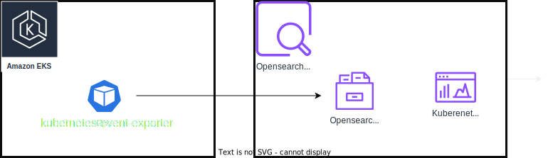
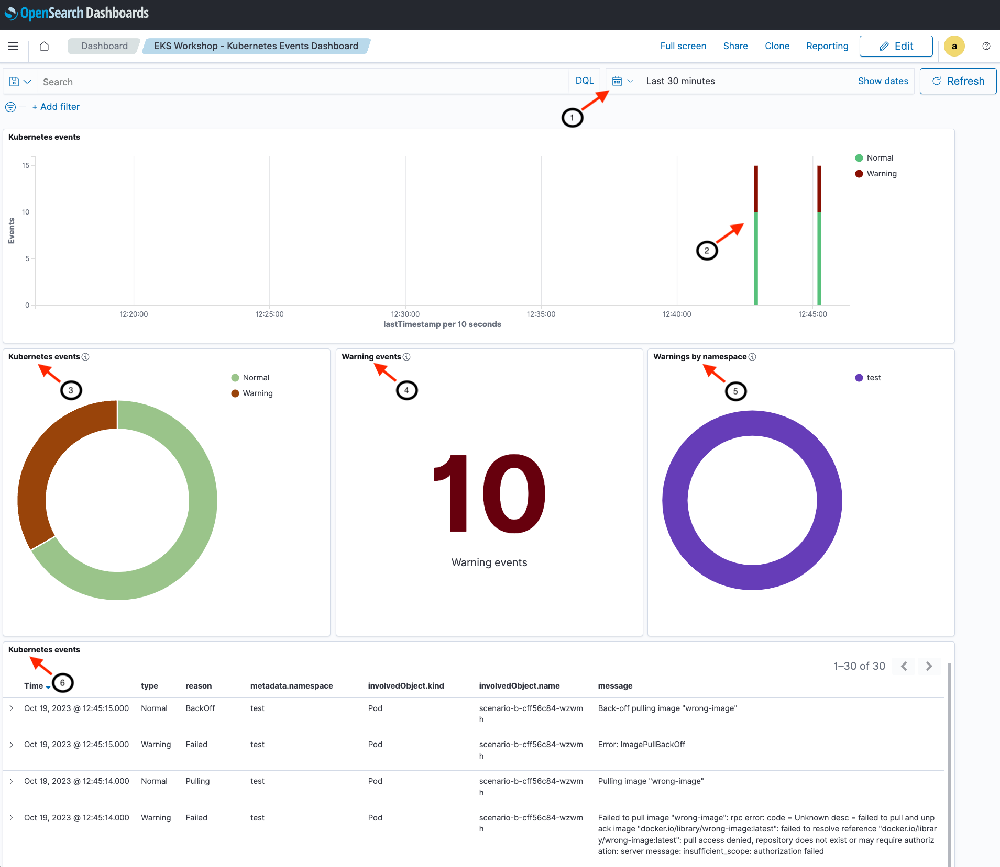
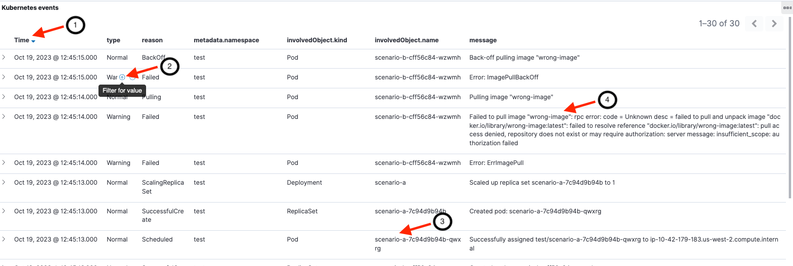
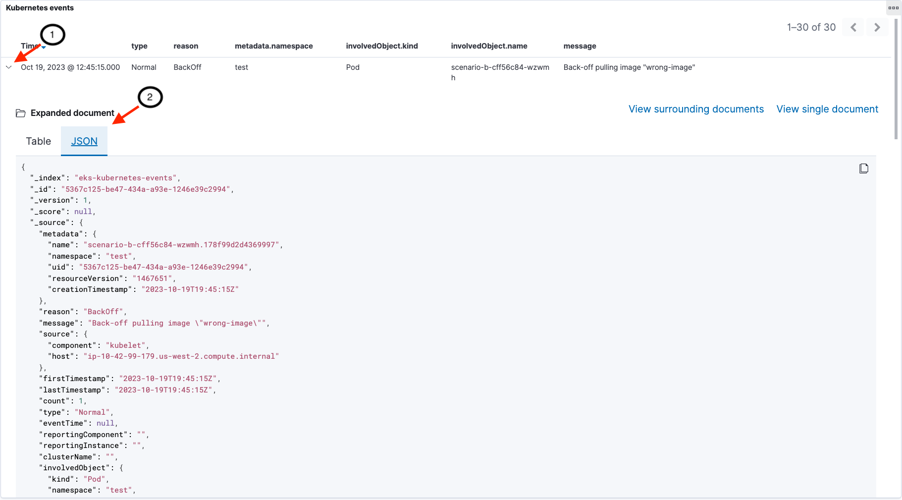
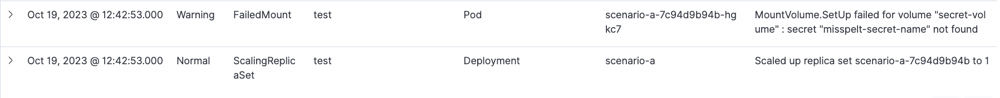
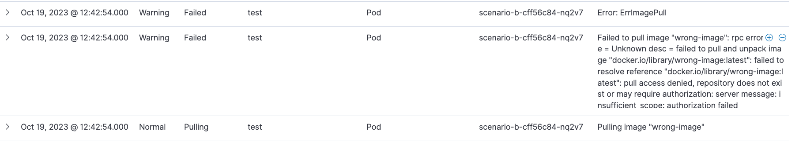
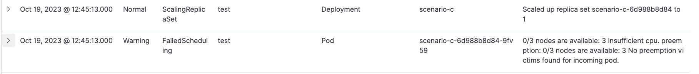

## Objective
This section demonstrates how we can export Kubernetes events to OpenSearch and use OpenSearch to improve observability of what is occurring within the EKS cluster. 

Here is a summary of steps we will follow:
1. Deploy Kubernetes events exporter to forward events to OpenSearch 
1. Generate Kubernetes events by spinning up test workloads
1. Explore the OpenSearch Kubernetes events dashboard
1. Identify issues using the OpenSearch dashboard 
1. Fix the issues and revisit OpenSearch dashboard to see changes
1. [Optional] Explore events within the Kuberntes cluster
---
## Introduction 

**Kubernetes Events** provide a rich source of information that can be used to monitor applications and cluster state, respond to failures and perform diagnostics. Events generally denote some state change. Examples include pod creation, adding replicas, scheduling resources. Each event includes a ```type``` field which is set to Normal or Warning to indicate success of failure. 

You may be familiar with Kubernetes events if you have ever run ``kubectl describe`` on a resource. As shown below, the last section of output from ```kubectl describe``` displays the Kubernetes events related to the resource in question.
```
...
Events:
  Type    Reason     Age   From               Message
  ----    ------     ----  ----               -------
  Normal  Scheduled  5s    default-scheduler  Successfully assigned default/nginx to ip-10-42-179-183.us-west-2.compute.internal
  Normal  Pulling    4s    kubelet            Pulling image "nginx"
  Normal  Pulled     4s    kubelet            Successfully pulled image "nginx" in 627.545722ms (627.553403ms including waiting)
  Normal  Created    4s    kubelet            Created container nginx
  Normal  Started    3s    kubelet            Started container nginx

```

Events are retained for a limited period within the cluster. OpenSearch provides a durable store that simplifies collection, analysis and visualization of the events.

The following diagram provides an overview of the setup for this section. ```kubernetes-events-exporter``` will be deployed within the EKS cluster to forward events to the OpenSearch domain. An OpenSearch Dashboard that we loaded earlier is used to visualize the events as they occur.



---
## Lab 
**Step 1:** Deploy Kubernetes events exporter and configure it to send events to our OpenSearch domain. The base configuration is available [here](https://github.com/VAR::MANIFESTS_OWNER/VAR::MANIFESTS_REPOSITORY/tree/VAR::MANIFESTS_REF/manifests/modules/observability/opensearch/events-exporter). The OpenSearch credentials we retrieved earlier are being used to configure the exporter. The second command verifies that the Kubernetes events pod is running.     

```bash timeout=120 wait=30 
$ helm install events-to-opensearch \
    oci://registry-1.docker.io/bitnamicharts/kubernetes-event-exporter \
    --namespace opensearch-exporter --create-namespace \
    -f ~/environment/eks-workshop/modules/observability/opensearch/kube-events/values.yaml \
    --set="config.receivers[0].opensearch.username"="$OPENSEARCH_USER" \
    --set="config.receivers[0].opensearch.password"="$OPENSEARCH_PASSWORD" \
    --set="config.receivers[0].opensearch.hosts[0]"="https://$OPENSEARCH_HOST" \
    --wait
 
$ kubectl get pods -n opensearch-exporter
NAME                                                              READY   STATUS    RESTARTS      AGE
events-to-opensearch-kubernetes-event-exporter-67fc698978-2f9wc   1/1     Running   0             10s
```
:::tip 
The Kubernetes events exporter we launched in the previous step sends events from the last hour and any new ones to OpenSearch. While Kubernetes events are continuously generated, they are retained within the cluster for only an hour. This is consistent with the Kubernetes upstream default event time-to-live (TTL) of 60 minutes. For this reason the list of events you see in the following steps will vary depending on the level of cluster activity that took place in the last hour.
:::
---
**Step 2**: Generate new Kubernetes events by spinning up test workloads

We will launch three deployments labelled ```scenario-a, scenario-b and scenario-c``` within the ```test``` namespace to demonstrate Normal and Warning events. Each deployment intentionally includes different errors.

```bash
$ kubectl apply -k ~/environment/eks-workshop/modules/observability/opensearch/scenarios/base
namespace/test created
secret/some-secret created
deployment.apps/scenario-a created
deployment.apps/scenario-b created
deployment.apps/scenario-c created
```
---
**Step 3:** Explore the OpenSearch Kubernetes events dashboard

Point your browser to the OpenSearch dashboard URL that we used in the previous page. Your live dashboard should look similar to the image below, but the numbers and messages will vary depending on cluster activity. 
1. [Header] You can customize the time range that you are exploring with this dashboard (Last 30 minutes in this example)
1. [Top section] Date histogram of events (split between Normal and Warning events)
1. [Middle section] Kubernetes events shows the total number of events (Normal and Warning)
1. [Middle section] Warning events seen during the selected time interval. 
1. [Middle section] Warnings broken out by namespace. All the warnings are in the ```test``` namespace in this example
1. [Bottom section] Detailed events and messages with most recent event first by default



The next image focuses on the bottom section with detailed messages. In this section of the dashboard we see event details including:
1. Last timestamp for the event
1. Event type (normal or warning).  Notice that hovering your mouse over a field enables you to filter by that value (e.g. filter for Warning events)
1. Name of Kubernetes resource (along with the object type and namespace) 
1. Human readable message



You can drill down into the full event details as shown in the following image: 
1. Clicking on the '>' next to each event opens up a new section
1. The full event document can be viewed as a table or in JSON format

An explanation of data fields within Kubernetes events can be found on [kubernetes.io](https://kubernetes.io/docs/reference/kubernetes-api/cluster-resources/event-v1) or by running ```kubectl explain events```. 



---
**Step 4:** Identify issues with earlier deployment using the OpenSearch dashboard 

Use the Kubernetes events dashboard to identify why the three deployments (```scenario-a, scenario-b and scenario-c```) are  experiencing issues. Recall that all the pods we deployed earlier are in the ```test``` namespace. 

|            | Reason for failure  |
| ---------- | ------------------- |
| scenario-a |  |
| scenario-b |  |
| scenario-c |  |

Compare your findings to the answers provided at the end of this page.

---
**Step 5:** Fix the issues and revisit OpenSearch dashboard to see changes

Fix the issues we had with the three deployments.  

```bash
$ kubectl apply -k ~/environment/eks-workshop/modules/observability/opensearch/scenarios/fix
namespace/test unchanged
secret/some-secret unchanged
deployment.apps/scenario-a configured
deployment.apps/scenario-b configured
deployment.apps/scenario-c configured
```

Go back to the OpenSearch dashboard and notice that the earlier issues have been resolved. The updated deployment launches new pods that are successful and the pods created earlier (with errors) are deleted.   

:::tip
As issues are fixed, a new set of Normal Kubernetes events are generated. The earlier events (Normal or Warning) remain as part of the history. Therefore, the number of Normal and Warning events only *increases*.   
:::

---
**[Optional] Step 6:** Explore events within the Kubernetes cluster

```bash 
$ kubectl get events --sort-by='.lastTimestamp' -A
NAMESPACE   LAST SEEN   TYPE      REASON              OBJECT                             MESSAGE
...
test        21m         Normal    Pulling             pod/scenario-a-85cfddd4bf-xlpkh    Pulling image "nginx"
test        21m         Normal    Created             pod/scenario-c-596bd55d6-rl9x9     Created container scenario-c
...
```

See events with a warning or failed status
```bash
$ kubectl get events --sort-by='.lastTimestamp' --field-selector type!=Normal -A 
NAMESPACE   LAST SEEN   TYPE      REASON             OBJECT                            MESSAGE
...
test        31m         Warning   FailedMount        pod/scenario-a-7c94d9b94b-qwxrg   Unable to attach or mount volumes: unmounted volumes=[secret-volume], unattached volumes=[secret-volume kube-api-access-tfwdj]: timed out waiting for the condition
test        22m         Warning   FailedScheduling   pod/scenario-c-6d988b8d84-9fv59   0/3 nodes are available: 3 Insufficient cpu. preemption: 0/3 nodes are available: 3 No preemption victims found for incoming pod.
...
```

See the most recent event as json in all namespaces 
```bash
$ kubectl get events --sort-by='.lastTimestamp' -o json -A | jq '.items[-1]'
{
  "apiVersion": "v1",
  "count": 1,
  "eventTime": null,
  "firstTimestamp": "2023-10-19T21:49:44Z",
  "involvedObject": {
    "apiVersion": "apps/v1",
    "kind": "Deployment",
    "name": "scenario-c",
    "namespace": "test",
    "resourceVersion": "1485908",
    "uid": "7b12f29b-2c83-4b3b-8aa3-a4c8b22d8a38"
  },
  "kind": "Event",
  "lastTimestamp": "2023-10-19T21:49:44Z",
  "message": "Scaled down replica set scenario-c-6d988b8d84 to 0 from 1",
  "metadata": {
    "creationTimestamp": "2023-10-19T21:49:44Z",
    "name": "scenario-c.178fa09ddad7c5e3",
    "namespace": "test",
    "resourceVersion": "1485955",
    "uid": "e56aa6b2-9808-45a8-8863-ec9112f23822"
  },
  "reason": "ScalingReplicaSet",
  "reportingComponent": "deployment-controller",
  "reportingInstance": "",
  "source": {
    "component": "deployment-controller"
  },
  "type": "Normal"
}
```

---
## Answers for Step 3

**scenario-a:** From the dashboard we can see that ```scenario-a``` has a reason of 'FailedMount' and the message 'MountVolume.SetUp failed for volume "secret-volume" : secret "misspelt-secret-name" not found'.  The pod is attempting to mount a secret that does not exist.    



**scenario-b:** The dashboard shows that the ```scenario-b``` pod has failed with a message 'Failed to pull image "wrong-image": rpc error: code = Unknown desc = failed to pull and unpack image "docker.io/library/wrong-image:latest": failed to resolve reference "docker.io/library/wrong-image:latest": pull access denied, repository does not exist or may require authorization: server message: insufficient_scope: authorization failed.' The pod is not getting created because it references a non-existent image. 

 

**scenario-c:** The dashboard shows a reason of 'FailedScheduling' and the message '0/3 nodes are available: 3 Insufficient cpu. preemption: 0/3 nodes are available: 3 No preemption victims found for incoming pod.' This deployment is requesting CPU that exceeds what any of the current cluster nodes can provide. (We do not have any of the cluster autoscaling capabilities enabled within this module of EKS workshop.)

 