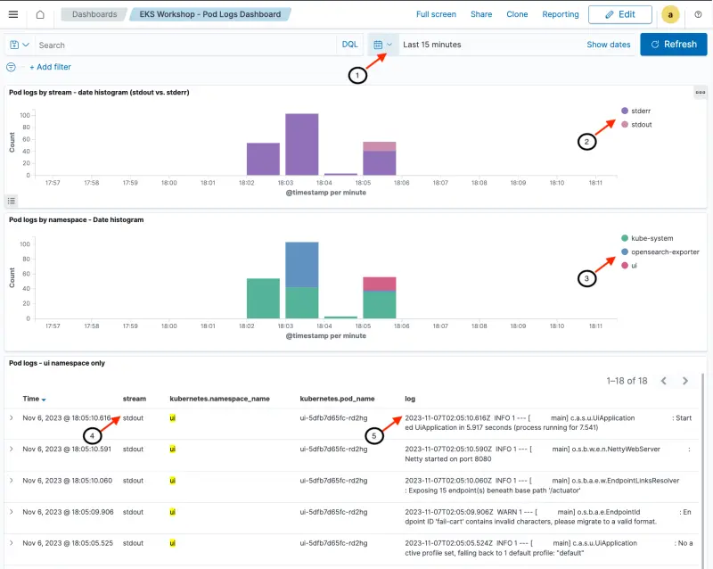

This section demonstrates how we can export pod logs to OpenSearch. We'll deploy [AWS for Fluent Bit](https://github.com/aws/aws-for-fluent-bit) to export pod logs to OpenSearch, generate log entries and explore the OpenSearch pod logs dashboard.

The next four paragraphs provide an overview of pod logging in Kubernetes and the use of Fluent Bit. Feel free to skip this overview if you already followed the earlier section on [Pod Logging in EKS](https://www.eksworkshop.com/docs/observability/logging/pod-logging/).

According to the [Twelve-Factor App manifesto](https://12factor.net/), which provides the gold standard for architecting modern applications, containerized applications should output their [logs to stdout and stderr](https://12factor.net/logs). This is also considered best practice in Kubernetes and cluster level log collection systems are built on this premise.

The Kubernetes logging architecture defines three distinct levels:

- Basic level logging: the ability to grab pods log using kubectl (e.g. `kubectl logs myapp` – where `myapp` is a pod running in my cluster)
- Node level logging: The container engine captures logs from the application’s `stdout` and `stderr`, and writes them to a log file.
- Cluster level logging: Building upon node level logging; a log capturing agent runs on each node. The agent collects logs on the local filesystem and sends them to a centralized logging destination like OpenSearch. The agent collects two types of logs:
  - Container logs captured by the container engine on the node
  - System logs

Kubernetes, by itself, doesn’t provide a native solution to collect and store logs. It configures the container runtime to save logs in JSON format on the local filesystem. Container runtime – like Docker – redirects container’s stdout and stderr streams to a logging driver. In Kubernetes, container logs are written to `/var/log/pods/*.log` on the node. Kubelet and container runtime write their own logs to `/var/logs` or to journald, in operating systems with systemd. Then cluster-wide log collector systems like Fluentd can tail these log files on the node and ship logs for retention. These log collector systems usually run as DaemonSets on worker nodes.

[Fluent Bit](https://fluentbit.io/) is a lightweight log processor and forwarder that allows you to collect data and logs from different sources, enrich them with filters and send them to multiple destinations like CloudWatch, Kinesis Data Firehose, Kinesis Data Streams and Amazon OpenSearch Service.

The following diagram provides an overview of the setup for this section. Fluent Bit will be deployed in the `opensearch-exporter` namespace and it will be configured to forward pod logs to the OpenSearch domain. Pod logs are stored in the `eks-pod-logs` index in OpenSearch. An OpenSearch dashboard that we loaded earlier is used to inspect the pod logs.


Deploy Fluent Bit as a [Daemon Set](https://kubernetes.io/docs/concepts/workloads/controllers/daemonset/) and configure it to send pod logs to the OpenSearch domain. The base configuration is available [here](https://github.com/VAR::MANIFESTS_OWNER/VAR::MANIFESTS_REPOSITORY/tree/VAR::MANIFESTS_REF/manifests/modules/observability/opensearch/config/fluentbit-values.yaml). The OpenSearch credentials we retrieved earlier are used to configure Fluent Bit. The last command verifies that Fluent Bit is running with one pod on each of the three cluster nodes.

```bash wait=60
$ helm repo add eks https://aws.github.io/eks-charts
"eks" has been added to your repositories

$ helm upgrade fluentbit eks/aws-for-fluent-bit --install \
    --namespace opensearch-exporter --create-namespace \
    -f ~/environment/eks-workshop/modules/observability/opensearch/config/fluentbit-values.yaml \
    --set="opensearch.host"="$OPENSEARCH_HOST" \
    --set="opensearch.awsRegion"=$AWS_REGION \
    --set="opensearch.httpUser"="$OPENSEARCH_USER" \
    --set="opensearch.httpPasswd"="$OPENSEARCH_PASSWORD" \
    --wait

$ kubectl get daemonset -n opensearch-exporter

NAME                           DESIRED   CURRENT   READY   UP-TO-DATE   AVAILABLE   NODE SELECTOR   AGE
fluentbit-aws-for-fluent-bit   3         3         3       3            3           <none>          60s

```

First, we will recycle the pods for the ui component to make sure fresh logs are written since we enabled Fluent Bit:

```bash
$ kubectl delete pod -n ui --all
$ kubectl rollout status deployment/ui -n ui --timeout 30s
deployment "ui" successfully rolled out
```

Now we can check that our `ui` component is creating logs by directly using `kubectl logs`. The timestamps in the logs should match your current time (shown in UTC format).

```bash
$ kubectl logs -n ui deployment/ui
Picked up JAVA_TOOL_OPTIONS:

  .   ____          _            __ _ _
 /\\ / ___'_ __ _ _(_)_ __  __ _ \ \ \ \
( ( )\___ | '_ | '_| | '_ \/ _` | \ \ \ \
 \\/  ___)| |_)| | | | | || (_| |  ) ) ) )
  '  |____| .__|_| |_|_| |_\__, | / / / /
 =========|_|==============|___/=/_/_/_/
 :: Spring Boot ::                (v3.4.4)

2025-07-26T10:38:05.763Z  INFO 1 --- [           main] c.a.s.u.UiApplication                    : Starting UiApplication v0.0.1-SNAPSHOT using Java 21.0.7 with PID 1 (/app/app.jar started by appuser in /app)
2025-07-26T10:38:05.820Z  INFO 1 --- [           main] c.a.s.u.UiApplication                    : The following 1 profile is active: "prod"
2025-07-26T10:38:09.105Z  INFO 1 --- [           main] i.o.i.s.a.OpenTelemetryAutoConfiguration : OpenTelemetry Spring Boot starter has been disabled

2025-07-26T10:38:10.323Z  INFO 1 --- [           main] o.s.b.a.e.w.EndpointLinksResolver        : Exposing 4 endpoints beneath base path '/actuator'
2025-07-26T10:38:12.338Z  INFO 1 --- [           main] o.s.b.w.e.n.NettyWebServer               : Netty started on port 8080 (http)
2025-07-26T10:38:12.365Z  INFO 1 --- [           main] c.a.s.u.UiApplication                    : Started UiApplication in 7.481 seconds (process running for 9.223)

```

We can confirm that the same log entries are also visible in OpenSearch. Access the pod logs dashboard from the dashboard landing page we saw earlier or use the command below to obtain its coordinates:

```bash
$ printf "\nPod logs dashboard: https://%s/_dashboards/app/dashboards#/view/31a8bd40-790a-11ee-8b75-b9bb31eee1c2 \
        \nUserName: %q \nPassword: %q \n\n" \
        "$OPENSEARCH_HOST" "$OPENSEARCH_USER" "$OPENSEARCH_PASSWORD"

Pod logs dashboard: <OpenSearch Dashboard URL>
Username: <user name>
Password: <password>
```

An explanation of the dashboards sections and fields follows.

1. [Header] Shows date / time range. We can customize the time range that we are exploring with this dashboard (Last 15 minutes in this example)
2. [Top section] Date histogram of log messages showing split between the `stdout` and `stderr` streams (including all namespaces)
3. [Middle section] Date histogram of log messages showing the split across all cluster namespaces
4. [Bottom section] Data table with most recent messages shown first. The stream name (`stdout` and `stderr`) are shown along with details such as the pod name. For demonstration purposes, this section has been filtered to only show logs from the `ui` namespace
5. [Bottom section] Log messages gathered from the individual pods. In this example, the most recent log message shown is `2023-11-07T02:05:10.616Z  INFO 1 --- [           main] c.a.s.u.UiApplication                    : Started UiApplication in 5.917 seconds (process running for 7.541)`, which matches the last line of output from running `kubectl logs -n ui deployment/ui` in an earlier step



We can drill down into the log entries to see the full JSON payload:

1. Clicking on the '>' next to each event opens up a new section
2. The full event document can be viewed as a table or in JSON format
3. The `log` attribute contains the log message generated by the pod
4. Metadata about the log message including the pod name, namespace and pod labels are included


