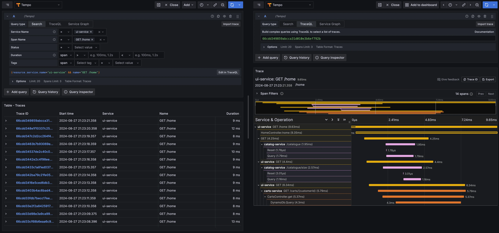

In this section we'll look at collecting and exploring the traces from our workloads. The applications were already instrumented by using OpenTelemetry SDKs and OpenTelemetry collector was configured with the OTLP receiver and exporter to ingest, batch and ship the trace data to Tempo.

To visualize them on Grafana, go to the Explore page and then select Loki as the datasource and then,

- Select `Search` for the Query type
- Filter `Service Name = ui-service`
- Filter `Span Name = GET /home`

Then, click on a link for a specific trace on the result table to populate the trace details panel.

You should see the result similar to the capture below. For this example trace, we can see that,

- The total round trip time for this request was 9.63ms
- UI service made 3 parallel requests (2 requests to catalog service and 1 request to carts service)
- Catalog and carts services spent a significant amount of time on querying the data from MySQL and DynamoDB databases



See [Language APIs & SDKs](https://opentelemetry.io/docs/languages/) doc on OpenTelemetry website to learn more about code instrumentation support for the popular programming languages.

Once you're satisfied with observing the metrics, logs and traces, you can stop the load generator using the below command.

```bash timeout=180 test=false
$ kubectl delete pod load-generator -n other
```
