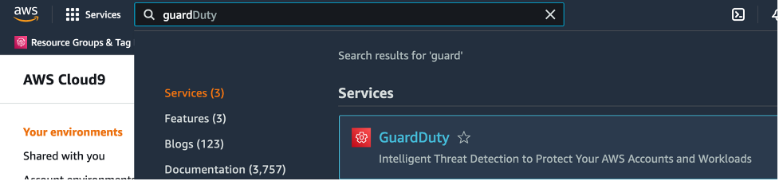
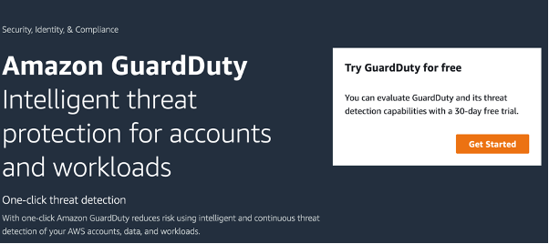
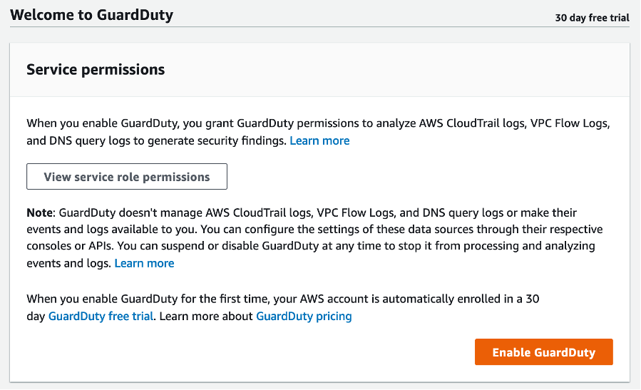

In this section, we will enable GuardDuty and Kubernetes protection.

Search for GuardDuty in AWS console

Click Get Started

Click Enable GuardDuty

Check if Kubernetes Protection is enabled. Go to Findings. Check there is no any findings available yet.

