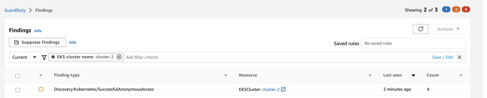

In this section, we will generate few Kubernetes findings in your Amazon EKS cluster.  


**Discovery:Kubernetes/SuccessfulAnonymousAccess**

This finding is used to indicate Kubernetes API commonly used in Discovery tactics by the anonymous user `system:anonymous`.

We will need to create a cluster role binding to bind clusterrole named **view** to user named **system:anonymous**.

```bash
$ kubectl create clusterrolebinding anonymous-view --clusterrole=view --user=system:anonymous
```

Identify the API server url of the cluster and run a http get call for uri /api/v1/pods using curl. This is equivalent to running `kubectl get pods -A -o json`. The difference between kubectl and curl is that while using kubectl we will be attaching an auth bearer token to authenticate however while running curl we are not using any auth bearer token and skipping authentication and using `system:anonymous` for authorization.

Please make sure to replace `cluster-name` with your cluster name and `REGION` with your region.


```bash
$ API_URL=`aws eks describe-cluster --name <cluster-name> --query "cluster.endpoint" --region <REGION> --output text`
$ curl -k $API_URL/api/v1/pods
```

With in few minutes we will see the finding `Discovery:Kubernetes/SuccessfulAnonymousAccess` in guardduty portal. 



Run the following command to delete the cluster role binding.

Cleanup: 
```bash
$ kubectl delete clusterrolebinding anonymous-view
```


**Impact:Kubernetes/SuccessfulAnonymousAccess and Policy:Kubernetes/AnonymousAccessGranted**

This finding is used to indicate that an API commonly used to tamper with resources in a Kubernetes cluster was invoked by an unauthenticated user.

To simulate this we will need to first create a role **pod-create**. 
```bash
$ kubectl create role pod-create --verb=get,list,watch,create,delete,patch --resource=pods -n default
```
Once the cluster role is created we will need to bind the role with `system:anonymous` user. Below command will create rolebinding named pod-access binding role pod-create to the user named system:anonymous.

```bash
$ kubectl create rolebinding pod-access --role=pod-create --user=system:anonymous
```
Please note that the above rolebinding command will trigger `Policy:Kubernetes/AnonymousAccessGranted` finding in guard duty within few minutes. It indicated that the anonymous user `system:anonymous` was granted API permissions on the EKS cluster. This enables unauthenticated access to the permitted APIs.

Now let us create a pod named nginx using a HTTP post call. Please make sure to replace `cluster-name` with your cluster name and `REGION` with your region.

```bash
$ API_URL=`aws eks describe-cluster --name <cluster-name> --query "cluster.endpoint" --region <REGION> --output text`
$ curl -k -v  $API_URL/api/v1/namespaces/default/pods -X POST -H 'Content-Type: application/yaml'   -d '---
apiVersion: v1
kind: Pod
metadata:
  name: nginx
  namespace: default
spec:
  containers:
  - name: nginx
    image: nginx
    ports:
    - containerPort: 80
'
```

verify if the pod is created.

```bash
$ kubectl get pods -n default

NAME                                 READY   STATUS    RESTARTS   AGE
nginx                                1/1     Running   0          2m17s
```
With in few minutes we will see the finding `Impact:Kubernetes/SuccessfulAnonymousAccess` in guardduty portal. 


Cleanup: 
```bash
$ kubectl delete pod nginx -n default
$ kubectl delete rolebinding pod-access -n default
$ kubectl delete role pod-create -n default
```

**Policy:Kubernetes/AdminAccessToDefaultServiceAccount**

The default service account in EKS Cluster was granted admin privileges. This may result in pods unintentionally launched with admin privileges. If this behavior is not expected, it may indicate a configuration mistake or that your credentials are compromised.

To simulate this we will need to bind clusterrole `cluster-admin` to a serviceaccount named `default`.

```bash
$ kubectl create rolebinding sa-default-admin --clusterrole=cluster-admin --serviceaccount=default:default --namespace=default
```

With in few minutes we will see the finding `Policy:Kubernetes/AdminAccessToDefaultServiceAccount` in guardduty portal. 


Run the following command to delete the role binding.

Cleanup: 
```bash
$ kubectl delete rolebinding sa-default-admin --namespace=default
```

**Policy:Kubernetes/ExposedDashboard**

This finding informs you that Kubernetes dashboard for your cluster was exposed to the internet by a Load Balancer service. An exposed dashboard makes the management interface of your cluster accessible from the internet and allows adversaries to exploit any authentication and access control gaps that may be present.


To simulate this we will need to expose kubernetes dashboard to internet with service type LoadBalancer.

```bash
$ kubectl apply -k /workspace/modules/security/Guardduty/Dashboard
```

With in few minutes we will see the finding `Policy:Kubernetes/ExposedDashboard` in guardduty portal. 


Cleanup
```bash
$ kubectl delete -k /workspace/modules/security/Guardduty/Dashboard
```

**PrivilegeEscalation:Kubernetes/PrivilegedContainer and Persistence:Kubernetes/ContainerWithSensitiveMount**

```kustomization
security/Guardduty/privileged/deployment.yaml
Deployment/carts
```

```bash
$ kubectl apply -k /workspace/modules/security/privileged
```

```bash
$ kubectl delete -k /workspace/modules/security/privileged
```