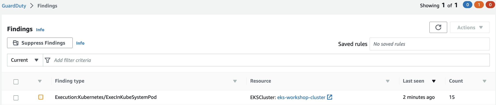

This finding indicates that a command was executed inside a pod in kube-system namespace on EKS Cluster eks-workshop-cluster.

Run the below commands to generate this finding. Note, the exact pod name varies in the second command. Use the pod name you see for the aws-node pod as displayed in the output of the first command.

```bash
$ VPC_CNI_POD=`kubectl get pods -n kube-system -l k8s-app=aws-node -o name | head -n 1
$ kubectl -n kube-system exec $VPC_CNI_POD -- pwd
/app
```

Go back to the GuardDuty console to check if a finding is generated.


