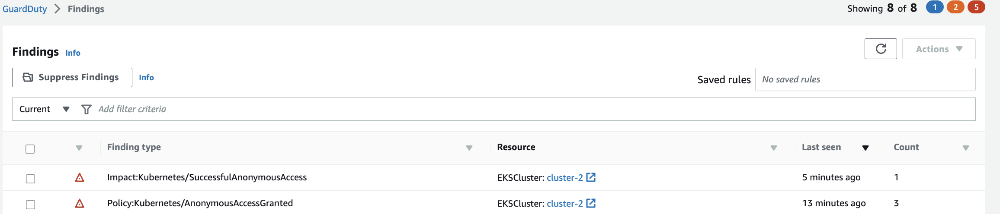

This finding is used to indicate that an API commonly used to tamper with resources in a Kubernetes cluster was invoked by an unauthenticated user.

To simulate this we will need to first create a role **pod-create**. 
```bash
$ kubectl create role pod-create --verb=get,list,watch,create,delete,patch --resource=pods -n default
```
Once the cluster role is created we will need to bind the role with `system:anonymous` user. Below command will create rolebinding named pod-access binding role pod-create to the user named system:anonymous.

```bash
$ kubectl create rolebinding pod-access --role=pod-create --user=system:anonymous
```
Please note that the above rolebinding command will trigger `Policy:Kubernetes/AnonymousAccessGranted` finding in guard duty within few minutes. It indicated that the anonymous user `system:anonymous` was granted API permissions on the EKS cluster. This enables unauthenticated access to the permitted APIs.

Now let us create a pod named nginx using a HTTP post call. Please make sure to replace `cluster-name` with your cluster name and `REGION` with your region.

```bash
$ API_URL=`aws eks describe-cluster --name <cluster-name> --query "cluster.endpoint" --region <REGION> --output text`
$ curl -k -v  $API_URL/api/v1/namespaces/default/pods -X POST -H 'Content-Type: application/yaml'   -d '---
apiVersion: v1
kind: Pod
metadata:
  name: nginx
  namespace: default
spec:
  containers:
  - name: nginx
    image: nginx
    ports:
    - containerPort: 80
'
```

verify if the pod is created.

```bash
$ kubectl get pods -n default

NAME                                 READY   STATUS    RESTARTS   AGE
nginx                                1/1     Running   0          2m17s
```
With in few minutes we will see the finding `Impact:Kubernetes/SuccessfulAnonymousAccess` in guardduty portal. 




Cleanup: 
```bash
$ kubectl delete pod nginx -n default
$ kubectl delete rolebinding pod-access -n default
$ kubectl delete role pod-create -n default
```
