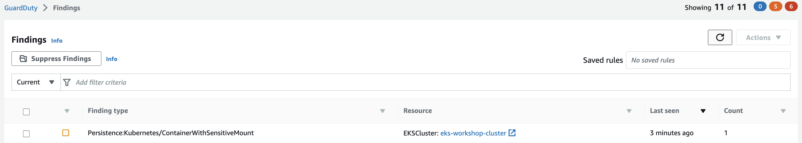

This finding indicates that a container was launched with a sensitive external host path mounted inside.

To simulate the finding we will be reusing Privileged Container manifest and patch it with host path volume mount. Lets apply the patched version of privileged container from earlier example with host path `/etc` mounted to container's path `/test-pd`.

```file
security/Guardduty/mount/previleged-pod-example.yaml
```

Run the below command to patch the deployment. Please note that the *environment* directory will be present in eks-workshop directory and the commands are executed from eks-workshop directory. eks-workshop directory must be downloaded prior to running below commands.

```bash
$ kubectl apply -k /workspace/modules/security/Guardduty/privileged/mount
```

With in few minutes we will see the finding `Persistence:Kubernetes/ContainerWithSensitiveMount` in guardduty portal.



Cleanup:

```bash
$ kubectl delete -k /workspace/modules/security/Guardduty/privileged/mount
```
