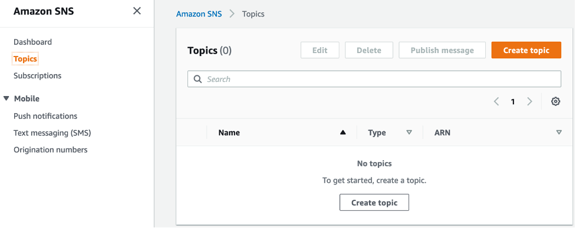
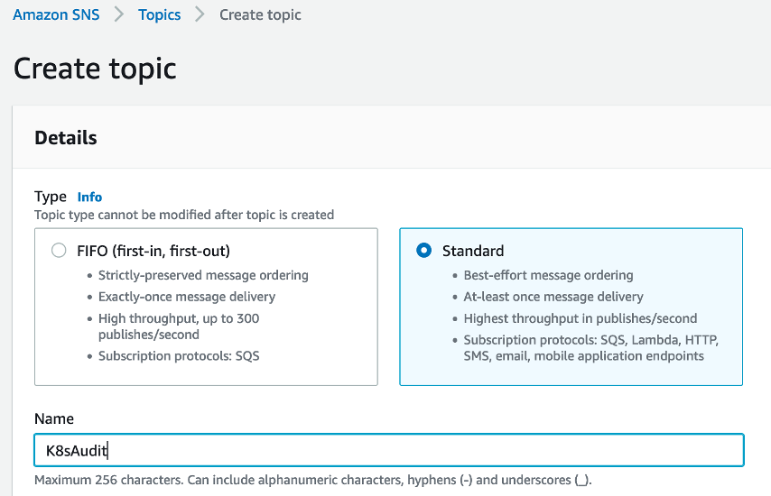
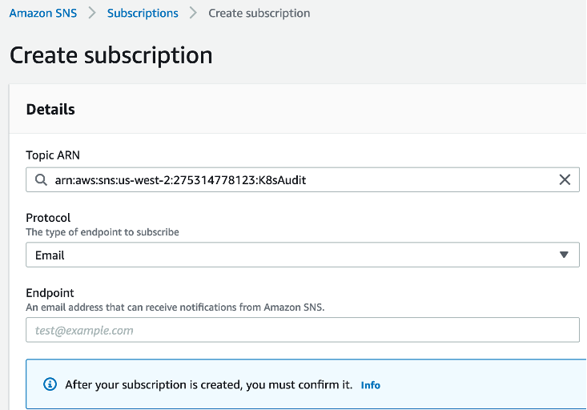
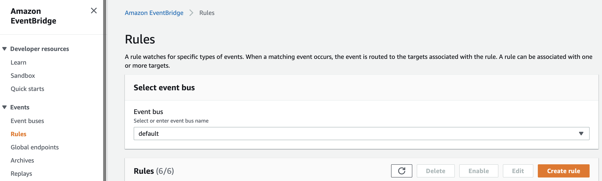
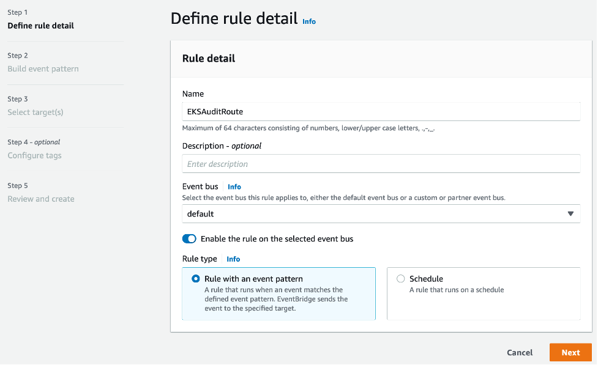
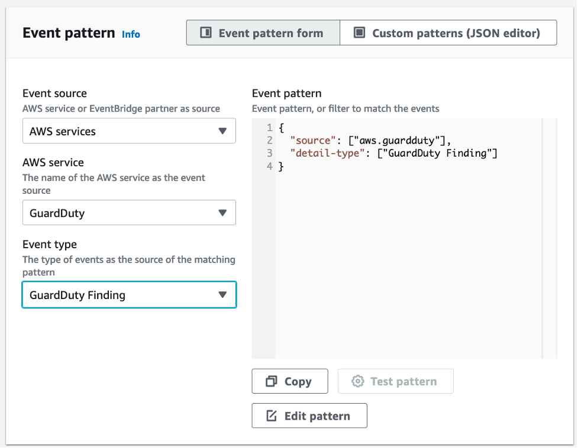
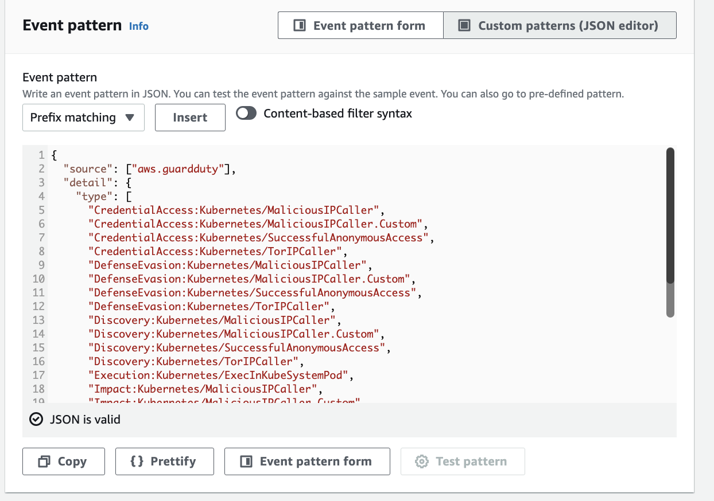
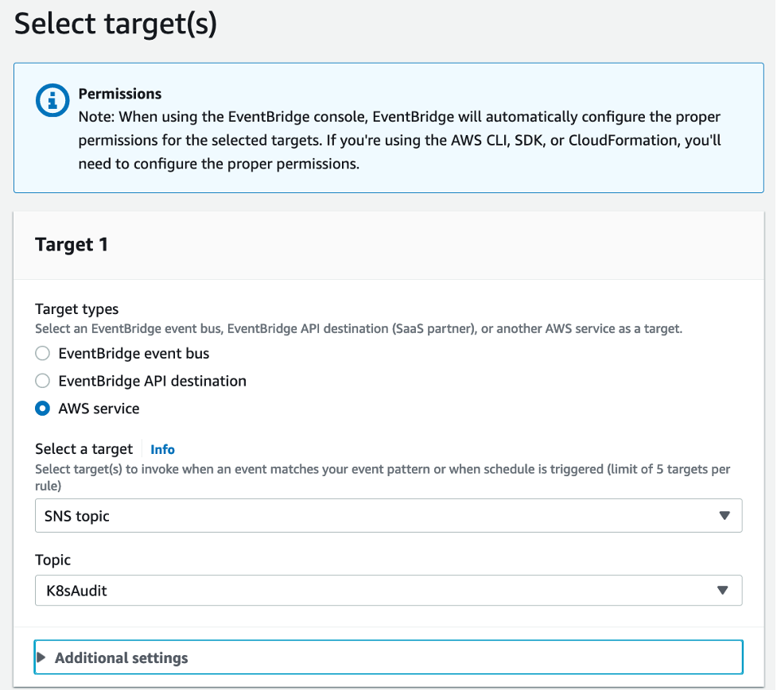
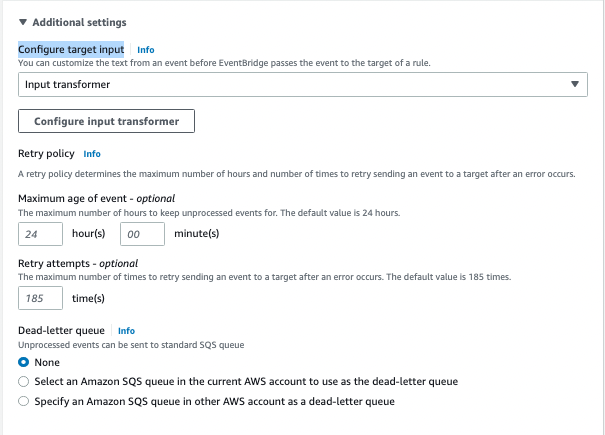
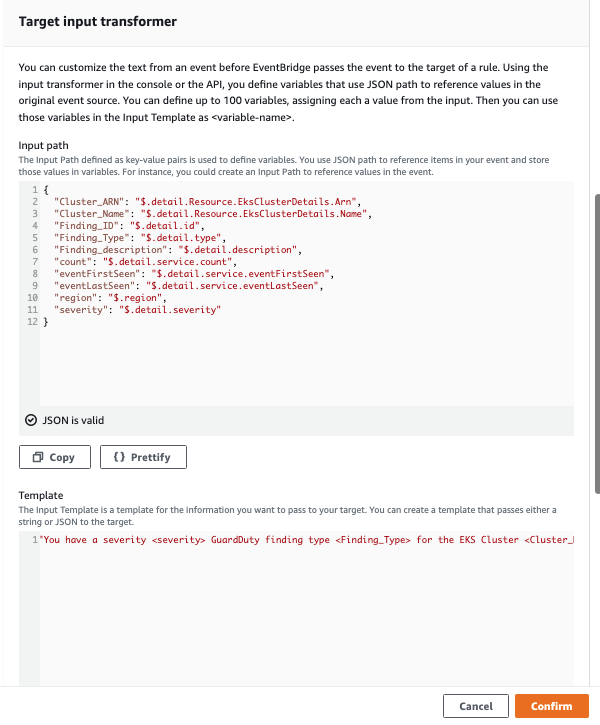

We will start by creating the Amazon SNS topic and subscribe it with your email address.

Search SNS in on the AWS Console, go to Topics and click **Create Topic.**




Select the Standard topic type, name it as **K8sAudit.** Keep everything as default and create it.




Next, under Create Subscription, choose Email as the protocol and add your email address as the endpoint. Keep everything else as default.



Log in to your email you have specified and confirm the subscription to the SNS topic.


Now, let’s create an Amazon EventBridge rule to catch GuardDuty Kubernetes findings and route the messages to the SNS topic.

Search and go to the Amazon EventBridge Console and click **Create rule**. 




Name it as **EKSAuditRoute** and leave everything as default and click Next.



Keep everything as default in Event source and Sample event. Scroll down to Event Pattern and select these options.

- Event source : AWS services
- AWS service : GuardDuty
- Event type : GuardDuty Finding



The default GuardDuty event pattern matches all the Guardduty findings. Let’s customize it as follows. This event pattern will match one of described types. Click Edit pattern and add the following pattern. You can find more information about Event Pattern rules [here](https://docs.aws.amazon.com/eventbridge/latest/userguide/eb-event-patterns.html). 

```
{
  "source": ["aws.guardduty"],
  "detail": {
    "type": [
      "CredentialAccess:Kubernetes/MaliciousIPCaller",
      "CredentialAccess:Kubernetes/MaliciousIPCaller.Custom",
      "CredentialAccess:Kubernetes/SuccessfulAnonymousAccess",
      "CredentialAccess:Kubernetes/TorIPCaller",
      "DefenseEvasion:Kubernetes/MaliciousIPCaller",
      "DefenseEvasion:Kubernetes/MaliciousIPCaller.Custom",
      "DefenseEvasion:Kubernetes/SuccessfulAnonymousAccess",
      "DefenseEvasion:Kubernetes/TorIPCaller",
      "Discovery:Kubernetes/MaliciousIPCaller",
      "Discovery:Kubernetes/MaliciousIPCaller.Custom",
      "Discovery:Kubernetes/SuccessfulAnonymousAccess",
      "Discovery:Kubernetes/TorIPCaller",
      "Execution:Kubernetes/ExecInKubeSystemPod",
      "Impact:Kubernetes/MaliciousIPCaller",
      "Impact:Kubernetes/MaliciousIPCaller.Custom",
      "Impact:Kubernetes/SuccessfulAnonymousAccess",
      "Impact:Kubernetes/TorIPCaller",
      "Persistence:Kubernetes/ContainerWithSensitiveMount",
      "Persistence:Kubernetes/MaliciousIPCaller",
      "Persistence:Kubernetes/MaliciousIPCaller.Custom",
      "Persistence:Kubernetes/SuccessfulAnonymousAccess",
      "Persistence:Kubernetes/TorIPCaller",
      "Policy:Kubernetes/AdminAccessToDefaultServiceAccount",
      "Policy:Kubernetes/AnonymousAccessGranted",
      "Policy:Kubernetes/ExposedDashboard",
      "Policy:Kubernetes/KubeflowDashboardExposed",
      "PrivilegeEscalation:Kubernetes/PrivilegedContainer"
    ]
  }
}
```




**Click Next.**

Under Target types, select AWS service. Under Select a target, pick SNS topic and select the topic created at the start of this section. 



Expand the **Additional setting** section and select **Configure target input** to be Input Transformer then 


click on **Configure input transformer** and then Scroll down to **Target input transformer** section and below  value in input path.

```
{
    "Cluster_ARN": "$.detail.Resource.EksClusterDetails.Arn",
    "Cluster_Name": "$.detail.Resource.EksClusterDetails.Name",
    "Finding_ID": "$.detail.id",
    "Finding_Type": "$.detail.type",
    "Finding_description": "$.detail.description",
    "count": "$.detail.service.count",
    "eventFirstSeen": "$.detail.service.eventFirstSeen",
    "eventLastSeen": "$.detail.service.eventLastSeen",
    "region": "$.region",
    "severity": "$.detail.severity"
}
```

In the Template add the below custom script and then click on confirm.

```
"You have a severity <severity> GuardDuty finding type <Finding_Type> for the EKS Cluster <Cluster_Name> with ARN <Cluster_ARN> in the region <region> as the <Finding_description>. The first attempt was on <eventFirstSeen> and the most recent attempt on <eventLastSeen> . The total occurrence is <count>. For more details open the GuardDuty console at https://console.aws.amazon.com/guardduty/home?region=<region>#/findings?search=id%3D<Finding_ID>"
```



Click Next and click Next again in the Tags section. Review and create the rule.
