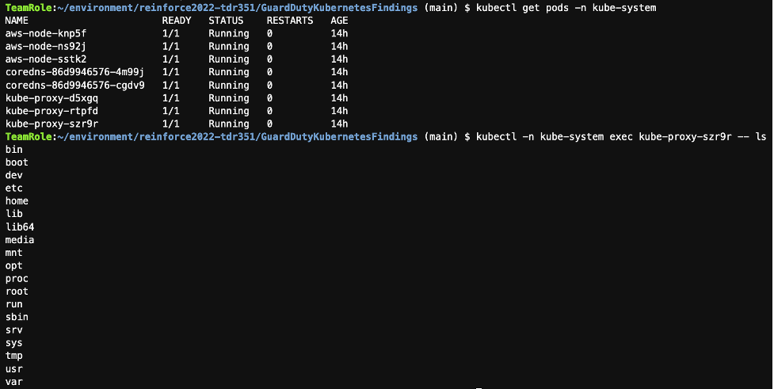
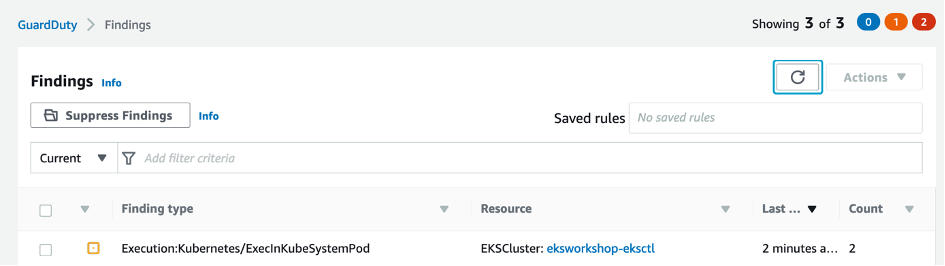
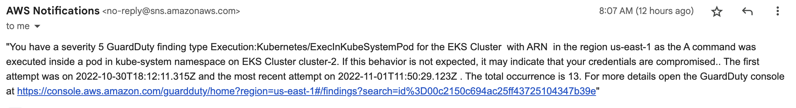

Now, let’s generate another GuardDuty finding in your Cloud9 terminal to check if the EventBridge rule routes events from GuardDuty to the target SNS topic, and sends an email notification to you.

This time will generate a new finding related to a command being executed inside a pod within the kube-system namespace. More information about this [here](https://docs.aws.amazon.com/guardduty/latest/ug/guardduty_finding-types-kubernetes.html#execution-kubernetes-execinkubesystempod).

Run the below commands to generate this finding. Note, the exact pod name varies in the second command. Use the pod name you see for the kube-proxy pod as displayed in the output of the first command.

```bash
$ KUBE_PROXY_POD=`kubectl get pods -n kube-system -l k8s-app=kube-proxy -o name | head -n 1`
$ kubectl -n kube-system exec $KUBE_PROXY_POD -- ls
bin
boot
dev
etc
home
lib
lib64
media
mnt
opt
proc
root
run
sbin
srv
sys
tmp
usr
var
```




Go back to the GuardDuty console to check if a finding is generated.



GuardDuty sends a notification to the Eventbridge within **5 minutes** of the finding. You can’t customize this default frequency.



After the event is emitted from GuardDuty and an Eventbridge rule is triggered, you should receive an email through the subscription on the SNS topic shortly after.

You can monitor Eventbridge metrics by CloudWatch. See details [here](https://docs.aws.amazon.com/eventbridge/latest/userguide/eb-monitoring.html)

You can try re-generating the other finding types by modifying the name of resource in the yaml files.