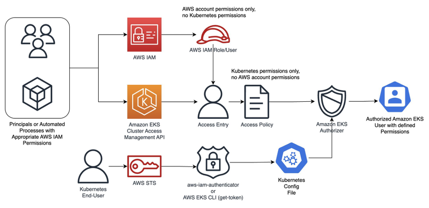

Whenever you create an Amazon EKS Cluster, inevitably, you will need to provide access to the teams or users that are consuming and managing resources in the platform. Also each team will require a specific level of access, for example platform engineers may require cluster-wide access to manage resources, deploy add-ons or troubleshoot situations, whereas for developers, a read-only access or an admin access restricted to the Namespace where their applications reside, may be enough.

Either cases, you will need a tool that provides centralized Authentication (AuthN) for Identities or Principals tied those teams or users in order to control their access to Amazon EKS Clusters.  Additionally to be more effective, this tool needs to be integrated with Kubernetes Role-Based Access Controls (RBACs), to grant specific Authorization (AuthZ) level requested by each team in a more granular way, following the principles Least Privilege.

The Cluster Access Management API, is a feature of the AWS API available for Amazon EKS v1.23 and later clusters (new or existing). It simplifies identity mapping between AWS IAM and Kubernetes RBACs, eliminating the need to switch between AWS and Kubernetes APIs for access management, reducing operational overhead. The tool also enables cluster administrators to revoke or refine cluster-admin permissions automatically granted to the AWS IAM principal used to create the cluster.

The Cluster Access Management API relies on two basic concepts:

* Access Entries (Authentication): A cluster identity directly linked to an AWS IAM principal (user or role) allowed to authenticate to an Amazon EKS cluster. Access entries are bound to clusters, so unless the cluster is created and set to use the Cluster Access Management API as authentication method, no Access Entries will exist for that cluster.
* Access Policies  (Authorization): Are Amazon EKS specific policies that provides the authorization for an Access Entry to perform actions in the Amazon EKS cluster. Access Policies are Account based resources, this means that they will exist in your AWS Account, even if no cluster is deployed.
    As of today, Amazon EKS supports only a few predefined and AWS managed policies. Access policies are not IAM entities and are defined and managed by Amazon EKS based on default Kubernetes default Cluster Roles, and are mapped like this.

|-|-|
|Access Policy|RBAC|Description|
|AmazonEKSClusterAdminPolicy|`cluster-admin`|Grants administrator access to a cluster|
|AmazonEKSAdminPolicy|`admin`|Grants most permissions to resources, usually scoped to a Namespace|
|AmazonEKSAdminViewPolicy|`view`|Grants access to list/view all resources in a cluster, including Secrets. Basically a view policy cluster-wide scoped|
|AmazonEKSEditPolicy|`edit`|Grants access to edit most Kubernetes resources, usually scoped to a Namespace|
|AmazonEKSViewPolicy|`view`|Grants access to list/view view most Kubernetes resources, usually scoped to a Namespace|

Access Policies are being often updated by Amazon EKS, to check the list of available Access Policies in your account, run the following command.

```bash
$ aws eks list-access-policies 

{
    "accessPolicies": [
        {
            "name": "AmazonEKSAdminPolicy",
            "arn": "arn:aws:eks::aws:cluster-access-policy/AmazonEKSAdminPolicy"
        },
        {
            "name": "AmazonEKSAdminViewPolicy",
            "arn": "arn:aws:eks::aws:cluster-access-policy/AmazonEKSAdminViewPolicy"
        },
        {
            "name": "AmazonEKSClusterAdminPolicy",
            "arn": "arn:aws:eks::aws:cluster-access-policy/AmazonEKSClusterAdminPolicy"
        },
        {
            "name": "AmazonEKSEditPolicy",
            "arn": "arn:aws:eks::aws:cluster-access-policy/AmazonEKSEditPolicy"
        },
        {
            "name": "AmazonEKSViewPolicy",
            "arn": "arn:aws:eks::aws:cluster-access-policy/AmazonEKSViewPolicy"
        },
        {
            "name": "AmazonEMRJobPolicy",
            "arn": "arn:aws:eks::aws:cluster-access-policy/AmazonEMRJobPolicy"
        }
    ]
}
```

As explained earlier, Cluster Access Management API allows the combination of upstream RBAC with Access Policies supporting allow and pass (but not deny) on Kubernetes AuthZ decision regarding API server requests. A deny decision will happen when both, the upstream RBAC and Amazon EKS authorizers can't determine the outcome of a request evaluation.
The below diagram illustrates the workflow followed by Cluster Access Management API to provide Authentication and Authorization for AWS IAM Principals to Amazon EKS Clusters.


