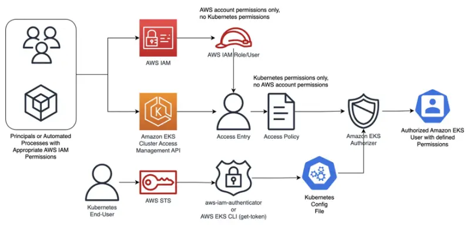

---
title: "Understanding Cluster Access Management API"
sidebar_position: 11
---

Whenever you create an Amazon EKS Cluster, inevitably, you will need to provide access to the teams or users that are consuming and managing resources in the platform. Each team will require a specific level of access. For example, platform engineers may require cluster-wide access to manage resources, deploy add-ons, or troubleshoot situations, whereas for developers, read-only access or admin access restricted to the Namespace where their applications reside may be sufficient.

In either case, you will need a tool that provides centralized Authentication (AuthN) for identities or principals tied to those teams or users to control their access to Amazon EKS clusters. Additionally, this tool should be integrated with Kubernetes Role-Based Access Controls (RBAC) to grant specific Authorization (AuthZ) levels required by each team in a more granular way, following the principle of least privilege.

The Cluster Access Management API is a feature of the AWS API available for Amazon EKS v1.23 and later clusters (new or existing). It simplifies identity mapping between AWS IAM and Kubernetes RBAC, eliminating the need to switch between AWS and Kubernetes APIs for access management and reducing operational overhead. The tool also enables cluster administrators to revoke or refine cluster-admin permissions automatically granted to the AWS IAM principal used to create the cluster.

The Cluster Access Management API relies on two basic concepts:

- **Access Entries (Authentication)**: A cluster identity directly linked to an AWS IAM principal (user or role) allowed to authenticate to an Amazon EKS cluster. Access entries are bound to clusters, so unless the cluster is created and set to use the Cluster Access Management API as an authentication method, no Access Entries will exist for that cluster.
- **Access Policies (Authorization)**: Amazon EKS specific policies that provide authorization for an Access Entry to perform actions in the Amazon EKS cluster. Access Policies are account-based resources, meaning they will exist in your AWS Account even if no cluster is deployed.
  
Currently, Amazon EKS supports only a few predefined and AWS-managed policies. Access policies are not IAM entities and are defined and managed by Amazon EKS based on default Kubernetes cluster roles, mapped as follows:

| Access Policy               | RBAC            | Description                                                                                                         |
| --------------------------- | --------------- | ------------------------------------------------------------------------------------------------------------------- |
| AmazonEKSClusterAdminPolicy | `cluster-admin` | Grants administrator access to a cluster                                                                            |
| AmazonEKSAdminPolicy        | `admin`         | Grants most permissions to resources, usually scoped to a Namespace                                                 |
| AmazonEKSAdminViewPolicy    | `view`          | Grants access to list/view all resources in a cluster, including Secrets. Basically a view policy cluster-wide scoped |
| AmazonEKSEditPolicy         | `edit`          | Grants access to edit most Kubernetes resources, usually scoped to a Namespace                                      |
| AmazonEKSViewPolicy         | `view`          | Grants access to list/view most Kubernetes resources, usually scoped to a Namespace                                |
| AmazonEMRJobPolicy          | N/A             | Custom access to run Amazon EMR Jobs on Amazon EKS Clusters                                                         |

To check the list of available access policies in your account, run the following command:

```bash
$ aws eks list-access-policies

{
    "accessPolicies": [
        {
            "name": "AmazonEKSAdminPolicy",
            "arn": "arn:aws:eks::aws:cluster-access-policy/AmazonEKSAdminPolicy"
        },
        {
            "name": "AmazonEKSAdminViewPolicy",
            "arn": "arn:aws:eks::aws:cluster-access-policy/AmazonEKSAdminViewPolicy"
        },
        {
            "name": "AmazonEKSClusterAdminPolicy",
            "arn": "arn:aws:eks::aws:cluster-access-policy/AmazonEKSClusterAdminPolicy"
        },
        {
            "name": "AmazonEKSEditPolicy",
            "arn": "arn:aws:eks::aws:cluster-access-policy/AmazonEKSEditPolicy"
        },
        {
            "name": "AmazonEKSViewPolicy",
            "arn": "arn:aws:eks::aws:cluster-access-policy/AmazonEKSViewPolicy"
        },
        {
            "name": "AmazonEMRJobPolicy",
            "arn": "arn:aws:eks::aws:cluster-access-policy/AmazonEMRJobPolicy"
        }
    ]
}
```

As explained earlier, the Cluster Access Management API allows a combination of upstream RBAC with access policies supporting allow and pass (but not deny) on Kubernetes authorization decisions regarding API server requests. A deny decision will happen when both the upstream RBAC and Amazon EKS authorizers can't determine the outcome of a request evaluation.

The below diagram illustrates the workflow followed by the Cluster Access Management API to provide authentication and authorization for AWS IAM principals to Amazon EKS Clusters.


