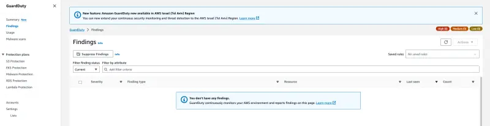

In this lab, we'll enable Amazon GuardDuty EKS Protection. This will provide threat detection coverage for EKS Audit Log Monitoring and EKS Runtime Monitoring to help you protect your clusters.

EKS Audit Log Monitoring uses Kubernetes audit logs to capture chronological activities from users, applications using the Kubernetes API, and the control plane searching for potentially suspicious activities.

EKS Runtime Monitoring uses operating system-level events to help you detect potential threats in Amazon EKS nodes and containers.

Lets enable GuardDuty using the AWS CLI:

```bash test=false
$ aws guardduty create-detector --enable --features '[{"Name" : "EKS_AUDIT_LOGS", "Status" : "ENABLED"}, {"Name" : "EKS_RUNTIME_MONITORING", "Status" : "ENABLED", "AdditionalConfiguration" : [{"Name" : "EKS_ADDON_MANAGEMENT", "Status" : "ENABLED"}]}]'
{
    "DetectorId": "1qaz0p2wsx9ol3edc8ik4rfv7ujm5tgb6yhn"
}
```

After several minutes validate the `aws-guardduty-agent` Pod deployment in your EKS Cluster.

```bash test=false
$ kubectl -n amazon-guardduty get pods
NAME                        READY   STATUS    RESTARTS   AGE
aws-guardduty-agent-h7qg5   1/1     Running   0          58s
aws-guardduty-agent-hgbsg   1/1     Running   0          58s
aws-guardduty-agent-k7x2b   1/1     Running   0          58s
```

Then navigate to **Findings** section of the GuardDuty console:

<ConsoleButton url="https://console.aws.amazon.com/guardduty/home#/findings?macros=current" service="guardduty" label="Open GuardDuty console"/>

You should find that there are no findings available yet.


