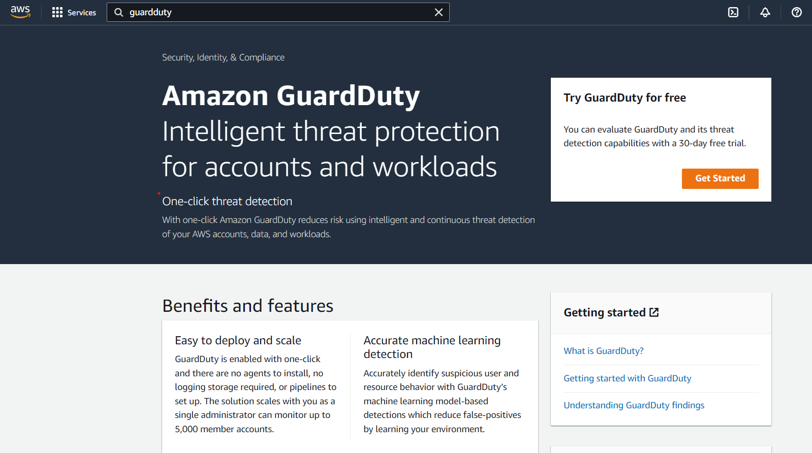
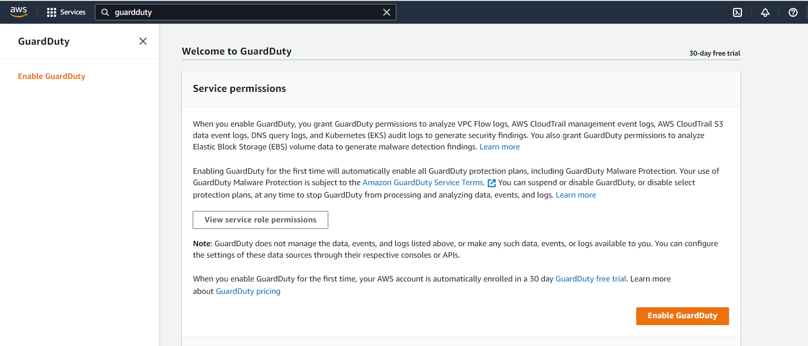
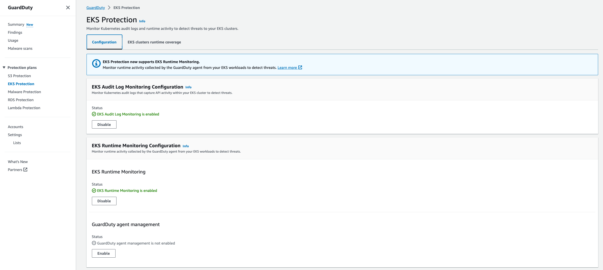
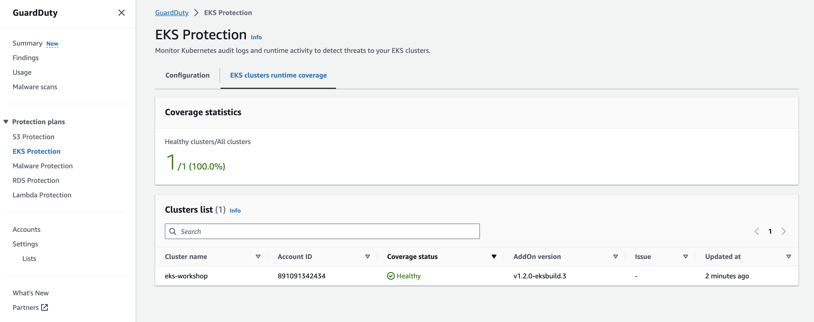
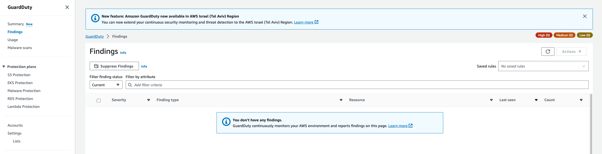

In this lab, we'll enable Amazon GuardDuty EKS Protection. This will provide threat detection coverage for EKS Audit Log Monitoring and EKS Runtime Monitoring to help you protect your clusters.

 EKS Audit Log Monitoring uses Kubernetes audit logs to capture chronological activities from users, applications using the Kubernetes API, and the control plane searching for potentially suspicious activities.

EKS Runtime Monitoring uses operating system-level events to help you detect potential threats in Amazon EKS nodes and containers.

**Enabling Amazon GuardDuty via AWS CLI**

```bash test=false
$ aws guardduty create-detector --enable --features '[{"Name" : "EKS_AUDIT_LOGS", "Status" : "ENABLED"}, {"Name" : "EKS_RUNTIME_MONITORING", "Status" : "ENABLED", "AdditionalConfiguration" : [{"Name" : "EKS_ADDON_MANAGEMENT", "Status" : "ENABLED"}]}]'
{
    "DetectorId": "1qaz0p2wsx9ol3edc8ik4rfv7ujm5tgb6yhn"
}
```

**Enabling Amazon GuardDuty via AWS Console**

Navigate to [Amazon GuardDuty Console](https://console.aws.amazon.com/guardduty/home)

Click on **Get Started** button.



Click on **Enable GuardDuty**




Navigate to **EKS Protection** on the left hand side menu, and double check that EKS Protection is enabled for both Audit Logs, and Runtime Monitoring.



Also check the tab **EKS clusters runtime coverage**.



*If your cluster is not showing in the Cluster list or the coverage statistics is not showing 1/1(100%), wait a few more minutes to Amazon GuardDuty finish the monitoring stack deployment.*

You can also validate the `aws-guardduty-agent` Pod deployment in your EKS Cluster.

```bash test=false
$ kubectl -n amazon-guardduty get pods                                                                                                                
NAME                        READY   STATUS    RESTARTS   AGE
aws-guardduty-agent-h7qg5   1/1     Running   0          58s
aws-guardduty-agent-hgbsg   1/1     Running   0          58s
aws-guardduty-agent-k7x2b   1/1     Running   0          58s
```


Then navigate to **Findings** on the left hand side menu. You should find that there are no findings available yet.

