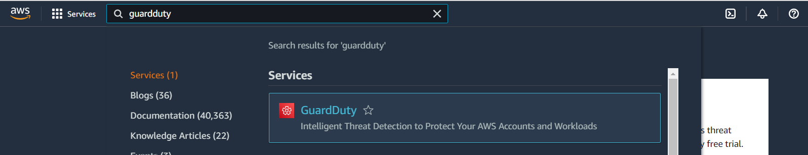

In this lab, we'll enable GuardDuty and Kubernetes protection.

**Enabling using CLI:**

```bash
$ aws guardduty create-detector --enable --data-sources Kubernetes={AuditLogs={Enable=true}}
{
    "DetectorId": "b6b992d6d2f48e64bc59180bfexample"
}
```

**Enabling using Console:**
Search for GuardDuty in AWS console



Click Get Started


Click **Enable GuardDuty**


Double check that Kubernetes Protection is enabled and go to Findings. You should find that there are no findings available yet.

