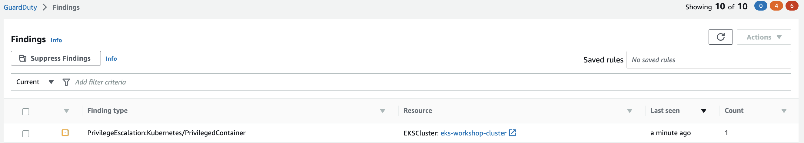

This finding indicates that a privileged container with root level access was launched on your Kubernetes cluster.

To simulate the finding we'll apply the following yaml.

```file
security/Guardduty/privileged/privileged-pod-example.yaml
```

Create the deployment by running the following command.

```bash
$ kubectl apply -f /workspace/modules/security/Guardduty/privileged/privileged-pod-example.yaml
```

Within a few minutes we'll see the finding `PrivilegeEscalation:Kubernetes/PrivilegedContainer` in the GuardDuty portal.



Cleanup:

```bash
$ kubectl delete -f /workspace/modules/security/Guardduty/privileged/privileged-pod-example.yaml
```
