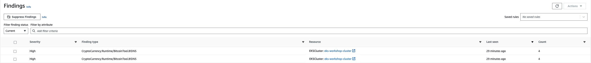

This finding indicates that a container tried to do a cryto mining inside a Pod.

To simulate the finding we'll be running a `ubuntu` image Pod in the `default` Namespace using the interactive mode, and from there run a couple of commands to start a crypto mining process, as an attacker would do.

Run the below command to run the Pod in an interactive mode.

```bash
$ kubectl run -ti ubuntu --image ubuntu
```

Inside the Pod, run the following commands to simulate a crypto miniing process.

```bash
$ curl -s http://pool.minergate.com/zaq12wsxcde34rfvbgt56yhnmju78iklo90p /dev/null &
$ curl -s http://xmr.pool.minergate.com/p09olki87ujmnhy65tgbvfr43edcxsw21qaz  > /dev/null &
```

Go back to [AWS GuardDuty console](https://console.aws.amazon.com/guardduty/home/), go to the **Findings** menu on the left hand side.

Within a few minutes we'll see a couple of findings `CryptoCurrency:Runtime/BitcoinTool.B!DNS`.



Lets delete this pod before we move on:

```bash
$ kubectl delete -f ~/environment/eks-workshop/modules/security/Guardduty/mount/privileged-pod-example.yaml
```
