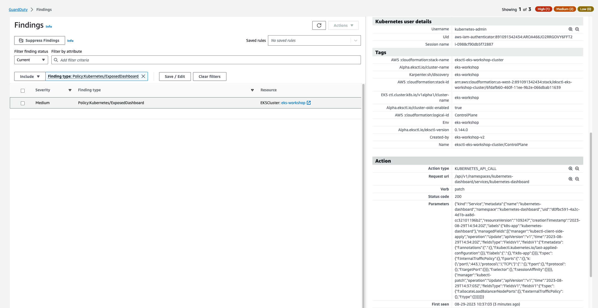

This finding informs you that Kubernetes dashboard for your cluster was exposed to the internet by a Load Balancer service. An exposed dashboard makes the management interface of your cluster accessible from the internet and allows adversaries to exploit any authentication and access control gaps that may be present.

To simulate this we'll need to expose the Kubernetes dashboard to the Internet with service type `LoadBalancer`.

First off, we'll install the Kubernetes dashboard component. We'll be using the version v2.7.0 of the dashboard, which is compatible with Kubernetes cluster vVAR::KUBERNETES_VERSION based on the [release notes](https://github.com/kubernetes/dashboard/releases/tag/v2.7.0).


```bash
$ kubectl apply -f https://raw.githubusercontent.com/kubernetes/dashboard/v2.7.0/aio/deploy/recommended.yaml
$ kubectl rollout status deployment/kubernetes-dashboard -n kubernetes-dashboard --timeout=60s
```

Let us patch the `kubernetes-dashboard` service to be type LoadBalancer.

```bash
$ kubectl patch svc kubernetes-dashboard -n kubernetes-dashboard -p='{"spec": {"type": "LoadBalancer"}}'
```

Within a few minutes we'll see the finding `Policy:Kubernetes/ExposedDashboard` in the GuardDuty portal.



Uninstall the dashboard with the following command:

```bash
$ kubectl delete -f https://raw.githubusercontent.com/kubernetes/dashboard/v2.7.0/aio/deploy/recommended.yaml
```