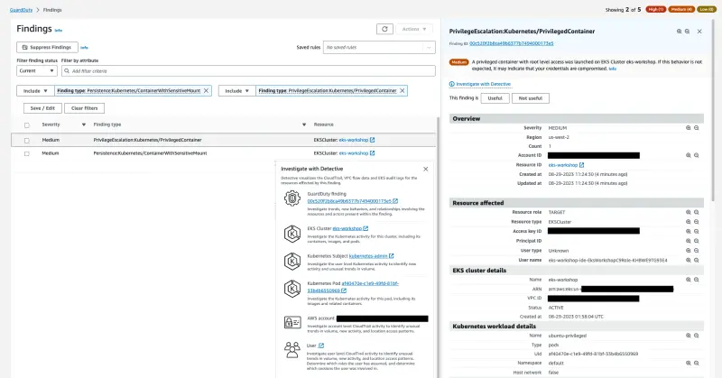
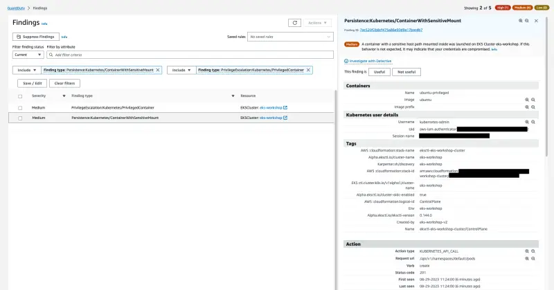

In this lab you will be creating a container with `privileged` Security Context, with root level access in the `default` Namespace of your EKS Cluster. This privileged container will also have a sensitive directory from the host, mounted and accessible as a volume within your container.

This exercise will generate two different findings, `PrivilegeEscalation:Kubernetes/PrivilegedContainer` which indicates that a container was launched with Privileged permissions, and `Persistence:Kubernetes/ContainerWithSensitiveMount` indicating a sensitive external host path mounted inside the container.

To simulate the finding you'll be using a pre-configure manifest with some specific parameters already set:

::yaml{file="manifests/modules/security/Guardduty/mount/privileged-pod-example.yaml" paths="spec.containers.0.securityContext,spec.containers.0.volumeMounts.0.mountPath,spec.volumes.0.hostPath.path"}

1. Setting `SecurityContext: privileged: true` grants full root privileges to the Pod
2. `mountPath: /host-etc` specifies that the mapped host volume will be accessible inside the container at `/host-etc` 
3. `path: /etc` specifies that `/etc` directory from the host system will be the source directory for the mount

Apply the manifest shown above with the following command:

```bash
$ kubectl apply -f ~/environment/eks-workshop/modules/security/Guardduty/mount/privileged-pod-example.yaml
```

:::note
This Pod will just run once, until it reaches the State `Completed`
:::

Within a few minutes we'll see the two finding `PrivilegeEscalation:Kubernetes/PrivilegedContainer` and `Persistence:Kubernetes/ContainerWithSensitiveMount` in the [GuardDuty Findings console](https://console.aws.amazon.com/guardduty/home#/findings).





Once again take sometime to analyze the Finding details, Action, and Detective Investigation.

Cleanup the Pod by running the command below:

```bash
$ kubectl delete -f ~/environment/eks-workshop/modules/security/Guardduty/mount/privileged-pod-example.yaml
```
