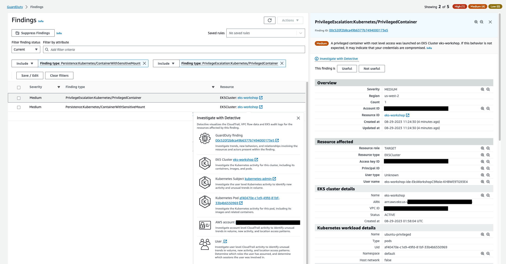
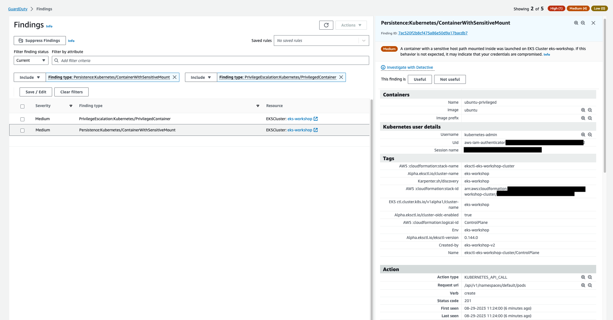

In this lab you will be creating a container with `privileged` Security Context, with root level access in the `default` Namespace of your EKS Cluster. Also this privileged container will also have a sensitive directory from the host, mounted and accessible as a volume within your container.

This exercise will generate two different findings, `PrivilegeEscalation:Kubernetes/PrivilegedContainer` which indicates that a container was launched with Privileged permissions, and `Persistence:Kubernetes/ContainerWithSensitiveMount` indicating a sensitive external host path mounted inside the container.

To simulate the finding you'll be using a pre-configure manifest with some specific parameters already set, `SecurityContext: privileged: true` and also the `volume` and `volumeMount` options, mapping the `/etc` host directory to `/host-etc` Pod volume mount.

```file
manifests/modules/security/Guardduty/mount/privileged-pod-example.yaml
```

Apply the manifest shown above with the following command:

```bash
$ kubectl apply -f https://raw.githubusercontent.com/aws-samples/eks-workshop-v2/main/manifests/modules/security/guardduty/mount/privileged-pod-example.yaml
```
*This Pod will just run once, until it reaches the State `Completed`*

Within a few minutes we'll see the two finding `PrivilegeEscalation:Kubernetes/PrivilegedContainer` and `Persistence:Kubernetes/ContainerWithSensitiveMount` in the [GuardDuty Findings console](https://console.aws.amazon.com/guardduty/home#/findings).





Once again take sometime to analyze the Finding details, Action, and Detective Investigation.


Cleanup the Pod by running the command below:

```bash
$ kubectl delete -f https://raw.githubusercontent.com/aws-samples/eks-workshop-v2/main/manifests/modules/security/guardduty/mount/privileged-pod-example.yaml
```