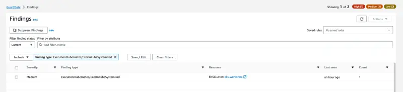
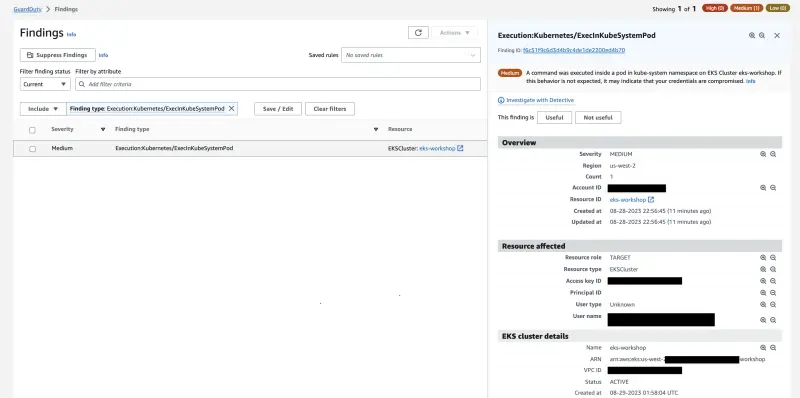
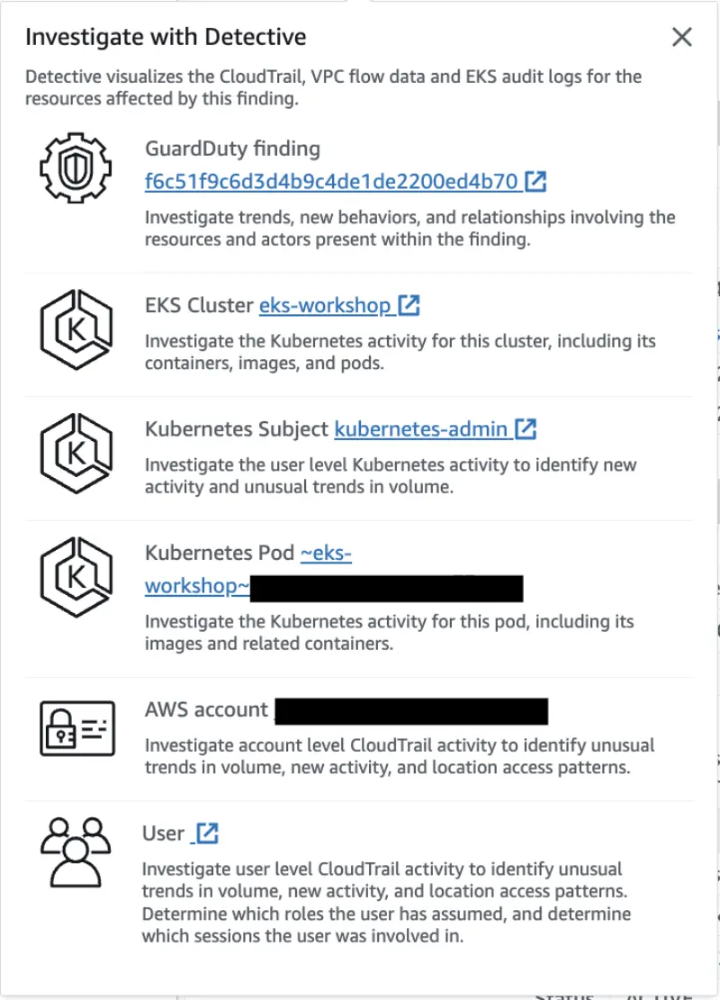

This finding indicates that a command was executed inside a Pod in the `kube-system` Namespace on EKS Cluster.

First lets run a Pod in the `kube-system` Namespace that provides access to its shell environment.

```bash
$ kubectl -n kube-system run nginx --image=nginx
$ kubectl wait --for=condition=ready pod nginx -n kube-system
$ kubectl -n kube-system get pod nginx
NAME    READY   STATUS    RESTARTS   AGE
nginx   1/1     Running   0          28s
```

Then run the below command to generate the `Execution:Kubernetes/ExecInKubeSystemPod` finding:

```bash
$ kubectl -n kube-system exec nginx -- pwd
/
```

Within a few minutes we'll see the finding `Execution:Kubernetes/ExecInKubeSystemPod` in the [GuardDuty Findings console](https://console.aws.amazon.com/guardduty/home#/findings)



If you click on the finding, it will open a tab in the right side of the screen, with the finding details, and a brief explanation about it.



It also gives you the option to investigate the finding using Amazon Detective.



Check the **Action** of the finding, where we can see that is related to a `KUBERNETES_API_CALL`.


Clean up the offending Pod we used to generate the finding:

```bash
$ kubectl -n kube-system delete pod nginx
```
