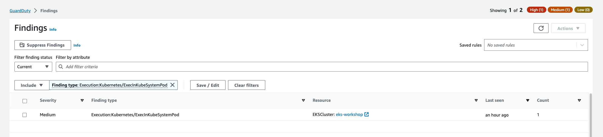

This finding indicates that a command was executed inside a pod in kube-system namespace on EKS Cluster.

First lets run a pod in the `kube-system` namespace that has a shell:

```bash
$ kubectl run nginx --image=nginx -n kube-system
$ kubectl wait --for=condition=ready pod nginx -n kube-system
```

Then run the below command to generate this finding:

```bash
$ kubectl -n kube-system exec nginx -- pwd
/
```

Within a few minutes we'll see the finding `Execution:Kubernetes/ExecInKubeSystemPod` in the GuardDuty portal.



Clean up the pod we used to generate the finding:

```bash
$ kubectl delete pod nginx -n kube-system
```