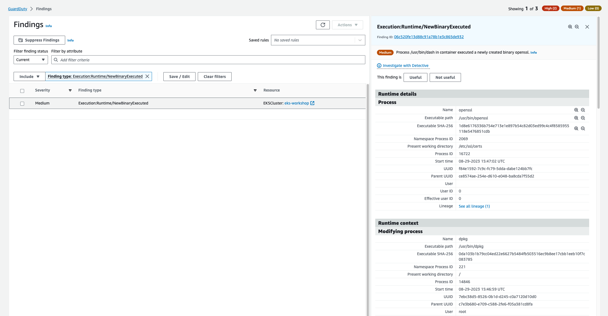
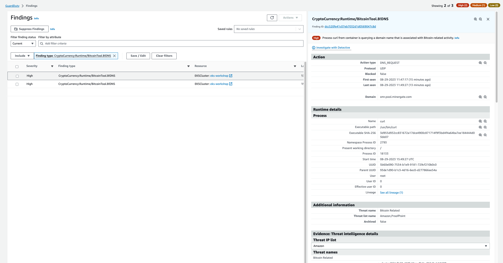

This finding indicates that a container tried to do a cryto mining inside a Pod.

To simulate the finding we'll be running a `ubuntu` image Pod in the `default` namespace and from there run a couple of commands to simulate downloading a crypto mining process.

Run the below command to start the Pod:

```bash
$ kubectl run crypto --namespace other --image ubuntu --restart=Never --command -- sleep infinity
```

Next we can use `kubectl exec` to run a series of commands inside the Pod. First lets install the `curl` utility:

```bash
$ kubectl exec crypto -n other -- bash -c 'apt update && apt install -y curl'
```

Next lets download the crypto mining process but dump the output to `/dev/null`:

```bash
$ kubectl exec crypto -n other -- bash -c 'curl -s http://pool.minergate.com/zaq12wsxcde34rfvbgt56yhnmju78iklo90p > /dev/null'
```

These commands will trigger two different findings in the [GuardDuty Findings console](https://console.aws.amazon.com/guardduty/home#/findings).

The first one is `Execution:Runtime/NewBinaryExecuted` which is related to the `curl` package installating via the APT tool.



Take a closer look to the details of this finding, which because they are related to the GuardDuty runtime monitoring show specific information regarding the runtime, context, and processes.

The second is `CryptoCurrency:Runtime/BitcoinTool.B!DNS` findings. Notice again that the finding details brings different information, this time showing the `DNS_REQUEST` action, and the **Threat intelligence Evidences**.

