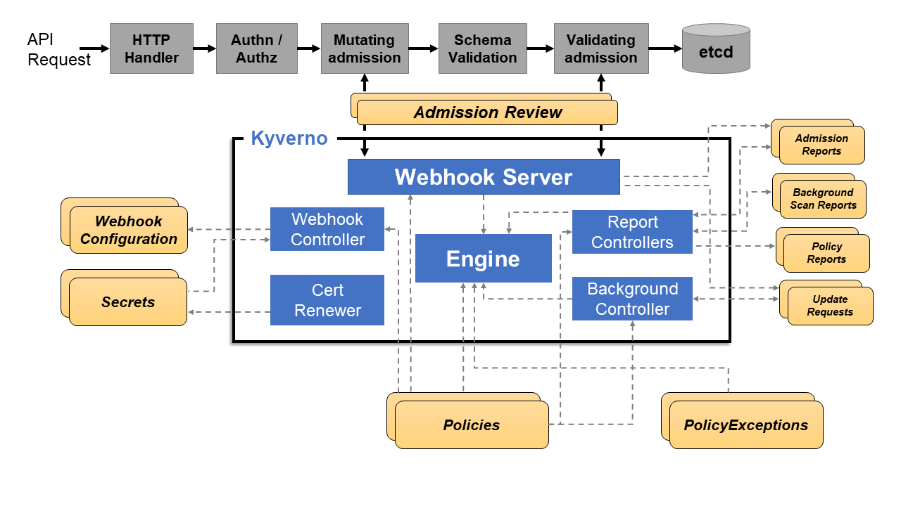

:::tip Before you start
Prepare your environment for this section:

```bash timeout=300 wait=30
$ prepare-environment security/kyverno
```
:::

As containers are used in cloud native production environments, DevOps, Security teams and Platform teams, need a solution and way to effectively collaborate and execute on the Governance and [Policy-as-Code (PaC)](https://aws.github.io/aws-eks-best-practices/security/docs/pods/#policy-as-code-pac) journey. This ensures that all teams which have a stake in Security are able to have the same source of truth, as well as use the same baseline "language" when describing their individual needs, thus furthering the march towards being Cloud Native

Kubernetes by its nature is meant to be a tool to build on and with, this means that out of the box it lacks pre-defined guardrails. In order to give builders a way to control security Kubernetes provides (starting on version 1.23) [Pod Security Admission (PSA)](https://kubernetes.io/docs/concepts/security/pod-security-admission/), a built-in admission controller that implements the security controls outlined in the [Pod Security Standards (PSS)](https://kubernetes.io/docs/concepts/security/pod-security-standards/), enabled in Amazon Elastic Kubernetes Service (EKS) by default.

### What is Kyverno

---

Kyverno (Greek for “govern”) is a policy engine designed specifically for Kubernetes. It is a Cloud Native Computing Foundation (CNCF) project allowing teams to collaborate and enforce Policy-as-Code.

The Kyverno policy engine is installed and integrates with the Kubernetes API server as [Dynamic Admission Controller](https://kubernetes.io/docs/reference/access-authn-authz/extensible-admission-controllers/). This allows written policies to be used to **mutate** and **validate** inbound Kubernetes API requests, thus ensuring compliance with the defined rules prior to the data being persisted and ultimately applied into the cluster.

Kyverno allows for declarative Kubernetes resources, **written in YAML, with no new policy language to learn.** Results are also available as Kubernetes resources and as events.

Kyverno policies can be used to **validate, mutate, and generate resource configurations, and validate image signatures and attestations.** Ultimately providing all the necessary building blocks for a complete software supply chain as well as security standards enforcement.

### How Kyverno Works

---

As mentioned above, Kyverno runs as a Dynamic Admission Controller in an Kubernetes Cluster. Kyverno receives validating and mutating admission webhook HTTP callbacks from the Kubernetes API server and applies matching policies to return results that enforce admission policies or reject requests. It can also be used to Audit the requests, to monitor the Security posture of the environment before enforcing.

Kyverno policies can be created for resources using Resource Kind, Labels, Namespaces, Roles, ClusterRoles and many more.

The diagram below shows the high-level logical architecture of Kyverno.



The two major components are the Webhook Server & the Webhook Controller. The **Webhook server** handles incoming AdmissionReview requests from the Kubernetes API server and sends them to the Engine for processing. It is dynamically configured by the **Webhook Controller** which watches the installed policies and modifies the webhooks to request only the resources matched by those policies.

Next we will take a look at the Workshop Activities. Click Next to Start with the Lab
