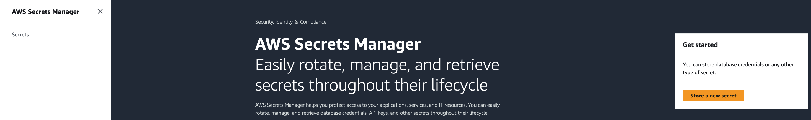
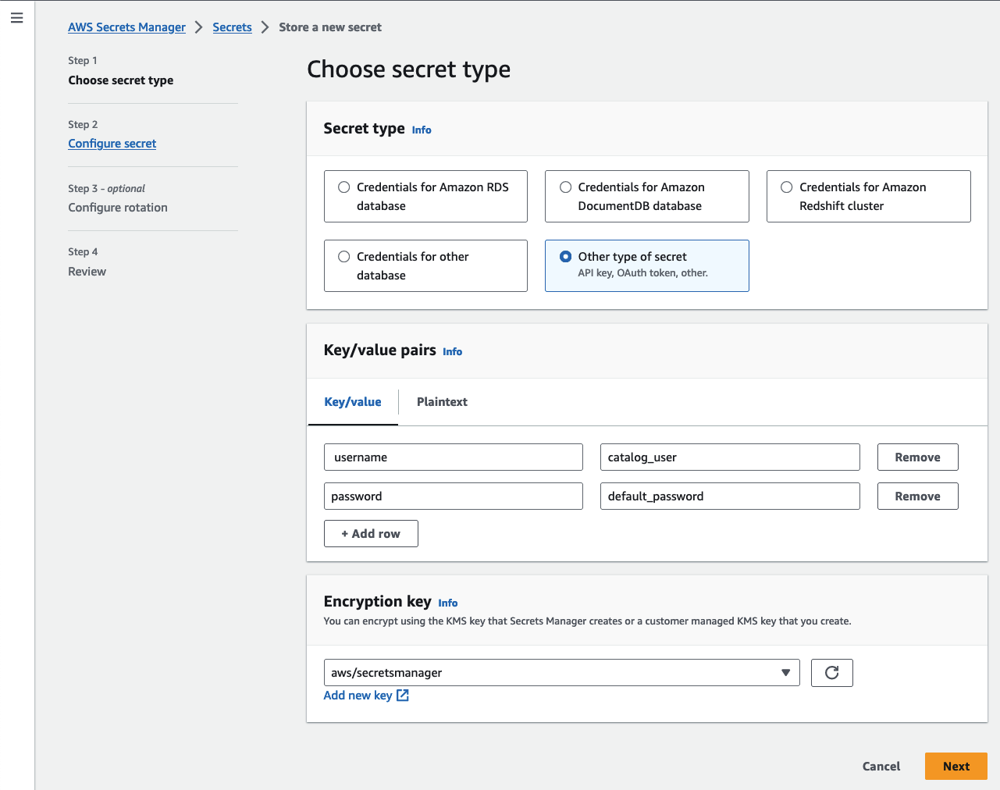
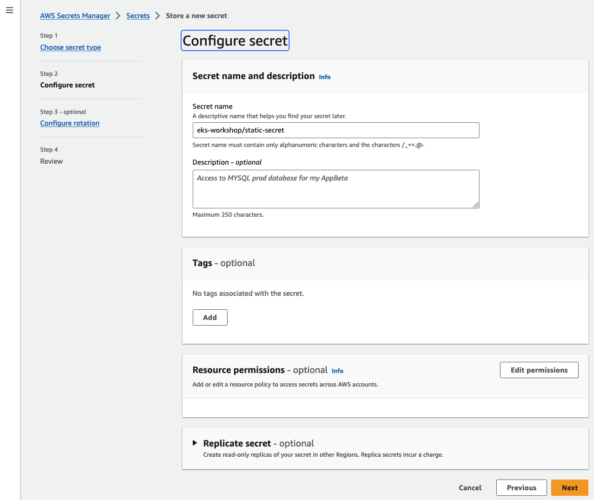

To store a secret in AWS Secrets Manager, you can either use the AWS Console or the AWS CLI. We will cover both scenarios below.

### AWS Console

If you choose to use the AWS Console, navigate to the [AWS Secrets Manager Console](https://console.aws.amazon.com/secretsmanager/landing), an click on the **Store a new secret** orange button, on the right hand side of the screen.



In the first screen *Choose secret type*, select *Other type of secret*, fill the *Key/value pairs* as shown below an click **Next**.




In the second screen *Configure secret*, type the secret name, and click **Store**.




Leave the rest of the configuration with the default values, then click **Create**.

### AWS CLI

If you prefere to use the AWS CLI, run the command like the example below in you Cloud9 Environment.

```bash
$ aws secretsmanager create-secret --name "eks-workshop/static-secret" --secret-string '{"username":"testdb_user", "password":"super-sekret"}' --region $AWS_REGION
{
    "ARN": "arn:aws:secretsmanager:$AWS_REGION:$AWS_ACCOUNT_ID:secret:eks-workshop/static-secret-ABCdef",
    "Name": "eks-workshop/static-secret",
    "VersionId": "7e0b352d-6666-4444-aaaa-cec1f1d2df1b"
}
```

Validate the new stored secret in the [AWS Secrets Manager Console](https://console.aws.amazon.com/secretsmanager/listsecrets)
