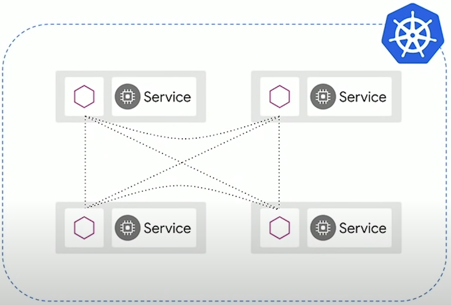

### What is a Service Mesh?
    *"A service mesh provides a **transparent** and **language-independent** way to flexibly and easily **automate** application network functions."*

    Service Mesh pictures all of your workloads running on a platform, such as Kubernetes.

    Service mesh lives on top of your workloads through a set of proxies, that allows you to manage network interactions in a very consistent way and it does not modify your workload.

    This is what a service mesh is at a high level. There are multiple open-source service mesh tools out there and **ISTIO** is one of them.

    For more info check out this [page](https://istio.io/latest/about/service-mesh/).

### How ISTIO Works?
    ISTIO works through a set of sidecar proxies. Those sidecar proxies are the data plane. So in this example, we have a set of pods, and inside of each pod, we have two containers. So those containers can talk to each other over local host.

    

    And what happens is you use Istio to inject proxies into your workloads. And then all subsequent traffic, inbound and outbound, goes through those proxies.
 
    Istio configures these proxies using rules that you give it to do very customizable things with Envoy.
 
    One key thing to note here is that Istio installs its API on Kubernetes as CRDs. So what this means is that you can interact with your Istio policies, and your rules using kubectl using Kubernetes native tooling.
