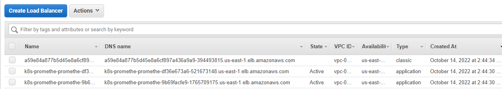
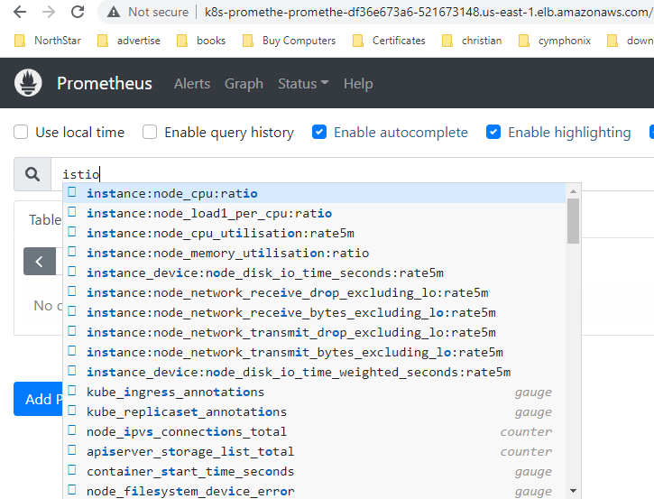
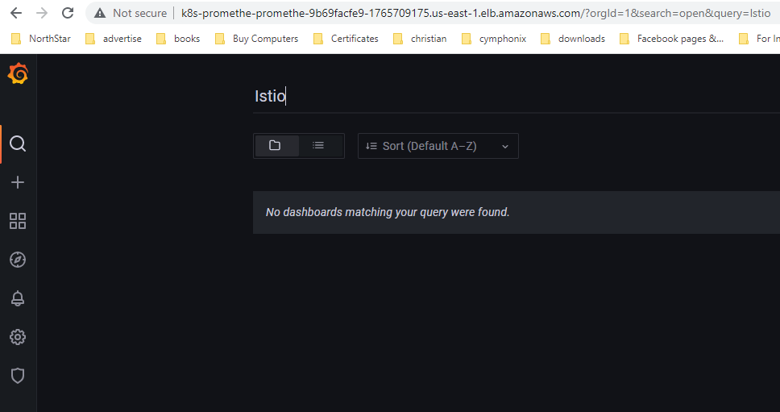

After creating your cluster with the default addons that comes with the EKS Blueprints module example [`eks-cluster-with-new-vpc`](https://github.com/aws-ia/terraform-aws-eks-blueprints/tree/main/examples/eks-cluster-with-new-vpc), you can enable or disable whatever addon you need, as long as it has a module for it under the directory [modules/kubernetes-addons](https://github.com/aws-ia/terraform-aws-eks-blueprints/tree/main/modules/kubernetes-addons). You can ALSO create your own addon module, if there is no existing module already for it in the repository.

Now, let's enable the addons `tetrate_istio` and `prometheus` addon using EKS Blueprints that we'll need throughout this chapter.

Go into the module example directory if you are not there already, and open the *`main.tf`* file for editing. 

```shell
cd examples/eks-cluster-with-new-vpc/
vi main.tf 
```
Add the follwoing two lines under the `eks_blueprints_kubernetes_addons` to enable istio and prometheus on your cluster 

```yaml
  enable_tetrate_istio                = true
  enable_prometheus                   = true
```

Like so:
```yaml
module "eks_blueprints_kubernetes_addons" {
  source = "../../modules/kubernetes-addons"
  ...

  # Add-ons
  enable_aws_load_balancer_controller = true
  ...

  enable_tetrate_istio                = true
  enable_prometheus                   = true

  tags = local.tags
}
```

Now, we need to configure the Prometheus module to use the Helm chart `kube-prometheus-stack` to enable Prometheus instead of the helm chart `prometheus`. That's becaue the chart `kube-prometheus-stack` installs Prometheus, in addition to Grafana and Prometheus-Operator that provides CRDs like ServiceMonitor and PodMonitor, which you are going to use in the next section for exposing ISTIO metrics to Prometheus.

The chart `prometheus` does not include those additional services. We also need to change the chart version to `35.3.1`

To do so, open the *main.tf* file of the prometheus module located under *modules/kubernetes-addons/prometheus/*, and change the `chart` and `version` values under the helm_config section of the module `helm_addon`. In addition, replace the sub-value `operating_system` with `ingressClassName` as follow:

```shell
cd ../../modules/kubernetes-addons/prometheus/
vi main.tf
```
```yaml
# module "helm_addon" {
module "helm_addon" {
  ...
  helm_config = merge(
    {
      name        = local.name
      chart       = "kube-prometheus-stack" 
      version     = "35.3.1" 
      repository  = "https://prometheus-community.github.io/helm-charts"
      namespace   = local.namespace_name
      description = "Prometheus helm Chart deployment configuration"
      values = [templatefile("${path.module}/values.yaml", {
        #operating_system = try(var.helm_config.operating_system, "linux")      # Remove this line
        ingressClassName = "alb"
      })]
    },
    var.helm_config
  )

...
}
```

You install this chart with the default values, except the following values that you set to expose Grafana and Prometheus services using ALB.

To do so, you create a *values.yaml* file in the directory of the prometheus module, in the following path */modules/kubernetes-addons/prometheus/*, which is the path that is already referenced in the `values` attribute under `helm_config` under module `helm_addon` in main.tf file (located in the prometheus module directory). 

```yaml
cat <<EOF > values.yaml
grafana:
  ingress:
    ## If true, Grafana Ingress will be created
    enabled: true

    ## IngressClassName for Grafana Ingress should be provided if Ingress is enable.
    ingressClassName: ${ingressClassName} 

    ## Annotations for Grafana Ingress
    annotations: {
      alb.ingress.kubernetes.io/scheme: "internet-facing",
      alb.ingress.kubernetes.io/target-type: "ip"       
      }
    pathType: Prefix 

prometheus:
  ingress:
    enabled: true
    ingressClassName: ${ingressClassName} 
    annotations: {
      alb.ingress.kubernetes.io/scheme: "internet-facing",
      alb.ingress.kubernetes.io/target-type: "ip"       
      }
    pathType: Prefix 
EOF
```

> **_Note:_**  
You may need to set values differently when running it in production. For a full list of values check this [values.yaml](https://raw.githubusercontent.com/prometheus-community/helm-charts/main/charts/kube-prometheus-stack/values.yaml) that holds the default values that this chart has.

Next step, is to add the following value to the locals values in *locals.tf* located in *modules/kubernetes-addons/aws-load-balancer-controller/*, to enable creating ingress class resources which is needed to create the ALB of Grafana and Prometheus. 

```shell
vi ../aws-load-balancer-controller/locals.tf
```
```yaml
locals {
    ...
    {
      name  = "createIngressClassResource"
      value = true
    }
    ...
}
```

Now you are all set to apply the resources of ISTIO and Prometheus to your EKS cluster
```shell
terraform apply
```

Wait for the resources to get applied to your cluster, and then you should be able seeing 
the services and pods of ISTIO and Prometheus in their respective namespaces.

```shell
kubectl get po,svc -n istio-system
```

Output:
```shell
NAME                                        READY   STATUS    RESTARTS   AGE
pod/istio-cni-node-5sb65                    1/1     Running   0          61s
pod/istio-cni-node-jxqs7                    1/1     Running   0          61s
pod/istio-cni-node-k226f                    1/1     Running   0          61s
pod/istio-ingressgateway-5fc9f486fc-jt748   1/1     Running   0          42s
pod/istiod-776dbc9dc-7js84                  1/1     Running   0          55s

NAME                           TYPE           CLUSTER-IP      EXTERNAL-IP                                                              PORT(S)                                      AGE
service/istio-ingressgateway   LoadBalancer   172.20.72.194   a59e84a877b5d45e8a6cf897a436a9a9-394493815.us-east-1.elb.amazonaws.com   15021:31196/TCP,80:32305/TCP,443:31608/TCP   42s
service/istiod                 ClusterIP      172.20.51.28    <none>                                                                   15010/TCP,15012/TCP,443/TCP,15014/TCP        56s
```

Enabling Istio will create a classic load balancer for Istio Ingress gateway as you notice in the preceeding output.

```shell
kubectl get po,svc -n prometheus
```

Output:
```shell
NAME                                                         READY   STATUS    RESTARTS   AGE
pod/alertmanager-prometheus-kube-prometheus-alertmanager-0   2/2     Running   0          56s
pod/prometheus-grafana-69cd67cb67-mc6p9                      3/3     Running   0          60s
pod/prometheus-kube-prometheus-operator-6794f987b-55ft8      1/1     Running   0          60s
pod/prometheus-kube-state-metrics-94f76f559-lbgr4            1/1     Running   0          60s
pod/prometheus-prometheus-kube-prometheus-prometheus-0       2/2     Running   0          56s
pod/prometheus-prometheus-node-exporter-pz8p5                1/1     Running   0          60s
pod/prometheus-prometheus-node-exporter-qdgjs                1/1     Running   0          60s
pod/prometheus-prometheus-node-exporter-vffgh                1/1     Running   0          60s

NAME                                              TYPE        CLUSTER-IP       EXTERNAL-IP   PORT(S)                      AGE
service/alertmanager-operated                     ClusterIP   None             <none>        9093/TCP,9094/TCP,9094/UDP   56s
service/prometheus-grafana                        ClusterIP   172.20.160.55    <none>        80/TCP                       60s
service/prometheus-kube-prometheus-alertmanager   ClusterIP   172.20.211.50    <none>        9093/TCP                     60s
service/prometheus-kube-prometheus-operator       ClusterIP   172.20.58.96     <none>        443/TCP                      60s
service/prometheus-kube-prometheus-prometheus     ClusterIP   172.20.4.219     <none>        9090/TCP                     60s
service/prometheus-kube-state-metrics             ClusterIP   172.20.87.244    <none>        8080/TCP                     60s
service/prometheus-operated                       ClusterIP   None             <none>        9090/TCP                     56s
service/prometheus-prometheus-node-exporter       ClusterIP   172.20.180.230   <none>        9100/TCP                     60s
```

Enabling Prometheus will create an application load balancer (ALB) for Promethes and Grafana, because that what we have passed to the helm chart to set while Installing the `kube-prometheus-stack` helm chart.




Test accessing the loadbalancer endpoint of Prometheus which should be up and running and then check if you can Istio metrics. It should show no Istio metrics yet, which would show  in the next section ***Integrating Prometheus/Grafana with ISTIO***.




Test accessing the loadbalancer endpoints of Grafana oging to Grafana with the follwoing default credential (username: `admin` and password: `prom-operator`). Rememeber to change those default credentilas. 

Grafana should be up and running. Check for ISTIO dashboards. It should show no Istio dashbpards yet, which would show  in the next section ***Integrating Prometheus/Grafana with ISTIO***. 



Next step, we need to expose ISTIO metrics to Pometheus.


