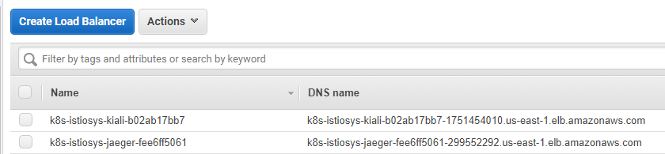
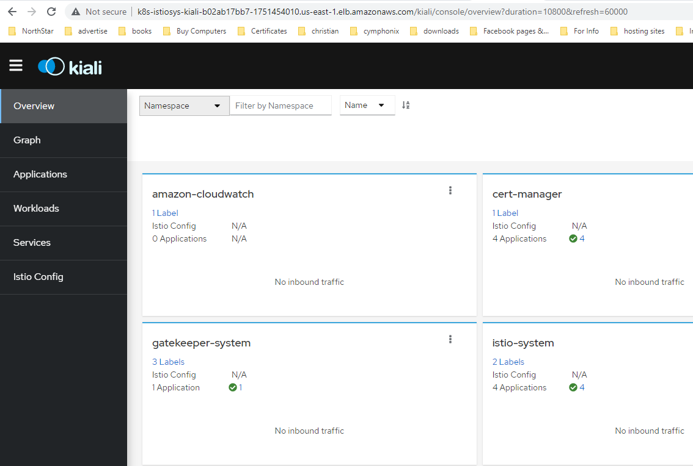
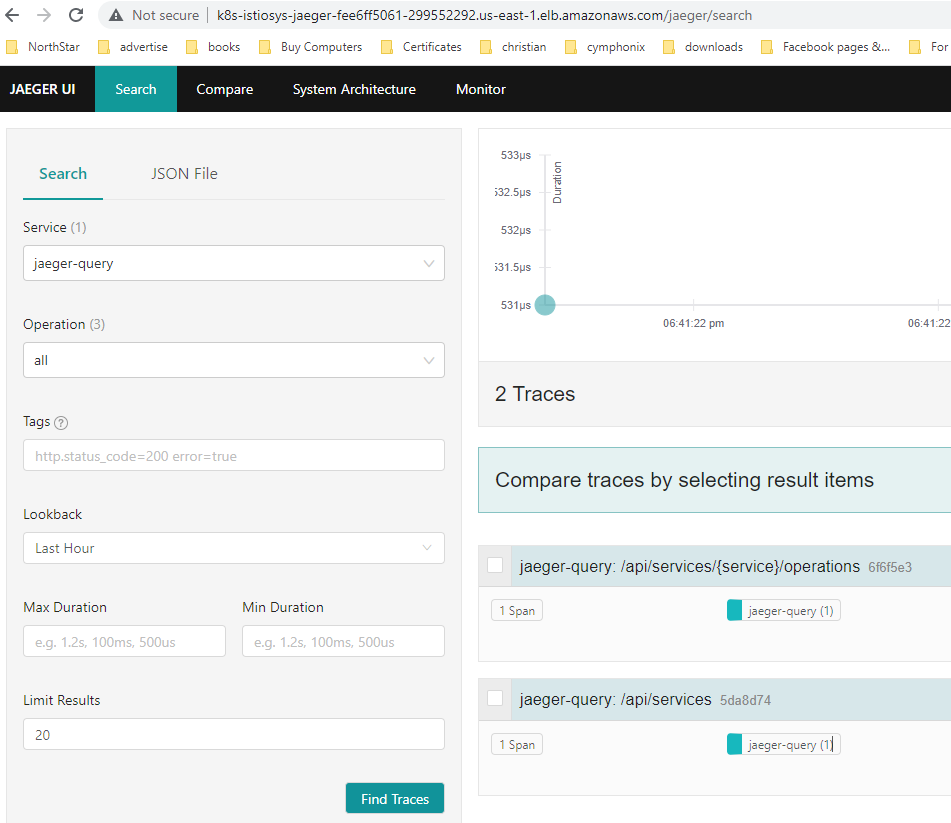

### What is Kiali?
Kiali is an observability console for Istio with service mesh configuration and validation capabilities. It helps you understand the structure and health of your service mesh by monitoring traffic flow to infer the topology and report errors. Kiali provides detailed metrics and a basic Grafana integration, which can be used for advanced queries. Distributed tracing is provided by integration with Jaeger.

To install Kilai run the following command:
```shell
curl -o ./kiali.yaml https://raw.githubusercontent.com/istio/istio/master/samples/addons/kiali.yaml
```

After downloading it, open it for editing and define the `external_services` section as follow for the `configMap` *Kiali* under `config.yaml: |`. Here you are defining the namespace of Istio, the url endpoint of Grafana and Prometheus.

```yaml
apiVersion: v1
kind: ConfigMap
metadata:
  name: kiali
  namespace: istio-system
...
data:
  config.yaml: |
    external_services:
      custom_dashboards:
        enabled: true
      istio:
        root_namespace: istio-system
      grafana:
        # Grafana service name is "prometheus-grafana" and is in the "prometheus" namespace, running on port 80.   
        url: "http://prometheus-grafana.prometheus:80/"
        in_cluster_url:        
      prometheus:
        # Prometheus service name is "prometheus-kube-prometheus-prometheus" and is in the "prometheus" namespace, running on port 9090. 
        url: "http://prometheus-kube-prometheus-prometheus.prometheus:9090/"   
        cache_enabled: true
        # Per-query expiration in seconds
        cache_duration: 10
        # Global cache expiration in seconds. Think of it as
        # the "reset" or "garbage collection" interval.
        cache_expiration: 300   
...
```
Save changes, and apply it to your cluster.
```shell
kubectl apply -f ./kiali.yaml
```

### What is Jager?
Jaeger is an open source end to end distributed tracing system, allowing users to monitor and troubleshoot transactions in complex distributed systems.

To install Jaeger run the following command:
```shell
kubectl apply -f https://raw.githubusercontent.com/istio/istio/master/samples/addons/jaeger.yaml
```

Now, we need to expose both Jager and Kiali services on AWS with ALB. To do that we create the following two ingress resources.
```yaml
kubectl apply -f - <<EOF
apiVersion: networking.k8s.io/v1
kind: Ingress
metadata:
  annotations:
    alb.ingress.kubernetes.io/scheme: internet-facing
    alb.ingress.kubernetes.io/target-type: ip
  name: kiali
  namespace: istio-system
spec:
  ingressClassName: alb
  rules:
  - http:
      paths:
      - backend:
          service:
            name: kiali
            port:
              number: 20001
        path: /
        pathType: Prefix
---
apiVersion: networking.k8s.io/v1
kind: Ingress
metadata:
  annotations:
    alb.ingress.kubernetes.io/scheme: internet-facing
    alb.ingress.kubernetes.io/target-type: ip
  name: jaeger
  namespace: istio-system
spec:
  ingressClassName: alb
  rules:
  - http:
      paths:
      - backend:
          service:
            name: tracing
            port:
              number: 80
        path: /
        pathType: Prefix
EOF
```

Wait a minute or so for AWS to provision an ALB for Kiali and Jaeger, and then browse the dns name of each one.


Kiali:



Jaeger:

