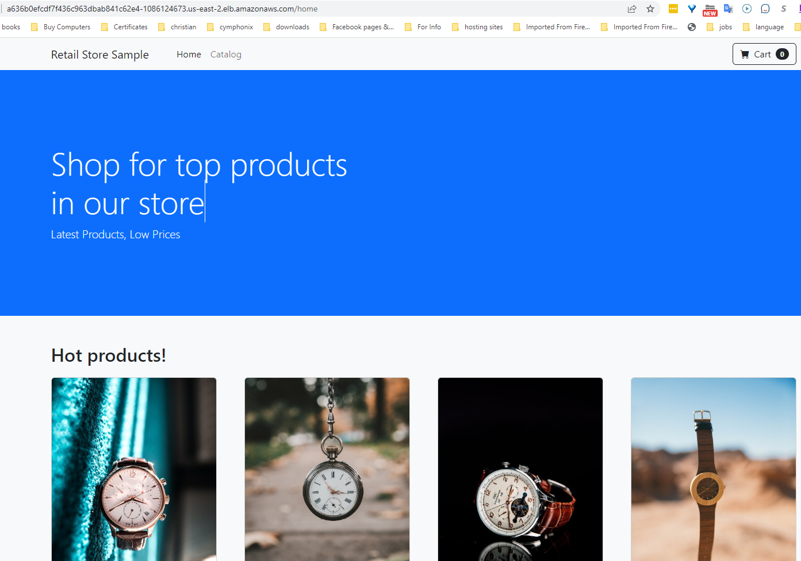

It's common for us to use a Kubernetes Ingress to access an internal kubernetes service from the outside. In this module, you configure the traffic to enter through an Istio ingress gateway, in order to apply Istio control on traffic to your microservices.


By default, Kubernetes services running in namespaces managed by the Istio service mesh are not exposed outside the cluster. For the Kubernetes service you want to expose externally, you must deploy an Istio Ingress Gateway as a LoadBalancer for it, and then define an Istio VirtualService with the necessary routes. Let's see how that works.

### Enable Istio in a Namespace
You must manually enable Istio in each namespace that you want to track or control with Istio. When Istio is enabled in a namespace, the Envoy sidecar proxy is injected into all new workloads deployed in that namespace. 

This namespace setting will only affect new workloads in the namespace. Any preexisting workloads will need to be re-deployed to leverage the sidecar auto injection.

Assuming that you have deployed the example application as explained in the Introduction module, in the [Getting started](../../introduction/getting-started.md) section. Each microservice is deployed to its own separate Namespace to provide some degree of isolation.

Now you need to get the list of namespaces specific to this example app:
```bash
$ kubectl get namespaces -l app.kubernetes.io/created-by=eks-workshop
```
Output:
```bash
NAME       STATUS   AGE
activemq   Active   5m55s
assets     Active   5m54s
carts      Active   5m54s
catalog    Active   5m54s
checkout   Active   5m54s
orders     Active   5m54s
other      Active   5m54s
ui         Active   5m54s
```

Now let's label those namespaces to automatically inject Envoy sidecar proxy into all pods going to run into those namespaces.
```bash
$ kubectl label namespace -l app.kubernetes.io/created-by=eks-workshop istio-injection=enabled
```

#### Verifying it:
To verify that automatic Istio sidecar injection is enabled, you need to delete the existing deployment pods in those namespaces and then they will be redeployed automatically by Kubernetes.

But before deleting them, if you listed pods into those namespaces you will notice that each pod has only one (1/1) container
```bash
$ kubectl get pod -l app.kubernetes.io/created-by=eks-workshop -A
```

Output:
```bash
NAMESPACE   NAME                              READY   STATUS    RESTARTS        AGE
assets      assets-7bd57dbfcc-gwctg           1/1     Running   0               6m31s
carts       carts-789498bdbd-8g67x            1/1     Running   0               6m31s
carts       carts-dynamodb-cc5bf4649-kxpn4    1/1     Running   0               6m31s
catalog     catalog-7c5d554d84-gt9pg          1/1     Running   2 (6m27s ago)   6m31s
catalog     catalog-mysql-0                   1/1     Running   0               6m31s
checkout    checkout-66b6dcbc45-rz969         1/1     Running   0               6m31s
checkout    checkout-redis-6cfd7d8787-82pjq   1/1     Running   0               6m31s
orders      orders-59b94995cf-z6q5n           1/1     Running   1 (6m24s ago)   6m31s
orders      orders-mysql-745b5b57c6-qvbgz     1/1     Running   0               6m31s
ui          ui-795bd46545-8nm9g               1/1     Running   0               6m31s
```

Now, let's redeploy them again by deleting them
```bash
$ kubectl delete pod -l app.kubernetes.io/created-by=eks-workshop -A
```

Now, if you get pods running, you will see 2 containers running per pod. That's because the Envoy proxy container has been injected automatically to all of them. This envoy proxy container has not been defined in the manifest files used to deply the pods of those apps.  

```bash
$ kubectl get pod -l app.kubernetes.io/created-by=eks-workshop -A
```
Output:
```bash
NAMESPACE   NAME                              READY   STATUS             RESTARTS     AGE
assets      assets-7bd57dbfcc-kt6c8           2/2     Running            0            8s
carts       carts-789498bdbd-rmcgh            2/2     Running            0            8s
carts       carts-dynamodb-cc5bf4649-h4njf    2/2     Running            0            8s
catalog     catalog-7c5d554d84-r68w5          1/2     CrashLoopBackOff   1 (5s ago)   8s
catalog     catalog-mysql-0                   2/2     Running            0            6s
checkout    checkout-66b6dcbc45-jkrt2         2/2     Running            0            8s
checkout    checkout-redis-6cfd7d8787-m7mzj   2/2     Running            0            8s
orders      orders-59b94995cf-mdx9z           1/2     Running            0            8s
orders      orders-mysql-745b5b57c6-8zhhw     2/2     Running            0            8s
ui          ui-795bd46545-hvsjs               2/2     Running            0            8s
```
**_Note:_**

If you need to **exclude** a workload from getting injected with the Istio sidecar, use the following annotation on the workload (deployment/pod):
```yaml
sidecar.istio.io/inject: “false”
```

### Expose a service
The service type of all services deployed with this example app are ClusterIP, which means that they can only be seen into the cluster. Now, we need to be able accessing the `ui` app externally. 

If you listed the `ui` service into the `ui` namespace, you will notice that the service type is ClusterIP, as you can see. 

```bash
$ kubectl get svc -n ui
```
Output:
```bash
NAME   TYPE        CLUSTER-IP    EXTERNAL-IP   PORT(S)   AGE
ui     ClusterIP   172.20.84.8   <none>        80/TCP    8m1s
```

How we can expose a service outside the cluster? Let's see how we can do that with the `ui` service.

To do so you define two Istio resources, `Gateway` and `VirtualService` into the namespace `ui`.
Gateway configurations are applied to standalone Envoy proxies that are running at the edge of the mesh. 

The two manifests to this lab can be deployed with the below command:
```bash
kubectl apply -k workspace/manifests/servicemesh/20-traffic-management/30-expose-a-service
```

```
/workspace/manifests/servicemesh/20-traffic-management/30-expose-a-service/ui-gateway.yaml
```
```bash
apiVersion: networking.istio.io/v1alpha3
kind: Gateway
metadata:
  name: ui-gateway
spec:
  selector:  
    istio: ingressgateway 
  servers: 
  - port:
      number: 80 
      name: http
      protocol: HTTP   
    hosts: # The addresses that can be used by a client when attempting to connect to a service.
    - "*"
```
Here we point to the default istio `ingressgateway` proxy service running in `istio-system` namespace to expose the service throug the AWS ELB created for this ingress gateway.

This gateway is a loadbalancer that listens or accept incoming traffic on port 80 that uses HTTP protocol (could be HTTP,HTTPS,GRPC,HTTP2,MONGO or TCP)

This gateway configuration here, allows clients to connect on port 80 and to use any address (*) when attemting to connect to a service

The gateway here, does not specify any traffic routing rules for the kuberenets service ***ui***. To make the gateway work as intended, you must also create a virtual service that defines traffic routing rules for the intended kuberenets service ***ui*** and bind it to the gateway.

```
/workspace/manifests/servicemesh/20-traffic-management/30-expose-a-service/ui-virtualservice.yaml
```
```bash
apiVersion: networking.istio.io/v1alpha3
kind: VirtualService
metadata:
  name: ui
spec:
  hosts:
  - "*"

  gateways:
  - ui-gateway 
  
  http:
  - match:
    - uri:
        prefix: /
    route:
    - destination:
        # Provide the destination service name using either a relative or an absolute path.
        host: ui # ui.ui.svc.cluster.local 
        port:
          number: 80
```

In VirtualService, you can define the routing rules for the external traffic.

In this example, traffic will be directed to the `destination` service, if it meets any of the listed rules. For instance, they will be directed to the destination service *ui* if the uri provided was */home, */catalog*, etc.

The `hosts` field contains a list of the destinations/addresses that the client uses when sending requests to the service where routing rules listed below apply.

As in this example, you can make a single set of routing rules that apply to all matching services by using wildcard ("*") prefixes under `hosts`.

To make the gateway to work as intended with those routing rules, you must bind/link this virtual service resource to the gateway resource name **ui-gateway** you created in the previous step. 

**_Note:_**

Under `hosts` attribue in *Gateway* and *virtualService* resources, you can remove "*", and only allow the dns name of the **istio-ingressgateway** servcie running in istio-ststem namespace, which is the AWS LB dns name that Istio created during the installation of Istio. Or to only allow dns cname/alias records (in Route53 for example) pointing to the dns name of the **istio-ingressgateway** servcie. Check this [page](https://istio.io/v1.14/docs/tasks/traffic-management/ingress/ingress-control/#determining-the-ingress-ip-and-ports) for more info.

#### Verify it:
Let's verify that the service has been exposed as intended with the routing rules that have been set.

Because the gateway we created is binded to the **istio-ingressgateway** service running in **istio-system** namespace, you can reach the endpoint of this gateway using the same domain name of the AWS ELB that Istio created for this istio-ingressgateway service. Let's see how that works?


Execute the following command to the dns hostname of the AWS load balancer of the **istio-ingressgateway** service, and then assign it to an environment variable.
```bash
$ export ISTIO_IG_HOSTNAME=$(kubectl -n istio-system get service istio-ingressgateway -o jsonpath='{.status.loadBalancer.ingress[0].hostname}')
$ echo $ISTIO_IG_HOSTNAME
```
Output:
```bash
ac8bed13fd78247e995b42664063ce47-1403049919.us-east-1.elb.amazonaws.com
```
Remember, the gateway you created earlier is exposed through this istio-ingressgateway service which is in turn exposed through an AWS Loadbalancer, and the destination service of the virtualService you created was *home* 

So to access it, we hit the same dns name of the istio-ingressgateway loadbalancer, by using the path */home*

```bash
$ curl -s $ISTIO_IG_HOSTNAME/home | grep "Retail Store Sample App"
```
Output:
```bash
        <title>Retail Store Sample App</title>
...
```
You can also test accessing the page using the browser:


**Congratulations!** By reaching this point, you have successfully exposed the kubernetes service **ui** externally through the Istio ingress gateway.