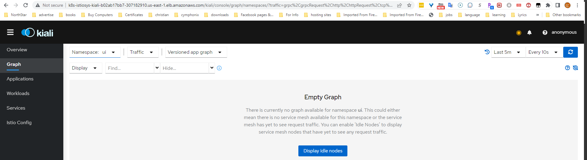

One of the *Retail Store*'s services is *ui*. At the time being, we only have one deployment version for the *ui* service. 

To practice this lab, you need to have mutiple deployment of a service, and you will do that with the *ui* service.

```bash
$ kubectl delete deployment ui -n ui 
$ kubectl apply -n ui -f - <<EOF
apiVersion: apps/v1
kind: Deployment
metadata:
  name: ui-v1
  labels:
    app.kubernetes.io/created-by: eks-workshop
    app.kubernetes.io/type: app
    version: ui-v1
spec:
  replicas: 1
  selector:
    matchLabels:
      app.kubernetes.io/name: ui
      app.kubernetes.io/instance: ui
      app.kubernetes.io/component: service
  template:
    metadata:
      annotations:
        prometheus.io/path: /actuator/prometheus
        prometheus.io/port: "8080"
        prometheus.io/scrape: "true"
      labels:
        app.kubernetes.io/name: ui
        app.kubernetes.io/instance: ui
        app.kubernetes.io/component: service
        app.kubernetes.io/created-by: eks-workshop
        version: ui-v1
    spec:
      serviceAccountName: ui
      securityContext:
        fsGroup: 1000
      containers:
        - name: ui
          env:
            - name: JAVA_OPTS
              value: -XX:MaxRAMPercentage=75.0 -Djava.security.egd=file:/dev/urandom
            - name: RETAIL_UI_BANNER
              valueFrom:
                fieldRef:
                  fieldPath: metadata.name
          envFrom:
            - configMapRef:
                name: ui
          securityContext:
            capabilities:
              add:
              - NET_BIND_SERVICE
              drop:
              - ALL
            readOnlyRootFilesystem: true
            runAsNonRoot: true
            runAsUser: 1000
          image: "public.ecr.aws/aws-containers/retail-store-sample-ui:latest"
          imagePullPolicy: IfNotPresent
          ports:
            - name: http
              containerPort: 8080
              protocol: TCP
          livenessProbe:
            httpGet:
              path: /actuator/health/liveness
              port: 8080
            initialDelaySeconds: 45
            periodSeconds: 20
          resources:
            limits:
              memory: 1.5Gi
            requests:
              cpu: 250m
              memory: 1.5Gi
          volumeMounts:
            - mountPath: /tmp
              name: tmp-volume
      volumes:
        - name: tmp-volume
          emptyDir:
            medium: Memory

---

apiVersion: apps/v1
kind: Deployment
metadata:
  name: ui-v2
  labels:
    app.kubernetes.io/created-by: eks-workshop
    app.kubernetes.io/type: app
    version: ui-v2
spec:
  replicas: 1
  selector:
    matchLabels:
      app.kubernetes.io/name: ui
      app.kubernetes.io/instance: ui
      app.kubernetes.io/component: service
  template:
    metadata:
      annotations:
        prometheus.io/path: /actuator/prometheus
        prometheus.io/port: "8080"
        prometheus.io/scrape: "true"
      labels:
        app.kubernetes.io/name: ui
        app.kubernetes.io/instance: ui
        app.kubernetes.io/component: service
        app.kubernetes.io/created-by: eks-workshop
        version: ui-v2
    spec:
      serviceAccountName: ui
      securityContext:
        fsGroup: 1000
      containers:
        - name: ui
          env:
            - name: JAVA_OPTS
              value: -XX:MaxRAMPercentage=75.0 -Djava.security.egd=file:/dev/urandom
            - name: RETAIL_UI_BANNER
              valueFrom:
                fieldRef:
                  fieldPath: metadata.name
          envFrom:
            - configMapRef:
                name: ui
          securityContext:
            capabilities:
              add:
              - NET_BIND_SERVICE
              drop:
              - ALL
            readOnlyRootFilesystem: true
            runAsNonRoot: true
            runAsUser: 1000
          image: "public.ecr.aws/aws-containers/retail-store-sample-ui:latest"
          imagePullPolicy: IfNotPresent
          ports:
            - name: http
              containerPort: 8080
              protocol: TCP
          livenessProbe:
            httpGet:
              path: /actuator/health/liveness
              port: 8080
            initialDelaySeconds: 45
            periodSeconds: 20
          resources:
            limits:
              memory: 1.5Gi
            requests:
              cpu: 250m
              memory: 1.5Gi
          volumeMounts:
            - mountPath: /tmp
              name: tmp-volume
      volumes:
        - name: tmp-volume
          emptyDir:
            medium: Memory
---
apiVersion: apps/v1
kind: Deployment
metadata:
  name: ui-v3
  labels:
    app.kubernetes.io/created-by: eks-workshop
    app.kubernetes.io/type: app
    version: ui-v3
spec:
  replicas: 1
  selector:
    matchLabels:
      app.kubernetes.io/name: ui
      app.kubernetes.io/instance: ui
      app.kubernetes.io/component: service
  template:
    metadata:
      annotations:
        prometheus.io/path: /actuator/prometheus
        prometheus.io/port: "8080"
        prometheus.io/scrape: "true"
      labels:
        app.kubernetes.io/name: ui
        app.kubernetes.io/instance: ui
        app.kubernetes.io/component: service
        app.kubernetes.io/created-by: eks-workshop
        version: ui-v3
    spec:
      serviceAccountName: ui
      securityContext:
        fsGroup: 1000
      containers:
        - name: ui
          env:
            - name: JAVA_OPTS
              value: -XX:MaxRAMPercentage=75.0 -Djava.security.egd=file:/dev/urandom
            - name: RETAIL_UI_BANNER
              valueFrom:
                fieldRef:
                  fieldPath: metadata.name
          envFrom:
            - configMapRef:
                name: ui
          securityContext:
            capabilities:
              add:
              - NET_BIND_SERVICE
              drop:
              - ALL
            readOnlyRootFilesystem: true
            runAsNonRoot: true
            runAsUser: 1000
          image: "public.ecr.aws/aws-containers/retail-store-sample-ui:latest"
          imagePullPolicy: IfNotPresent
          ports:
            - name: http
              containerPort: 8080
              protocol: TCP
          livenessProbe:
            httpGet:
              path: /actuator/health/liveness
              port: 8080
            initialDelaySeconds: 45
            periodSeconds: 20
          resources:
            limits:
              memory: 1.5Gi
            requests:
              cpu: 250m
              memory: 1.5Gi
          volumeMounts:
            - mountPath: /tmp
              name: tmp-volume
      volumes:
        - name: tmp-volume
          emptyDir:
            medium: Memory
EOF
```
now you have three different versions for the ui service.
```bash
$ kubectl get deployment,pod -n ui
```
Output:
```bash
NAME                    READY   UP-TO-DATE   AVAILABLE   AGE
deployment.apps/ui-v1   1/1     1            1           4h6m
deployment.apps/ui-v2   1/1     1            1           4h5m
deployment.apps/ui-v3   1/1     1            1           81s

NAME                         READY   STATUS    RESTARTS   AGE
pod/ui-v1-5b476c4744-28ghv   2/2     Running   0          4h4m
pod/ui-v2-5b476c4744-q6sxx   2/2     Running   0          4h4m
pod/ui-v3-5b476c4744-ptw94   2/2     Running   0          81s
```

Now, you have the *ui* comes in three different pod versions, which are created from three separate deployments. All versions labeled with following labels, which are used with the selector of the *ui** service.

      app.kubernetes.io/component: service
      app.kubernetes.io/instance: ui
      app.kubernetes.io/name: ui

```bash
$ kubectl get pods -n ui -l app.kubernetes.io/name=ui
```
Output:
```bash
NAME                     READY   STATUS    RESTARTS   AGE
ui-v1-5b476c4744-28ghv   2/2     Running   0          4h12m
ui-v2-5b476c4744-q6sxx   2/2     Running   0          4h12m
ui-v3-5b476c4744-ptw94   2/2     Running   0          9m5s
```

As a result, when you hit the home page, kubernetes will just distribute traffic equally to all versions as you see in the output of the following loop command. 
```bash
$ for i in {1..6}; do curl -s $ISTIO_IG_HOSTNAME/home | grep "ui-v" & sleep 1; done
```

Output:
```bash
[1] 1926
          <div class="container" style="text-align: center">ui-v2-5b476c4744-q6sxx</div>
[1]+  Done                    curl -s $ISTIO_IG_HOSTNAME/home | grep --color=auto "ui-v"
[1] 2025
          <div class="container" style="text-align: center">ui-v2-5b476c4744-q6sxx</div>
[1]+  Done                    curl -s $ISTIO_IG_HOSTNAME/home | grep --color=auto "ui-v"
[1] 2030
          <div class="container" style="text-align: center">ui-v1-5b476c4744-28ghv</div>
[1]+  Done                    curl -s $ISTIO_IG_HOSTNAME/home | grep --color=auto "ui-v"
[1] 2040
          <div class="container" style="text-align: center">ui-v1-5b476c4744-28ghv</div>
[1]+  Done                    curl -s $ISTIO_IG_HOSTNAME/home | grep --color=auto "ui-v"
[1] 2095
          <div class="container" style="text-align: center">ui-v1-5b476c4744-28ghv</div>
[1]+  Done                    curl -s $ISTIO_IG_HOSTNAME/home | grep --color=auto "ui-v"
[1] 2113
          <div class="container" style="text-align: center">ui-v3-5b476c4744-ptw94</div>
[1]+  Done                    curl -s $ISTIO_IG_HOSTNAME/home | grep --color=auto "ui-v"
```

Now, let's open **Kiali**. Get the DNS name of the AWS ALB of Kilai, then hit it in the browser.


Navigate to *Graph* in the Kiali dashboard. Choose the *ui* namespace next. Then, in the display dropdown, tick the boxes next to "Traffic Animation" and "Traffic Distribution". Finally, set the *Traffic metric per refresh* to **Last 5m**, and the *Refresh interval* to **Every 10s**.

Now, execute the same loop command again for enough time and while the loop is running, check how Kiali shows the distribution of traffic to the 3 pod versions of the reviews service, which should still be almost equally distributed.
```bash
$ for i in {1..300}; do curl -s $ISTIO_IG_HOSTNAME/home | grep "ui-v" & sleep 1; done
```

Wait a minute, and then you will notice that the traffic to the reviews versions are distributed amost equally. 

You now understand the behavior of Kubernetes when distributing traffic to different versions of service backend pods. But the question now is, how to route traffic to each version by percentage of the coming taffic? 


For example, the reviews service backed by 3 different versions. Is it possible to route 80% of traffic to v1, 10% to v2, and 10% to v3?

Yes, you can easily accomplish this with Istio by creating a `VirtualService` that lists the different versions subsets with their weights, and a `DestinationRule` that defines policies that apply to traffic intended for a service after routing has occurred.

Now, each deployment version is labeled with the label `version`, but with a different value. For example deployment of version 1, has the version label defined like this `version=ui-v1`, and deployment of version 2, has the version label defined like this `version=ui-v2`, etc.

For example, if you want to list reviews pods of version 1, run the following command:
```bash
$ kubectl get pod -n ui -l version=ui-v1 | grep ui
```
Output:
```bash
ui-v1-7bdb5d65dc-xpx87   2/2     Running   0          174m
```

Now, let's define a subset per version using a DestinationRule. The label attached to the pods of each version must match the label defined here for each subset.

```bash
kubectl apply -n ui -f - <<EOF
apiVersion: networking.istio.io/v1alpha3
kind: DestinationRule
metadata:
  name: ui
spec:
  host: ui # reviews.<namespace>.svc.cluster.local
  subsets: 
  - name: v1
    labels:
      version: ui-v1 # This is a label attached to the pods of version 1.
  - name: v2
    labels:
      version: ui-v2 # This is a label attached to the pods of version 2.
  - name: v3
    labels:
      version: ui-v3 # This is a label attached to the pods of version 3.
EOF
```


For the weight-based routing to happen, you create a VirtualService where you define a routing rule per version. Weights associated with the version determine the proportion of traffic it receives. For example, the rules defined here will route 80% of traffic for the “ui” service to instances with the “v1” label 10% of traffic for "v2", and the remaining 10% for "v3".

```bash

kubectl apply -n ui -f - <<EOF
apiVersion: networking.istio.io/v1alpha3
kind: VirtualService
metadata:
  name: ui
spec:
  hosts:
  - "*"

  gateways:
  - ui-gateway 
  
  http:
  - match:
    - uri:
        prefix: /  
    route:
    - destination:
        host: ui
        subset: v1
        port:
          number: 80        
      weight: 80 
    - destination:
        host: ui
        subset: v2
        port:
          number: 80        
      weight: 10
    - destination:
        host: ui
        subset: v3
        port:
          number: 80        
      weight: 10

EOF
```

Now, execute the same loop command you executed earlier. 
```bash
$ for i in {1..300}; do curl -s $ISTIO_IG_HOSTNAME/home | grep "ui-v" & sleep 1; done
```

Wait a minute, and then Open Kiali to look at the distribution of traffic to the 3 pod versions of the reviews service, 

This time, the traffic to the reviews versions are distributed following the weight based rules we defined in the VirtualService. 


You can also use this weight-based method to gradually `traffic shifting` from one version to another, or to have `Canary Deployment` to test a newer version of a service by incrementally rolling out to users to minimize the risk and impact of any bugs introduced by the newer version. 
