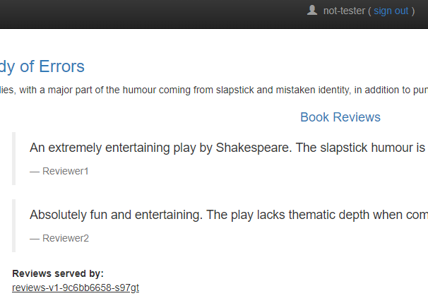

In this task, you use Istio to send 100% of the traffic to `ui-v1`. You then set a rule to selectively send traffic to `ui-v2` based on the cookie ID added to the end-user header request by the UI service. 

Most cookies contain a unique identifier called a cookie ID: a string of characters that websites and servers associate with the browser on which the cookie is stored.

In this case, all traffic from a user with a unique *COOKIE ID=XXX* will be routed to the deployment `ui-v2`, but all remaining user traffic goes to `ui-v1`.

To check which version of the UI traffic is routed to, the grep banner at the of the page should display the pod name which includes the deployment version.

Run the following command to re-configure the virtualService reviews you created in the previous task with the following one to enable user-based routing:

```
/workspace/manifests/ui-identity.yaml
```
```
apiVersion: networking.istio.io/v1alpha3
kind: VirtualService
metadata:
  name: ui
spec:
  hosts:
  - "*"
  gateways:
  - ui-gateway
  http:
  - match:
    - headers:
        cookie:
          regex: "^(.*?;)?(SESSIONID=XXX)(;.*)?$"
    route:
    - destination:
        host: ui
        subset: v2
  - route:
    - destination:
        host: ui
        subset: v1
```

Now, let's open the retail store sample using the browser:
```bash
$ echo $ISTIO_IG_HOSTNAME/home
```
Output:
```bash
http://af08b29901d054f489ffb6473b1593a9-510276527.us-east-1.elb.amazonaws.com/home
```

To check Cookie ID in Chrome: 

  * Right-click and click on Inspect to open the developer console. 
  * Go to the Applications tab on the console. 
  * Expand the Cookies dropdown under the Storage section. 
  * Under Cookies, select the website with Path / to see the Cookie ID


Notice here before logging, that on the grep banner, the displayed page shows `ui-v1` and not `ui-v2`. This is due to the Cookie Session ID assigned to your browser is not `XXX`.

Now, let's see what happens when sending a request over with a Cookie Session ID matching your browser.

Copy the `Session ID` and replace XXX:
```bash
regex: "^(.*?;)?(SESSIONID=XXX)(;.*)?$"
```

Run:
```bash
kubectl apply -k /workspace/manifests/ -n ui
```

Once the browser is refreshed, you will notice that the grep banner on the displayed page will now route to `ui-v2`.


And if you singed out and signed in back with any user other than *tester* (pick any name you wish). You will see that review stars are not there and it shows reviews-v1. This is because traffic is routed to reviews:v1 for all users except tester.



You have successfully configured Istio to route traffic based on user identity.

**Try it out:** Change the routing rule to direct tester user to v1, and remaining traffic to goes to v2.


