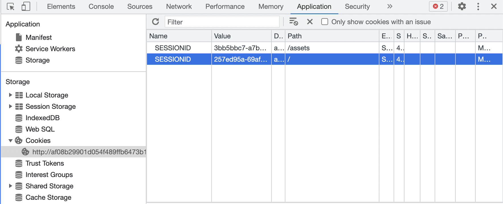

In this task, you use Istio to send 100% of the traffic to `ui-v1`. You then set a rule to selectively send traffic to `ui-v2` based on the cookie ID added to the end-user header request by the UI service. 

Most cookies contain a unique identifier called a cookie ID: a string of characters that websites and servers associate with the browser on which the cookie is stored.

In this case, all traffic from a user with a unique *COOKIE ID=XXX* will be routed to the deployment `ui-v2`, but all remaining user traffic goes to `ui-v1`.

To check which version of the UI traffic is routed to, the grep banner at the top of the page should display the pod name which includes the deployment version.

Now, let's open the retail store sample using the browser:
```bash
$ echo $ISTIO_IG_HOSTNAME/home
```
Output Similar to:
```bash
http://af08b29901d054f489ffb6473b1593a9-510276527.us-east-1.elb.amazonaws.com/home
```

Currently, your virtualservice routes to all 3 versions of the ui.

To check Cookie ID in Chrome: 

  * Right-click and click on Inspect to open the developer console. 
  * Go to the Applications tab on the console. 
  * Expand the Cookies dropdown under the Storage section. 
  * Under Cookies, select the website with Path / to see the SESSION ID


NOTE: Make note of the SESSION ID with Path /. This will be used below.




The following virtualservice manifest file shows how you can create an identity-based route. Now, let's see what happens when sending a request over with a Cookie Session ID matching your browser.

```
/workspace/manifests/ui-identity.yaml
```
```
apiVersion: networking.istio.io/v1alpha3
kind: VirtualService
metadata:
  name: ui
spec:
  hosts:
  - "*"
  gateways:
  - ui-gateway
  http:
  - match:
    - headers:
        cookie:
          regex: "^(.*?;)?(SESSIONID=XXX)(;.*)?$"
    route:
    - destination:
        host: ui
        subset: v2
  - route:
    - destination:
        host: ui
        subset: v1
```

Paste in the `Session ID` and replace XXX in the below line:
```bash
regex: "^(.*?;)?(SESSIONID=XXX)(;.*)?$"
```

Run the following command to configure the virtualService `ui` you created above to enable identity-based routing:

```bash
kubectl apply -k /workspace/manifests/ -n ui
```

Once the browser is refreshed, you will notice that the grep banner on the displayed page will now only route to `ui-v2`.


You have successfully configured Istio to route traffic based on user identity.

**Try it out:** Clear cache and obtain new Cookie ID. The routing rule to direct your traffic to `ui-v2` is longer valid and new traffic is now going to `ui-v1`.


