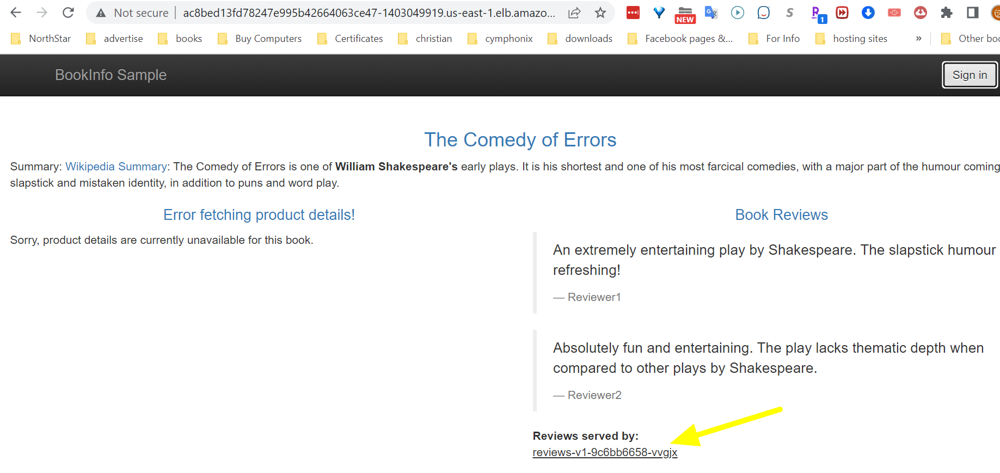
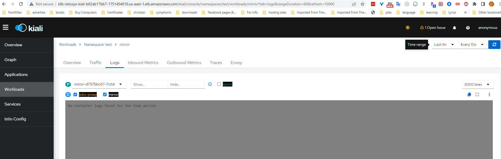
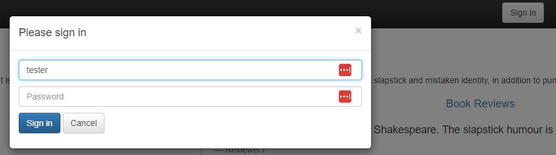
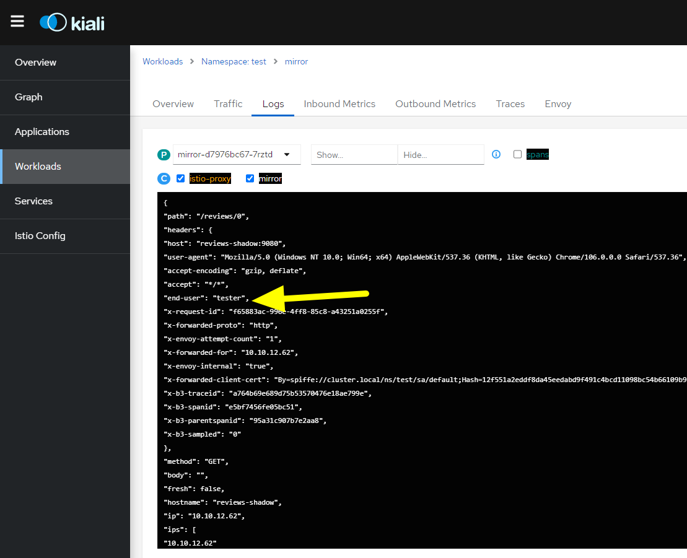

In this task, you will learn how to use the Istio's traffic mirroring capability.

Traffic mirroring is a powerful concept that enables introducing new features/changes into production with the least amount of risk. Mirroring copies live traffic and sends it to a mirrored service. The mirrored traffic occurs outside of the critical request path for the primary service.

In this taks, all traffic will be directed to ui-v1 of the *ui* service, but when logging with the user *tester*, traffic will be routed to ui-v2. You will create a VirtualService rule to force all traffic that go to ui-v2, to be mirrored and directed to a mirror service, which can be helpful for troubleshooting, testing, or monitorization.

Assuming you have the application already deployed with the three versions of the ui service.

```bash
$ kubectl get po -n ui | grep ui
```

Output:
```bash
ui-v1-9c6bb6658-gsf5p       2/2     Running   0          14h
ui-v2-8454bb78d8-qthqq      2/2     Running   0          14h
ui-v3-6dc9897554-894cg      2/2     Running   0          14h
```

Create a DestinationRule to define a subset for the versions available for the ui service
```bash
$ kubectl apply -n test -f - <<EOF
apiVersion: networking.istio.io/v1alpha3
kind: DestinationRule
metadata:
  name: reviews
spec:
  host: reviews # reviews.<namespace>.svc.cluster.local
  subsets: 
  - name: v1
    labels:
      version: v1 # label attached to Pod definition
  - name: v2
    labels:
      version: v2 # label attached to Pod definition
  - name: v3
    labels:
      version: v3 # label attached to Pod definition
EOF
```

Now, let's deploy another application, that you will mirror traffic to, from the reviews service. This application will listen to the HTTP requests and write the contents of the header in the logs.
```bash
$ kubectl apply -n test -f - <<EOF
apiVersion: apps/v1
kind: Deployment
metadata:
  name: mirror
  labels:
    app: mirror
    version: v1
    #app.kubernetes.io/part-of: Mirror
spec:
  replicas: 1
  selector:
    matchLabels:
      app: mirror
  template:
    metadata:
      labels:
        app: mirror
        version: v1
    spec:
      containers:
        - name: mirror
          image: mendhak/http-https-echo
          ports:
            - containerPort: 9080
              protocol: TCP
            - containerPort: 9443
              protocol: TCP
          env:
            - name: HTTP_PORT
              value: '9080'
            - name: HTTPS_PORT
              value: '9443'
EOF
```

Next, configure a service for it
```bash
$ kubectl apply -n test -f - <<EOF
apiVersion: v1
kind: Service
metadata:
  name: mirror
  labels:
    app: mirror
    service: mirror
spec:
  ports:
  - port: 9080
    name: http
  selector:
    app: mirror
EOF
```

Now, we need to mirror the traffic when traffic routed to reviews:v2. Traffic will be routed to reviews:v2 only when logging with the user *tester* 

Create a VirtualService with the following mirroring routing role, which will route all traffic to reviews:v1 by default, but when logging with the user *tester*, the traffic will be routed to reviews:v2 that 100% of it will be mirrored to the mirror service.
```bash
$ kubectl apply -n test -f - <<EOF
apiVersion: networking.istio.io/v1alpha3
kind: VirtualService
metadata:
  name: reviews
spec:
  hosts:
    - reviews
  http:
  - match:
    - headers:
        end-user:
          exact: tester
    route:
    - destination:
        host: reviews
        subset: v2
    mirror:
      host: mirror
    mirror_percent: 100
  - route:
    - destination:
        host: reviews
        subset: v1
EOF
```

As a result of this rule, when you hit the product page, any traffic goes to reviews:v2 will be mirrored to the mirror servcie.


So let's see how it works, by hitting the productpage without logging, and you will notice that the page displays reviews:v1.


Now, let's open **Kiali**. Get the DNS name of the AWS ALB of Kilai, then hit it in the browser.

Navigate to *Workloads* in the Kiali dashboard. Choose the *mirror* pod. Then, hit the *Logs* tab, make sure that the the boxe next to the container "mirror"is ticked. 

Finally, set the *Time Range* to **Last 1m**, and the *Refresh interval* to **Every 10s**.


Notice here in the logs, that there is no traffic yet mirrored to the mirror service, since we did not login yet with the user *tester*.

Now, let's see what happens when logging with the *tester* user to the productpage?

Hit the `Sign In` button, to log in with the `tester` user, with no password:



Then, while logged in as *tester*, refresh the page in the browser to send some requests to the application. The traffic must now be mirrored to the new mirror pod and written into the logs:


So, by mirroring the traffic, you were able to gather information on internal communication without affecting the actual service, and you saw how the forwarded header end-user contains the user variable you logged with and set in the VirtualService rule (end-user: tester).


**__Note__**

You can get those logs of the *mirror* pod using the following kubectl command as well:
```bash
$ kubectl -n test logs $(kubectl get pod -n test -l app=mirror,version=v1 -o jsonpath="{.items[0].metadata.name}") -c mirror -f
```
