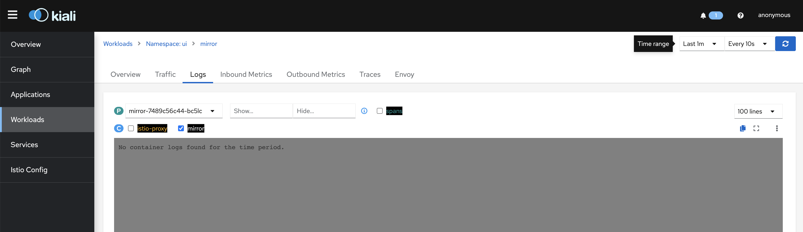
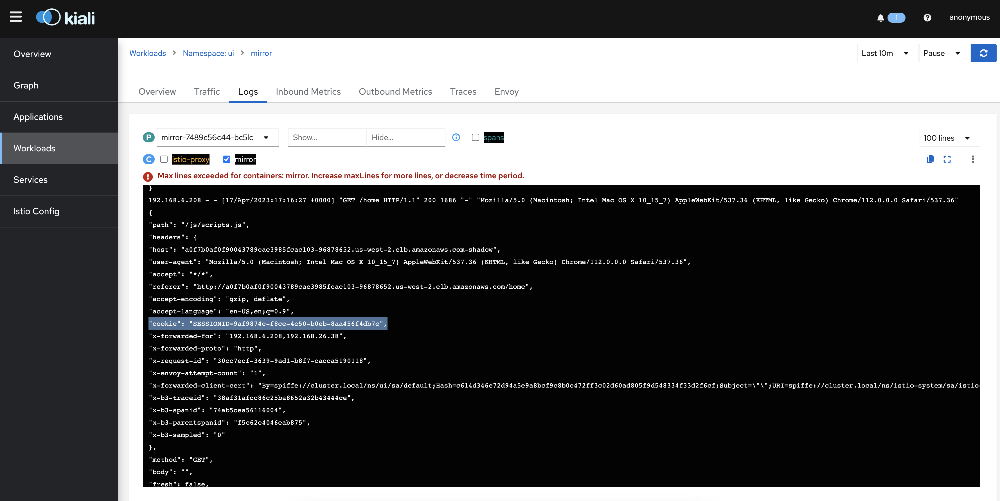

In this task, you will learn how to use the Istio's traffic mirroring capability.

Traffic mirroring is a powerful concept that enables introducing new features/changes into production with the least amount of risk. Mirroring copies live traffic and sends it to a mirrored service. The mirrored traffic occurs outside of the critical request path for the primary service.

In this task, all traffic will be directed to ui-v1 of the *ui* service but a user with a unique SESSION ID=XXX will be routed to the deployment ui-v2. You will create a VirtualService rule to force all traffic that go to ui-v2, to be mirrored and directed to a mirror service, which can be helpful for troubleshooting, testing, or monitorization.

Assuming you have the application already deployed with the three versions of the ui service.

```bash
$ kubectl get po -n ui | grep ui
```

Output:
```bash
ui-v1-9c6bb6658-gsf5p       2/2     Running   0          14h
ui-v2-8454bb78d8-qthqq      2/2     Running   0          14h
ui-v3-6dc9897554-894cg      2/2     Running   0          14h
```


Now, let's define a subset per version using a DestinationRule. The label attached to the pods of each version must match the label defined here for each subset.

```file
/workspace/modules/servicemesh/traffic-management/mirroring/destinationrule.yaml
```

```bash
kubectl apply -k /workspace/modules/servicemesh/traffic-management/mirroring/destinationrule.yaml
```

Now, let's deploy another application, that you will mirror traffic to, from the *ui* service. This application will listen to the HTTP requests and write the contents of the header in the logs.
```file
/workspace/modules/servicemesh/traffic-management/mirroring/deployment-mirror.yaml
```

```bash
kubectl apply -k /workspace/modules/servicemesh/traffic-management/mirroring/deployment-mirror.yaml
```
Next, configure a service for it
```file
/workspace/modules/servicemesh/traffic-management/mirroring/service-mirror.yaml
```

```bash
kubectl apply -k /workspace/modules/servicemesh/traffic-management/mirroring/service-mirror.yaml
```

Now, we need to mirror the traffic when traffic routed to ui-v2. Traffic will be routed to ui-v2 only when accessing with SessionID=XXX

Create a VirtualService with the following mirroring routing role, which will route all traffic to ui-v1 by default, but a user with SessionID=XXX, the traffic will be routed to ui-v2 and 100% of it will be mirrored to the mirror service.
```file
/workspace/modules/servicemesh/traffic-management/mirroring/virtualservice.yaml
```

```bash
kubectl apply -k /workspace/modules/servicemesh/traffic-management/mirroring/virtualservice.yaml
```

As a result of this rule, when you hit the home page, any traffic goes to ui-v2 will be mirrored to the mirror servcie.


So let's see how it works, by hitting the homepage without SessionID=XXX, and you will notice that the page displays ui-v1.


Now, let's open **Kiali**. Get the DNS name of the AWS ALB of Kilai, then hit it in the browser.

Navigate to *Workloads* in the Kiali dashboard. Choose the *mirror* pod. Then, hit the *Logs* tab, make sure that the the boxe next to the container "mirror"is ticked. 

Finally, set the *Time Range* to **Last 1m**, and the *Refresh interval* to **Every 10s**.


Notice here in the logs, that there is no traffic yet mirrored to the mirror service, since we did not access the page with SessionID=XXX.



So, by mirroring the traffic, you were able to gather information on internal communication without affecting the actual service, and you saw how the forwarded header contains the Session ID mentioned in the VirtualService rule.


**__Note__**

You can get those logs of the *mirror* pod using the following kubectl command as well:
```bash
$ kubectl -n ui logs $(kubectl get pod -n ui -l app=mirror,version=v1 -o jsonpath="{.items[0].metadata.name}") -c mirror -f
```
