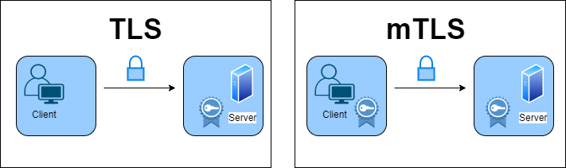
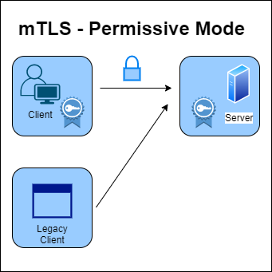
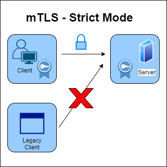

ISTIO comes with a couple of custom resource definitions (CRDs) for configuring user and service to service authentication as well as authorization policies.

The key three access control components here are the `principle`, `action`, and `object`.

* **Principle** in kubernetes is a kubernetes `service`.
* **Action**, assuming we're talking about http, this can be a GET request, a POST request, DELETE, PUT request and so on.
* **Object** is a service as well.

### What is authentication? 
Authentication is all about the identity of the principle or service.

When you perform authentication, you are validating some kind of credential and ensuring that it is valid and trustworthy. Once the authentication succeeds, we can talk about an authenticated principle. 

If the credential is invalid or cannot be trusted, you have an unauthenticated principle or none at all.

Each workload in kubernetes is assigned a unique identity. This identity is then used when the workloads communicate with one another.

In kubernetes, the identity is represented by a kubernetes service account. This service account is the identity that pods use and then present at run time. Istio uses the x509 certificate from that service account to create a new identity in accordance with the [SPIFFE](https://spiffe.io/) spec.

SPIFFE takes that identity and encodes it into an x 509 certificate.

### Mutual TLS (mTLS)


So, now that we've created and obtained these identities for our workloads, we can use these certificates to perform mutual tls at runtime.

So, what exactly is mutual tls?
When doing tls, it's usually one way. So you open your browser. You go to google.com and you'll see that lock, and you can check the certificate and all that stuff.

However, when I do this, I do not provide Google with any proof of my identity. I only have a request. So this is one-way tls, but this is also where mutual tls differs fundamentally.

So, when two services try to communicate with mutual tls, they must both provide certificates to each other. So both parties, the client and the server, know who they're talking to.

So you should have it enabled for all of your services. However, there are some scenarios where you are likely to have some legacy applications. They don't yet support mutual tls, and there's also a timing issue.

So, what if we wanted to enable mutual tls in all of our deployments?
As a result, clients connecting to a server via mutual tls will fail if the server does not accept mutual tls. And the server attempting to serve mutual tls where the client wants plain text communication will also fail.

That means that if we just want to enable mutual tls, we'll have to redeploy the clients and servers simultaneously.

All of this is impossible; you can't do it consistently, and even if you can, you won't be able to repeat it.



Now, ISTIO has solved this problem because it has a graceful mode where you can opt into mutual tls, which is known as permissive mode.

When you install Istio, this permissive mode is enabled by default. If a client attempts to connect to me using mutual tls while permissive mode is enabled, I will serve mutual tls. If the client does not use mutual TLS and calls the server, the server can also respond in plain text.

So I'm giving the client the option of doing mutual tls or not. As a result of using this mode, you can gradually roll out mutual tls across your entire mesh. You can opt in one service at a time. If you want, you can do it for one service per namespace and then mesh wide.



Once you've transferred all of your services, you can switch from permissive to strict mode.

With the strict mode you can only do mutual tls. As a result, any client attempting to connect will need to perform mutual tls and present their certificate. If they don't, the connection will be rejected.

### PeerAuthentication (Service to Service communication)
```yaml
apiVersion: security.istio.io/v1beta1
kind: PeerAuthentication
metadata:
  name: default
  namespace: test # namespace-wide policy
spec:
  selector:
    matchLabels:
      teir: frontend # <---- config applied to incoming request to pods with this label
  mtls:
    mode: STRICT # only accept requests encrypted with TLS
```
This brings us to the first security resource in istio, known as PeerAuthentication that you can use to configure the communication between workloads. Basically, you can use this resource to configure the mutual tls mode when the workloads communicate.

As previously stated, the default mode is permissive. The mutual tls mode can be controlled at the mesh level, namespace level, or even more granularly by using labels to set mutual tls only for specific workloads. If that isn't enough, you can also control mutual tls mode for specific ports. For example, you could configure strict mutual mode for some workloads but disable mutual tls for communication on a specific port.

### Users Authentication (RequestAuthentication)
```yaml
apiVersion: security.istio.io/v1beta1
kind: RequestAuthentication
metadata:
 name: customers
  namespace: test
spec:
  selector:
    matchLabels:
      app: customers
  jwtRules:
  - issuer: "https://minasys.us.auth0.com/"
    jwksUri: "https://minasys.us.auth0.com/.well-known/jwks.json"
```
So far, we've discussed how services communicate, but now how do you authenticate users in Istio?
This is where RequestAuthentication comes into play. This resource is used for end-user authentication and validates the credentials attached to the request.

In this case, the JWT token is used for request level authentication. So, just as we used the SIFEFE identity to authenticate services, we use JWT tokens to authenticate users.

This sample example above applies to all workloads in the test namespace that have the label app set to customers. As a result, any request made to these workloads will require a JWT token on the request (in the header). 

So the requestAuthentication resource configures how the token is generated and how the signature is authenticated using the provided key set.

If a request to this specific workload does not include a valid JWT token, the token will not conform to those rules, and the request will be rejected.

However, if we do not provide a token, the request will not be rejected; it will simply not be authenticated.

### Authorization (AuthorizationPolicy)
So, assuming we have authenticated the request, we can talk about performing an action on an object, which is what authorization is all about.

So authorization is an authenticated principle that allows a user to perform an action on an object. For example, can (user a) send a GET request to a specific path on (service b). 

Now note, that the principle could be authenticated. However, it may not be permitted to perform an action.

Now that we have an authenticated principle, we can use another resource called authorizationPolicy to control access based on it.

```yaml
apiVersion: security.istio.io/v1beta1
kind: AuthorizationPolicy
metadata:
  name: customers
  namespace: test
spec:
  selector:
    matchLabels:
      app: customers
  action: ALLOW
  rules:
  - from:
    - source:
       requestPrincipals: ["*"]
```
This is the resource where we can apply the principle from the peerAuthentication policies and the requestAuthentication policies. 

Remember that there are principles when the services communicate, but there is also a principle when you do requestAuthentication. If you want to write policies based on peer or service identities, you can use a field called `principles`. And if we're making decisions based on the requestAuthentication or the users, we can use the field `requestPrinciples`.

You can also write more complex rules in the authorizationPolicies like the follwoing example:
```yaml
apiVersion: security.istio.io/v1beta1
kind: AuthorizationPolicy
metadata:
  name: customers
  namespace: test
spec:
  action: ALLOW
  rules:
  - from:
    - source:
        principals: ["cluster.local/ns/default/sa/sleep"]
    - source:
        namespaces: ["test"]
    to:
    - operation:
        methods: ["GET"]
        paths: ["/info*"]
    - operation:
        methods: ["POST"]
        paths: ["/data"]
    when:
    - key: request.auth.claims[iss]
      values: ["https://accounts.google.com"]
```
With the `from` field you can define a list of source identities, source namespaces, and principles that are allowed to call the services that the policy applies to. 

This example allows calls from the services that use the sleep service account. so that's under source principles, and they come from the test namespace. 
 
The second field is called the `to` field, and this is where you can specify what paths and what operations and methods can be used when making the calls to the service. This example shows that we can call `/info` and use the `GET` method and we can also call `POST` method on `/data` path. 
 
Finally the `when` field, this one allows us to specify different conditions based on the attributes from the request itself, things like headers or values from authenticated principles. This example shows that we can only make calls, from, and to, when that request has a valid JWT token that was issues by accounts.google.com. 
