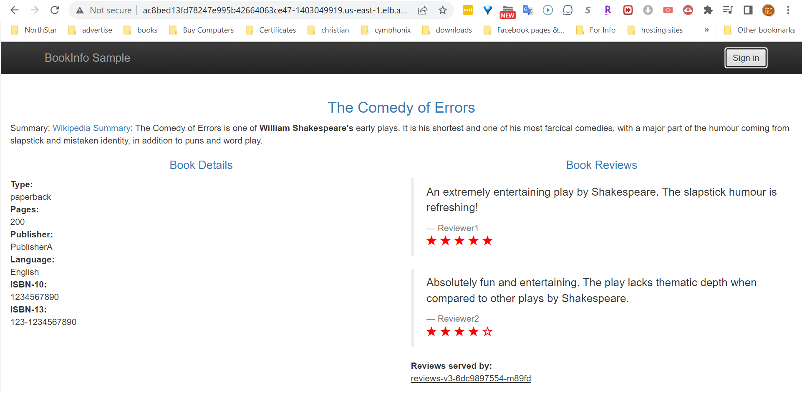

This chapter will teach you to enhance the security of applications operating on Kubernetes with the use of Istio and Auth0.

To proceed with the task, you must:

* Ensure that port 80 is accessible for the bookinfo application through the use of a Gateway resource.
* Set up the ingress gateway to direct traffic to your bookinfo services through the configuration of a VirtualService resource.

#### Routing Traffic to Services Using An Istio Gateway
Remember you created the `bookinfo-gateway` resource in the ["Expose a Service" section under the "Traffic Management"](../20-traffic-management/30-expose-a-service.md) chapter. 

```bash
$ kubectl get gw bookinfo-gateway -n test -o yaml
```

Output:
```bash
apiVersion: networking.istio.io/v1beta1
kind: Gateway
metadata:
  annotations:
    kubectl.kubernetes.io/last-applied-configuration: |
      {"apiVersion":"networking.istio.io/v1alpha3","kind":"Gateway","metadata":{"annotations":{},"name":"bookinfo-gateway","namespace":"test"},"spec":{"selector":{"istio":"ingressgateway"},"servers":[{"hosts":["*"],"port":{"name":"http","number":80,"protocol":"HTTP"}}]}}
  creationTimestamp: "2022-10-21T02:22:31Z"
  generation: 1
  name: bookinfo-gateway
  namespace: test
  resourceVersion: "3949235"
  uid: 743de076-c22e-4152-af84-cc69a2fa0f74
spec:
  selector:
    istio: ingressgateway
  servers:
  - hosts:
    - '*'
    port:
      name: http
      number: 80
      protocol: HTTP
```
If you did not find this gateway resource exist, you can apply it to your cluster by executing the following command.
```bash
$ kubectl apply -n test -f - <<EOF
apiVersion: networking.istio.io/v1alpha3
kind: Gateway
metadata:
  name: bookinfo-gateway
spec:
  selector:  
    istio: ingressgateway 
  servers: 
  - port:
      number: 80 
      name: http
      protocol: HTTP   
    hosts: 
    - "*"
EOF
```
The definition above will only be applicable to workloads that match the selector. The default ingress gateway that was installed with Istio is the only one that the selector istio: ingressgateway matches for.

The Istio ingress gateway accepts traffic on port 80 for any host once this Gateway resource has been applied.

#### Defining a virtual service for your application

Once you have allowed traffic into your cluster, it is necessary to set up the ingress gateway to route the traffic to your Bookinfo services. This can be accomplished by creating a VirtualService resource. 

The VirtualService rules specify how the gateway should redirect incoming traffic based on the specified endpoint paths. In this case, the rules direct the incoming traffic to the "productpage" service:

```bash
$ kubectl apply -n test -f - <<EOF
apiVersion: networking.istio.io/v1alpha3
kind: VirtualService
metadata:
  name: bookinfo
spec:
  hosts:
  - "*"
  gateways:
  - bookinfo-gateway
  http:
  - match:
    - uri:
        exact: /productpage
    - uri:
        exact: /login
    - uri:
        exact: /logout
    - uri:
        exact: /callback
    - uri:
        prefix: /api/v1/products
    - uri:
        prefix: /static/
    route:
    - destination:
        host: productpage
        port:
          number: 9080
EOF
```
In this chapter, the crucial functionality of your application is made available through these endpoint paths:

* **/productpage**: This is the main endpoint of the Bookinfo application that can be accessed through a web browser.
* **/login**: After integrating Auth0, this endpoint will redirect users to the Auth0 login page for them to sign in or sign up.
* **/logout**: Users can log out of the application using this endpoint.
* **/callback**: Auth0 uses this endpoint to redirect the user back to the application after they log in. Upon completion, the application will receive a code, which it can then exchange for an access token.

By executing the specified command, you will be able to access the application in your browser by accessing the `/productpage` endpoint via the load balancer endpoint of the "ingress-gateway" service located in the "istio-system" namespace, similar to the process described in the previous chapter.


```bash
$ export ISTIO_IG_HOSTNAME=$(kubectl -n istio-system get service istio-ingressgateway -o jsonpath='{.status.loadBalancer.ingress[0].hostname}')
$ echo $ISTIO_IG_HOSTNAME/productpage
```
Output:
```bash
ac8bed13fd78247e995b42664063ce47-1403049919.us-east-1.elb.amazonaws.com/productpage
```

Notice here that you can see book details and reviews displayed on the page without even logging with any users yet.

#### Authenticating and Authorizing Users
To implement access control policies for the services, you must first redirect the user to Auth0 for authentication. Afterwards, you must configure the services with rules that either accept or reject requests based on the user's permissions. The following is a summary of the policies:

* The **productpage** service can be accessed by any user.
* The **reviews** service can be accessed by identities with the `read:book-reviews` permission.
* The **details** service can only be accessed by identities with the `read:book-details` permission.
* The **ratings** service does not have any policies applied, so it can be accessed by any user, but it can also be restricted if desired.

There will be three categories of users:
* **Admins** can access all services.
* **Users** can only access the productpage and details services.
* **Unauthenticated users** can only access the productpage service.


#### Setting up the Auth0 application
To begin configuring Auth0 to authenticate users for our services, you must first [create a free Auth0 account]((https://auth0.com/signup)) if you do not already have one.

After signing up, navigate to the ["Applications"](https://manage.auth0.com/#/applications) section of your dashboard and click the "Create Application" button. Auth0 will display a dialog box for you to enter the following information:

* **Application Name**: This can be any name you choose, such as "istio-auth".
* **Application Type**: Choose "Regular Web Applications".
Once you click "Create", you will be directed to the "Quick Start" tab of your new application. Then, select the "Settings" tab and modify the following two fields:

* **Allowed Callback URLs**: Enter the URL that Auth0 will call after users have authenticated. In this case, enter `http://{ISTIO_IG_HOSTNAME}/callback`.
* **Allowed Logout URLs**: Enter the URL that Auth0 will call after users log out. In this case, enter `http://{ISTIO_IG_HOSTNAME}/productpage`.

Finally, click the "Save Changes" button.


#### Registering an API in Auth0
Navigate to the APIs section and click on Create API and enter the following information:

* **Name for your API**: Name it as the application name (istio-auth) or any other name.
* **Identifier for your API**: Use a URI such as https://istio-auth. It doesn't have to be a valid URL, it will not be used.
* **Signing Algorithm**: Choose RS256.

After creating the [API](https://manage.auth0.com/#/apis), you will be taken to its configuration page where you will configure it to add permissions to the access token after a user logs in. Here are the steps:

1. Go to the Settings tab and scroll down to RBAC Settings.
1. Enable both the options for `Enable RBAC` and `Add Permissions in the Access Token`. Then, scroll down and save your changes.
1. Next, go to the Permissions tab and add the following two permissions:

| Permissions	      | Description      |
|  --------------- |  -------------- |
| read:book-details	| Read book details |
| read:book-reviews	| Read book reviews |


#### Defining roles and assigning permissions
To manage permissions more efficiently, it is advisable to group a set of permissions into roles and assign the roles to users. This way, when a role is assigned to a user, they automatically receive the same set of permissions.

To create roles, go to the [User Management > Roles](https://manage.auth0.com/#/roles) section on Auth0 and create the following two roles: Then, assign the following permissions to each role by navigating to the Permissions tab after clicking on the role.

| Roles	| Assigned Permissions                  |
|--    |  --                                  |
| user	| read:book-details                     |
| admin |	read:book-details, read:book-reviews  |


#### Creating users and assigning roles
Head over to the [User Management](https://manage.auth0.com/#/users) section and create the following users and assign the appropriate role to each:


| Usernames         |	Assigned Role   |
| --               |    --          | 
| test-user	        | user            |
| admin-user	      | admin           |

To assign roles after creating the users, you need to click the user. Then switch to the Roles tab, where you can assign the listed roles.

Head back to the [Applications](https://manage.auth0.com/#/applications) section and open the application you created above. Leave this page open as you will need to copy some values from it in the next steps.


#### Validating the Access Token (RequestAuthentication) 
Users who successfully verify their identity and authenticate using Auth0 are given an access token in JWT format. To verify JWT tokens, Istio offers the `RequestAuthentication` custom resource. So just like the use of SPIFEE identity to authenticate services, we use JWT tokens to authenticate users. 

This RequestAuthentication resource is used for end user authentication and it verifies the credentials that are attached to the request. This resource applies to all workloads in a namespace or you can make it particular to specific workloads within a namespace with specific labels. 

Any request made to these workloads will need a JWT token on the request (in the header). 

The `jwksUri` field is where you point to the public key that can be used to authenticate the token and the signature. 

Let's deploy the following RequestAuthentication resource after replacing placeholders called **{your_Auth0_Application_Domain}** with the value presented in the Domain field of your Auth0 Application.

```bash
$ kubectl apply -n test -f - <<EOF
apiVersion: security.istio.io/v1beta1
kind: RequestAuthentication
metadata:
  name: "auth0"
spec:
  # selector:
  #   match9labels:
  #     app: details
  jwtRules:
  - issuer: "https://{your_Auth0_Application_Domain}/" # https://your_auth0_nickname.us.auth0.com/
    jwksUri: "https://{your_Auth0_Application_Domain}/.well-known/jwks.json" # "https://your_auth0_nickname.us.auth0.com/.well-known/jwks.json"
EOF
```

Now, if the request to this specific workload does not contain a valid JWT token, the token is not going to conform to those rules, and the request will be rejected. 
 
On the other hand, if we do not provide a token at all, the request will not be rejected, it just won't be authenticated.

Now, if you you refresh the productpage app, you will see that the page still accepts requests without access tokens. That's because we didn't redirect users to Auth0 to authenticate themselves yet.

#### Authenticating User Requests with Auth0
Next, you will update the productpage application to redirect users to Auth0 for authentication. The updated app retrieves the Auth0 credentials from environment variables that can be set using a Kubernetes Secret.

Execute the following command to create this secret after replacing the following placeholders with the appropriate values of your own Auth0 application and API and the hostname of your Ingress-gateway loadbalancer.

```bash
$ kubectl apply -n test -f - <<EOF
apiVersion: v1
kind: Secret
metadata:
  name: app-credentials
type: Opaque
stringData:
  AUTH0_CALLBACK_URL: http://{ISTIO_IG_HOSTNAME}/callback 

  # Auth0 Application properties
  AUTH0_CLIENT_ID: {YOUR-AUTH0-APPLICATION-CLIENT-ID} 
  AUTH0_CLIENT_SECRET: {YOUR-AUTH0-APPLICATION-CLIENT-SECRET}
  AUTH0_DOMAIN: {YOUR-AUTH0-APPLICATION-DOMAIN} # your_auth0_nickname.us.auth0.com

  # Auth0 API properties
  AUTH0_AUDIENCE: {YOUR-AUDIENCE} # The Auth0 API audience/identifier like https://istio-auth 
EOD
```
Next, update the productpage deployment with the new image redirecting to Auth0 for authentication and setting its environment from the previously created secret:

```bash
$ kubectl -n test patch deployment productpage-v1 --patch "
spec:
  template:
    spec:
      containers:
      - name: productpage
        image: rinormaloku/productpage:istio-auth0
        envFrom:
        - secretRef:
            name: app-credentials
"
```
**__Important Note__**<br />
To get an idea what exact changes happened to enable this productpage to redirect users to Auth0 for authentication checkout the following two pages:<br />
https://shorturl.at/fkoyT<br />
https://shorturl.at/lrsx3

Wait until the updated pod is running, then refresh the productpage application page in your browser and hit the Sign In button. It will redirect you to the Auth0 login page, where you will be able to sign in.

After the authentication, the end-user is redirected to the productpage application with the access token. This token is sent to the productpage, which uses it when requesting other services, which then can apply policies based on the permissions of the identity.

#### Authorizing end-users with Istio
In this section, you'll create policies that allow access to services based on the permissions claim of the token.

Policies in Istio are defined using the `AuthorizationPolicy` custom resource. For example, with the policy below we allow users with the permission `read:book-details` to access the details service:
```bash
$ kubectl apply -n test -f - <<EOF
apiVersion: "security.istio.io/v1beta1"
kind: "AuthorizationPolicy"
metadata:
  name: "details-policy"
spec:
  action: ALLOW
  selector:
    matchLabels:
      app: details
  rules:
  - when:
    - key: request.auth.claims[permissions]
      values: ["read:book-details"]
EOF
```
Remember that we can apply this policy to any of the services. However, using the selector app: details we apply it specifically to the details service.

The following policy allows access to the reviews service only for users with the permission `read:book-reviews`:
```bash
$ kubectl apply -n test -f - <<EOF
apiVersion: "security.istio.io/v1beta1"
kind: "AuthorizationPolicy"
metadata:
  name: "reviews-policy"
spec:
  action: ALLOW
  selector:
    matchLabels:
      app: reviews
  rules:
  - when:
    - key: request.auth.claims[permissions]
      values: ["read:book-reviews"]
EOF
```
Wait a few seconds for the policy to be applied to the services. Then refresh the productpage in your browser and you will see that it shows two "error fetching ..." messages. This means that your policy is enforced and that the productpage microservice was unable to fetch the product details and the product reviews for an unauthenticated user.


Next, verify that after logging in with the credentials of the user `test-user`, you'll be able to access the product details but not the reviews!

When you log in with the credentials of the user `admin-user`, you will see that both services are queried successfully! That's because the admin role has both permissions.
