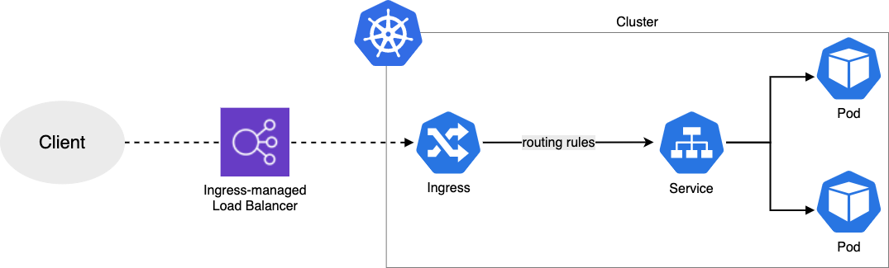
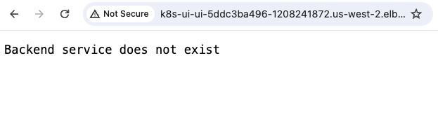
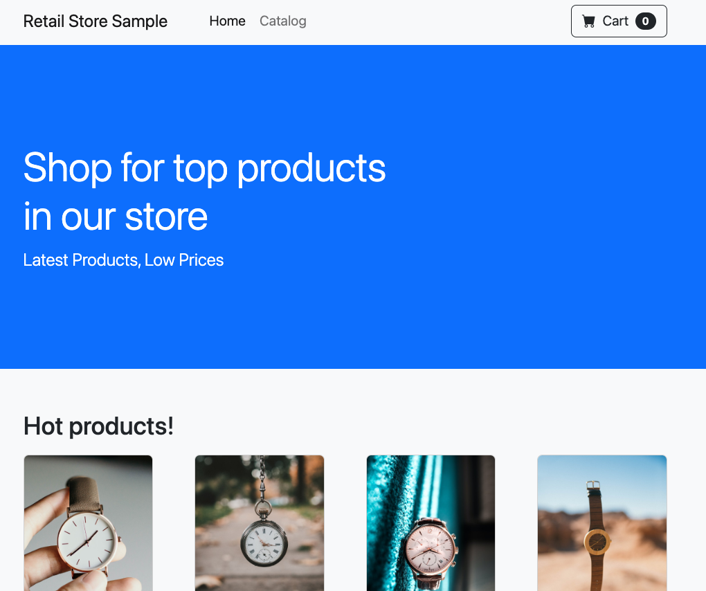

The task for you in this troubleshooting scenario is to investigate the deployment for AWS Load Balancer Controller as well as the ingress object created by following the prompts with the script. At the end of this session, you should be able to see the ui app on your EKS cluster using ALB ingress through the browsers as depicted in the image.



## Let's start the troubleshooting

### Step 1:

First, we need to verify the status of our pods and get ingress for ingress object creation. To do so, we will use `kubectl` tool.

```bash
$ kubectl get pod -n ui
NAME                  READY   STATUS    RESTARTS   AGE
ui-68495c748c-jkh2z   1/1     Running   0          85s
```

### Step 2:

In _Step 1_, we checked the pods status for our application and aws-load-balancer-controller. The _aws-load-balancer-controller_ deployment is responsible for ALB creation for any ingress objects applied to the cluster.

Upon looking for ingress object, did you observe any ALB DNS name to access your application with the ingress object? You can also verify ALB creation in the AWS Management Console. In a successful installation scenario, the ingress object should have an ALB DNS name shown like the example below. However in this case, the ADDRESS section where the ALB DNS should have populated is empty.

```bash
$ kubectl get ingress/ui -n ui
NAME   CLASS   HOSTS   ADDRESS   PORTS   AGE
ui     alb     *                 80      105s

#---This is the expected output when the ingress was deployed correctly--
NAME           CLASS    HOSTS   ADDRESS                                                                   PORTS   AGE
ingress-2048   <none>   *       k8s-ui-ingress2-xxxxxxxxxx-yyyyyyyyyy.region-code.elb.amazonaws.com   80      2m32s
```

### Step 3:

Check further into the ingress for any events indicating why we do not see the ALB DNS. You can retrieve those logs by running the following command. The event logs should point you towards what the issue might be with ingress creation.

```bash
$ kubectl describe ingress/ui -n ui
Name:             ui
Labels:           <none>
Namespace:        ui
Address:
Ingress Class:    alb
Default backend:  <default>
Rules:
  Host        Path  Backends
  ----        ----  --------
  *
              /   service-ui:80 (<error: endpoints "service-ui" not found>)
Annotations:  alb.ingress.kubernetes.io/healthcheck-path: /actuator/health/liveness
              alb.ingress.kubernetes.io/scheme: internet-facing
              alb.ingress.kubernetes.io/target-type: ip
Events:
  Type     Reason            Age                    From     Message
  ----     ------            ----                   ----     -------
  Warning  FailedBuildModel  2m23s (x16 over 5m9s)  ingress  Failed build model due to couldn't auto-discover subnets: unable to resolve at least one subnet (0 match VPC and tags: [kubernetes.io/role/elb])

```

Refer the documentation on prerequisites for setting up ALB with EKS: https://kubernetes-sigs.github.io/aws-load-balancer-controller/v2.4/deploy/subnet_discovery/

### Step 4:

_Step 3_ points to issues with the subnet auto-discovery for load balancer controller deployment. Ensure that all the public subnets have correct tags `tag:kubernetes.io/role/elb,Values=1'`

:::info
Keep in mind that public subnet means the route table for the subnet has an Internet Gateway allowing traffic to and from the internet.  
:::

1. To find the all subnets through the command line, filter through existing ones with the following tag "Key: `alpha.eksctl.io/cluster-name` Value: `${EKS_CLUSTER_NAME}`". There should be four subnets. **Note:** _For your convenience we have added the cluster name as env variable with the variable `$EKS_CLUSTER_NAME`._

```bash
$ aws ec2 describe-subnets --filters "Name=tag:alpha.eksctl.io/cluster-name,Values=${EKS_CLUSTER_NAME}" --query 'Subnets[].SubnetId[]'
[
    "subnet-xxxxxxxxxxxxxxxxx",
    "subnet-xxxxxxxxxxxxxxxxx",
    "subnet-xxxxxxxxxxxxxxxxx",
    "subnet-xxxxxxxxxxxxxxxxx",
    "subnet-xxxxxxxxxxxxxxxxx",
    "subnet-xxxxxxxxxxxxxxxxx"
]
```

2. Then by adding in the subnet ID into the route tables CLI filter one at a time, `--filters 'Name=association.subnet-id,Values=subnet-xxxxxxxxxxxxxxxxx'`, identify which subnets are public.

```
aws ec2 describe-route-tables --filters 'Name=association.subnet-id,Values=<ENTER_SUBNET_ID_HERE>' --query 'RouteTables[].Routes[].[DestinationCidrBlock,GatewayId]'
```

Here a script that will help to iterate over the list of subnets

```bash

$ for subnet_id in $(aws ec2 describe-subnets --filters "Name=tag:alpha.eksctl.io/cluster-name,Values=${EKS_CLUSTER_NAME}" --query 'Subnets[].SubnetId[]' --output text); do echo "Subnect: ${subnet_id}"; aws ec2 describe-route-tables --filters "Name=association.subnet-id,Values=${subnet_id}" --query 'RouteTables[].Routes[].[DestinationCidrBlock,GatewayId]'; done
```

If the output shows `0.0.0.0/0` route to an Internet gateway ID, this is a public subnet. See below example.

```
WSParticipantRole:~/environment $ aws ec2 describe-route-tables --filters "Name=association.subnet-id,Values=subnet-xxxxxxxxxxxxx0470" --query 'RouteTables[].Routes[].[DestinationCidrBlock,GatewayId]'
[
    [
        "10.42.0.0/16",
        "local"
    ],
    [
        "0.0.0.0/0",
        "igw-xxxxxxxxxxxxxxxxx"
    ]
]
```

3. Once you have all the public subnet ID's, describe subnets with the appropriate tag and confirm that the public subnet ID's that you identified are missing. In our case, none of our subnets have the correct tags.

```bash
$ aws ec2 describe-subnets --filters 'Name=tag:kubernetes.io/role/elb,Values=1' --query 'Subnets[].SubnetId'
[]
```

4. Then add the correct tags. To help you a little bit, we have added the 3 public subnets to the `env` variables with the names `PUBLIC_SUBNET_1, PUBLIC_SUBNET_2 and PUBLIC_SUBNET_3`

```
aws ec2 create-tags --resources subnet-xxxxxxxxxxxxxxxxx subnet-xxxxxxxxxxxxxxxxx subnet-xxxxxxxxxxxxxxxxx --tags 'Key="kubernetes.io/role/elb",Value=1'
```

```bash
$ aws ec2 create-tags --resources $PUBLIC_SUBNET_1 $PUBLIC_SUBNET_2 $PUBLIC_SUBNET_3 --tags 'Key="kubernetes.io/role/elb",Value=1'
```

5. Confirm the tags are created. You should see the public subnet ID's populated following the command below.

```bash
$ aws ec2 describe-subnets --filters 'Name=tag:kubernetes.io/role/elb,Values=1' --query 'Subnets[].SubnetId'
[
    "subnet-xxxxxxxxxxxxxxxxx",
    "subnet-xxxxxxxxxxxxxxxxx",
    "subnet-xxxxxxxxxxxxxxxxx"
]
```

6. Now restart the controller deployment using the kubectl rollout restart command:

```bash timeout=180
$ kubectl -n kube-system rollout restart deploy aws-load-balancer-controller
deployment.apps/aws-load-balancer-controller restarted
```

7. Now, check again the ingress deployment:

```bash expectError=true
$ kubectl describe ingress/ui -n ui
  Warning  FailedDeployModel  68s  ingress  Failed deploy model due to AccessDenied: User: arn:aws:sts::xxxxxxxxxxxx:assumed-role/alb-controller-20240611131524228000000002/1718115201989397805 is not authorized to perform: elasticloadbalancing:CreateLoadBalancer on resource: arn:aws:elasticloadbalancing:us-west-2:xxxxxxxxxxxx:loadbalancer/app/k8s-ui-ui-5ddc3ba496/* because no identity-based policy allows the elasticloadbalancing:CreateLoadBalancer action
  status code: 403, request id: b862fb9c-480b-44b5-ba6f-426a3884b6b6
  Warning  FailedDeployModel  26s (x5 over 66s)  ingress  (combined from similar events): Failed deploy model due to AccessDenied: User: arn:aws:sts::xxxxxxxxxxxx:assumed-role/alb-controller-20240611131524228000000002/1718115201989397805 is not authorized to perform: elasticloadbalancing:CreateLoadBalancer on resource: arn:aws:elasticloadbalancing:us-west-2:xxxxxxxxxxxx:loadbalancer/app/k8s-ui-ui-5ddc3ba496/* because no identity-based policy allows the elasticloadbalancing:CreateLoadBalancer action
  status code: 403, request id: 197cf2f7-2f68-44f2-92ae-ff5b36cb150f
```

:::tip
In AWS generally for creation/deletion/update of any resource, you will observe a corresponding API call which are recorded in CloudTrail. Look for any CloudTrail events for CreateLoadBalancer API calls. Do you observe any such calls in the last 1 hour of this lab setup?
:::

### Step 5

With this setup, we’re leveraging IAM Roles for Service Accounts, which essentially allows pods to assume IAM roles using service accounts in Kubernetes and OIDC provider associated with your EKS cluster. Locate the service account that load balancer controller is using and find out the IAM role associated with it, to identify the IAM entity that would make API calls to provision your load balancer.
Try running:

```bash
$ kubectl get serviceaccounts -n kube-system -l app.kubernetes.io/name=aws-load-balancer-controller -o yaml
```

```yaml {8}
apiVersion: v1
items:
  - apiVersion: v1
    automountServiceAccountToken: true
    kind: ServiceAccount
    metadata:
      annotations:
        eks.amazonaws.com/role-arn: arn:aws:iam::xxxxxxxxxxxx:role/alb-controller-20240611131524228000000002
        meta.helm.sh/release-name: aws-load-balancer-controller
        meta.helm.sh/release-namespace: kube-system
      creationTimestamp: "2024-06-11T13:15:32Z"
      labels:
        app.kubernetes.io/instance: aws-load-balancer-controller
        app.kubernetes.io/managed-by: Helm
        app.kubernetes.io/name: aws-load-balancer-controller
        app.kubernetes.io/version: v2.7.1
        helm.sh/chart: aws-load-balancer-controller-1.7.1
      name: aws-load-balancer-controller-sa
      namespace: kube-system
      resourceVersion: "4950707"
      uid: 6d842045-f2b4-4406-869b-f2addc67ff4d
kind: List
metadata:
  resourceVersion: ""
```

:::tip
Can you verify if there’s a call in your CloudTrail events with the IAM role listed in the output for above command? If not, take a look at the logs from your controller.
:::

### Hint 6

You can check the logs from controller pods to find additional details which could be preventing the load balancer to create. Let's check the logs using the command below.

```bash
$ kubectl logs -n kube-system -l app.kubernetes.io/name=aws-load-balancer-controller
```

For example the output may show something similar to the below output.

```
{"level":"error","ts":"2024-06-11T14:24:24Z","msg":"Reconciler error","controller":"ingress","object":{"name":"ui","namespace":"ui"},"namespace":"ui","name":"ui","reconcileID":"49d27bbb-96e5-43b4-b115-b7a07e757148","error":"AccessDenied: User: arn:aws:sts::xxxxxxxxxxxx:assumed-role/alb-controller-20240611131524228000000002/1718115201989397805 is not authorized to perform: elasticloadbalancing:CreateLoadBalancer on resource: arn:aws:elasticloadbalancing:us-west-2:xxxxxxxxxxxx:loadbalancer/app/k8s-ui-ui-5ddc3ba496/* because no identity-based policy allows the elasticloadbalancing:CreateLoadBalancer action\n\tstatus code: 403, request id: a24a1620-3a75-46b7-b3c3-9c80fada159e"}
```

As you can see the error indicates the IAM role does not have the correct permissions, in this case the permissions to create the load balancer `elasticloadbalancing:CreateLoadBalancer`.

:::tip
Verify the correct permissions required by the IAM role in the documentations here [[1]](https://kubernetes-sigs.github.io/aws-load-balancer-controller/v2.4/deploy/installation/#setup-iam-manually) where you can find the latest IAM permissions json file required for the LB Controller. After the changes, you have to wait a few minutes for the changes to reflect, since IAM uses an eventual consistency model. To make the changes, locate the IAM role through the AWS console and add the missing permissions that are shown in the log. In this case CreateLoadBalancer is missing.
:::

Now let's fix it. To avoid conflicts with the automation of the workshop, we have already provisioned the correct permissions into the account and added the environment variable `LOAD_BALANCER_CONTROLLER_ROLE_NAME` that contains the role name and `LOAD_BALANCER_CONTROLLER_POLICY_ARN_FIX` which contains the correct IAM policy arn, and `LOAD_BALANCER_CONTROLLER_POLICY_ARN_ISSUE` that contains the incorrect IAM policy arn.

So, to fix it we will just need to attach the correct IAM policy, as follows:

```bash
$ aws iam attach-role-policy --role-name ${LOAD_BALANCER_CONTROLLER_ROLE_NAME} --policy-arn ${LOAD_BALANCER_CONTROLLER_POLICY_ARN_FIX}
```

and detach the incorrect IAM policy from the role:

```bash
$ aws iam detach-role-policy --role-name ${LOAD_BALANCER_CONTROLLER_ROLE_NAME} --policy-arn ${LOAD_BALANCER_CONTROLLER_POLICY_ARN_ISSUE}
```

Try accessing the new Ingress URL in the browser as before to check if you can access the UI app:

```bash
$ kubectl get ingress -n ui ui -o jsonpath="{.status.loadBalancer.ingress[*].hostname}{'\n'}"
k8s-ui-ui-5ddc3ba496-1208241872.us-west-2.elb.amazonaws.com
```

:::tip
It can take a couple of minutes for the Load Balancer to be available once created.
:::

Also, feel free to go to CloudTrail again and verify the API call for CreateLoadBalancer is there.

### Step 7

Even though the ingress creation succeeded, when you try accessing the app in browser there is an error stating, "Backend service does not exist".



Since ingress is created, that would mean that there is an issue with communication from the Kubernetes ingress to the service. Check the deployment and service using:

```bash
$ kubectl -n ui get service/ui -o yaml
```

```yaml {27}
apiVersion: v1
kind: Service
metadata:
  annotations:
    ...
  labels:
    app.kubernetes.io/component: service
    app.kubernetes.io/created-by: eks-workshop
    app.kubernetes.io/instance: ui
    app.kubernetes.io/managed-by: Helm
    app.kubernetes.io/name: ui
    helm.sh/chart: ui-0.0.1
  name: ui
  namespace: ui
  resourceVersion: "4950875"
  uid: dc832144-b2a1-41cd-b7a1-8979111da677
spec:
  ...
  ports:
  - name: http
    port: 80
    protocol: TCP
    targetPort: http
  selector:
    app.kubernetes.io/component: service
    app.kubernetes.io/instance: ui
    app.kubernetes.io/name: ui-app
  sessionAffinity: None
  type: ClusterIP
status:
  loadBalancer: {}
```

And now check the ingress configuration:

```bash
$ kubectl  get ingress/ui -n ui -o yaml
```

```yaml {23}
apiVersion: networking.k8s.io/v1
kind: Ingress
metadata:
  annotations:
    alb.ingress.kubernetes.io/healthcheck-path: /actuator/health/liveness
    alb.ingress.kubernetes.io/scheme: internet-facing
    alb.ingress.kubernetes.io/target-type: ip
    ...
  finalizers:
  - ingress.k8s.aws/resources
  generation: 1
  name: ui
  namespace: ui
  resourceVersion: "4950883"
  uid: 327b899c-405e-431b-8d67-32578435f0b9
spec:
  ingressClassName: alb
  rules:
  - http:
      paths:
      - backend:
          service:
            name: service-ui
            port:
              number: 80
        path: /
        pathType: Prefix
...
```

From the outputs, observe the ingress spec and the service name `name: service-ui` that it is pointing to versus what the service name should be.

We will need to edit the ingress spec to point to correct service name using the command below, which contains the fix:

```bash
$ kubectl apply -k ~/environment/eks-workshop/modules/troubleshooting/alb/creating-alb/fix_ingress
```

To look like:

```yaml {10}
spec:
  ingressClassName: alb
  rules:
    - http:
        paths:
          - path: /
            pathType: Prefix
            backend:
              service:
                name: ui
                port:
                  number: 80
```

Try accessing the ALB again using the domain name shared in the get ingress output and check if you can access the app now?

### Step 8

Now we observe a 503 error when accessing the ALB:


503 would suggest a server-side issue, specifically with the service being unavailable. But we ensured that the service was running on the cluster when we ran get service command in _Step 7_.

In Kubernetes, a service is just a construct to expose deployments either externally or within the cluster. Services rely on selectors to be able to send traffic to the correct backend deployment. To verify that we have our service pointing to the correct deployment, check the endpoints that are dynamically configured by kube-proxy on service creation. Run the following command:

```bash
$ kubectl -n ui get endpoints ui
NAME   ENDPOINTS   AGE
ui     <none>      13d
```

The endpoints in command above should be pointing to IPs of the app pods running in _ui_ namespace. Can you identify if the selectors are setup correctly in service?

### Step 9:

Taking a look at the deployment spec using command below, verify the selector value being used versus the one used in your service.

```bash
$ kubectl -n ui get deploy/ui -o yaml
```

```yaml {34}
apiVersion: apps/v1
kind: Deployment
metadata:
  annotations:
    ...
  name: ui
  namespace: ui
  ..
spec:
  progressDeadlineSeconds: 600
  replicas: 1
  revisionHistoryLimit: 10
  selector:
    matchLabels:
      app.kubernetes.io/component: service
      app.kubernetes.io/instance: ui
      app.kubernetes.io/name: ui
  strategy:
    rollingUpdate:
      maxSurge: 25%
      maxUnavailable: 25%
    type: RollingUpdate
  template:
    metadata:
      annotations:
        prometheus.io/path: /actuator/prometheus
        prometheus.io/port: "8080"
        prometheus.io/scrape: "true"
      creationTimestamp: null
      labels:
        app.kubernetes.io/component: service
        app.kubernetes.io/created-by: eks-workshop
        app.kubernetes.io/instance: ui
        app.kubernetes.io/name: ui
    spec:
      containers:
...

```

And

```bash
$ kubectl -n ui get svc ui -o yaml
```

```yaml {22}
apiVersion: v1
kind: Service
metadata:
  annotations:
    ...
  labels:
    app.kubernetes.io/component: service
    app.kubernetes.io/created-by: eks-workshop
    app.kubernetes.io/instance: ui
    app.kubernetes.io/managed-by: Helm
    app.kubernetes.io/name: ui
    helm.sh/chart: ui-0.0.1
  name: ui
  namespace: ui
  resourceVersion: "5000404"
  uid: dc832144-b2a1-41cd-b7a1-8979111da677
spec:
  ...
  selector:
    app.kubernetes.io/component: service
    app.kubernetes.io/instance: ui
    app.kubernetes.io/name: ui-app
  sessionAffinity: None
  type: ClusterIP
...
```

Notice what the `service/ui` selector is using and what the actual `deployment/ui` labels are. To fix the issue, we need to update the `service/ui` selector `app.kubernetes.io/name: ui-app` to `app.kubernetes.io/name: ui`.

:::tip
You can either update the service selector with:

- `kubectl edit service <service-name> -n <namespace>` or
- `kubectl patch service <service-name> -n <namespace> --type='json' -p='[{"op": "replace", "path": "/spec/selector", "value": {"key1": "value1", "key2": "value2"}}]'`
  :::

for your convenience, we have added a kustomize script that update the selector, just execute the following command:

```bash
$ kubectl apply -k ~/environment/eks-workshop/modules/troubleshooting/alb/creating-alb/fix_ui
```

Now refresh the browsers and you should see the ui application:



**Go ahead and enjoy a break, you’ve earned it!!**

## Wrapping it up

Here’s the general flow of how Load Balancer Controller works:

1. The controller watches for [ingress events](https://kubernetes.io/docs/concepts/services-networking/ingress/#ingress-controllers) from the API server. When it finds ingress resources that satisfy its requirements, it begins the creation of AWS resources.

2. An [ALB](https://docs.aws.amazon.com/elasticloadbalancing/latest/application/introduction.html) (ELBv2) is created in AWS for the new ingress resource. This ALB can be internet-facing or internal. You can also specify the subnets it's created in using annotations.

3. [Target Groups](https://docs.aws.amazon.com/elasticloadbalancing/latest/application/load-balancer-target-groups.html) are created in AWS for each unique Kubernetes service described in the ingress resource.

4. [Listeners](https://docs.aws.amazon.com/elasticloadbalancing/latest/application/load-balancer-listeners.html) are created for every port detailed in your ingress resource annotations. When no port is specified, sensible defaults (80 or 443) are used. Certificates may also be attached via annotations.

5. [Rules](https://docs.aws.amazon.com/elasticloadbalancing/latest/application/listener-update-rules.html) are created for each path specified in your ingress resource. This ensures traffic to a specific path is routed to the correct Kubernetes Service.

---
