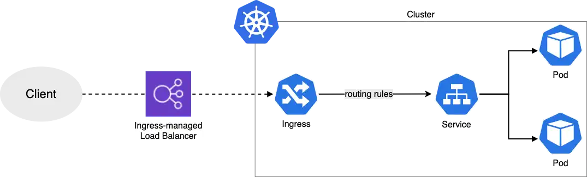

In this troubleshooting scenario, you'll investigate why the AWS Load Balancer Controller isn't creating an Application Load Balancer (ALB) for your ingress resource. By the end of this exercise, you'll be able to access the UI application through an ALB ingress as shown in the image below.



## Let's start troubleshooting

### Step 1: Verify Application Status

First, let's verify the status of our UI application:

```bash
$ kubectl get pod -n ui
NAME                  READY   STATUS    RESTARTS   AGE
ui-68495c748c-jkh2z   1/1     Running   0          85s
```

### Step 2: Check Ingress Status

Let's examine the ingress resource. Notice that the ADDRESS field is empty - this indicates the ALB hasn't been created:

```bash
$ kubectl get ingress/ui -n ui
NAME   CLASS   HOSTS   ADDRESS   PORTS   AGE
ui     alb     *                 80      105s
```

In a successful deployment, you would see an ALB DNS name in the ADDRESS field like this:

```text
NAME   CLASS   HOSTS   ADDRESS                                                    PORTS   AGE
ui     alb     *      k8s-ui-ingress-xxxxxxxxxx-yyyyyyyyyy.region.elb.amazonaws.com   80   2m32s
```

### Step 3: Investigate Ingress Events

Let's look at the events associated with the ingress to understand why the ALB creation failed:

```bash
$ kubectl describe ingress/ui -n ui
Name:             ui
Labels:           <none>
Namespace:        ui
Address:
Ingress Class:    alb
Default backend:  <default>
Rules:
  Host        Path  Backends
  ----        ----  --------
  *
              /   service-ui:80 (<error: endpoints "service-ui" not found>)
Annotations:  alb.ingress.kubernetes.io/healthcheck-path: /actuator/health/liveness
              alb.ingress.kubernetes.io/scheme: internet-facing
              alb.ingress.kubernetes.io/target-type: ip
Events:
  Type     Reason            Age                    From     Message
  ----     ------            ----                   ----     -------
  Warning  FailedBuildModel  2m23s (x16 over 5m9s)  ingress  Failed build model due to couldn't auto-discover subnets: unable to resolve at least one subnet (0 match VPC and tags: [kubernetes.io/role/elb])

```

The error indicates the AWS Load Balancer Controller cannot find any subnets tagged for use with load balancers. Here is the documentation to set up [ALB with EKS](https://kubernetes-sigs.github.io/aws-load-balancer-controller/v2.4/deploy/subnet_discovery/) correctly.

### Step 4: Fix Subnet Tags

The Load Balancer Controller requires public subnets to be tagged with `kubernetes.io/role/elb=1`. Let's identify and tag the correct subnets:

#### 4.1 Find the cluster's subnets

```bash
$ aws ec2 describe-subnets --filters "Name=tag:alpha.eksctl.io/cluster-name,Values=${EKS_CLUSTER_NAME}" --query 'Subnets[].SubnetId[]'
[
      "subnet-xxxxxxxxxxxxxxxxx",
      "subnet-xxxxxxxxxxxxxxxxx",
      "subnet-xxxxxxxxxxxxxxxxx",
      "subnet-xxxxxxxxxxxxxxxxx",
      "subnet-xxxxxxxxxxxxxxxxx",
      "subnet-xxxxxxxxxxxxxxxxx"
]
```

#### 4.2. Identify which subnets are public by checking their route tables

:::info
You can identify which subnets are public by adding the subnet ID into the route tables CLI filter one at a time with: `--filters 'Name=association.subnet-id,Values=subnet-xxxxxxxxxxxxxxxxx'`.

```text
aws ec2 describe-route-tables --filters 'Name=association.subnet-id,Values=<ENTER_SUBNET_ID_HERE>' --query 'RouteTables[].Routes[].[DestinationCidrBlock,GatewayId]'

```

:::

```bash
$ for subnet_id in $(aws ec2 describe-subnets --filters "Name=tag:alpha.eksctl.io/cluster-name,Values=${EKS_CLUSTER_NAME}" --query 'Subnets[].SubnetId[]' --output text); do \
    echo "Subnet: ${subnet_id}"; \
    aws ec2 describe-route-tables --filters "Name=association.subnet-id,Values=${subnet_id}" \
      --query 'RouteTables[].Routes[].[DestinationCidrBlock,GatewayId]' --output text; \
done

Subnet: subnet-xxxxxxxxxxxxxxxxx
10.42.0.0/16    local
0.0.0.0/0       igw-xxxxxxxxxxxxxxxxx
Subnet: subnet-xxxxxxxxxxxxxxxxx
10.42.0.0/16    local
0.0.0.0/0       igw-xxxxxxxxxxxxxxxxx
...
```

A public subnet will have a route `0.0.0.0/0` pointing to an Internet Gateway (igw-xxx).

#### 4.3. Verify current ELB tag status

```bash
$ aws ec2 describe-subnets --filters 'Name=tag:kubernetes.io/role/elb,Values=1' --query 'Subnets[].SubnetId'
[]
```

#### 4.4. Tag the public subnets (we've stored them in environment variables for convenience)

```bash
$ aws ec2 create-tags --resources $PUBLIC_SUBNET_1 $PUBLIC_SUBNET_2 $PUBLIC_SUBNET_3 \
      --tags 'Key="kubernetes.io/role/elb",Value=1'
```

#### 4.5. Verify the tags were applied

```bash
$ aws ec2 describe-subnets --filters 'Name=tag:kubernetes.io/role/elb,Values=1' --query 'Subnets[].SubnetId'
```

#### 4.6. Restart the Load Balancer Controller to pick up the new subnet configuration

```bash
$ kubectl -n kube-system rollout restart deploy aws-load-balancer-controller
deployment.apps/aws-load-balancer-controller restarted
```

#### 4.7. Check the ingress status again

```bash
$ kubectl describe ingress/ui -n ui
Warning  FailedDeployModel  50s  ingress  Failed deploy model due to AccessDenied: User: arn:aws:sts::021629549003:assumed-role/alb-controller-20250216203332410200000002/1739739040072980120 is not authorized to perform: elasticloadbalancing:CreateLoadBalancer on resource: arn:aws:elasticloadbalancing:us-west-2:021629549003:loadbalancer/app/k8s-ui-ui-5ddc3ba496/* because no identity-based policy allows the elasticloadbalancing:CreateLoadBalancer action
         status code: 403, request id: 33be0191-469b-4eff-840d-b5c9420f76c6
Warning  FailedDeployModel  9s (x5 over 49s)  ingress  (combined from similar events): Failed deploy model due to AccessDenied: User: arn:aws:sts::021629549003:assumed-role/alb-controller-20250216203332410200000002/1739739040072980120 is not authorized to perform: elasticloadbalancing:CreateLoadBalancer on resource: arn:aws:elasticloadbalancing:us-west-2:021629549003:loadbalancer/app/k8s-ui-ui-5ddc3ba496/* because no identity-based policy allows the elasticloadbalancing:CreateLoadBalancer action
         status code: 403, request id: a8d8f2c9-4911-4f3d-b4f3-81e2b0644e04
```

The error has changed - now we're seeing an IAM permissions issue that needs to be addressed:

```text
Warning  FailedDeployModel  68s  ingress  Failed deploy model due to AccessDenied: User: arn:aws:sts::xxxxxxxxxxxx:assumed-role/alb-controller-20240611131524228000000002/1718115201989397805 is not authorized to perform: elasticloadbalancing:CreateLoadBalancer
```

This indicates we need to fix the IAM permissions for the Load Balancer Controller, which will be addressed in the next section.

:::tip
You can verify ALB creation attempts in CloudTrail by looking for CreateLoadBalancer API calls within the last hour.
:::
