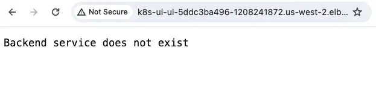
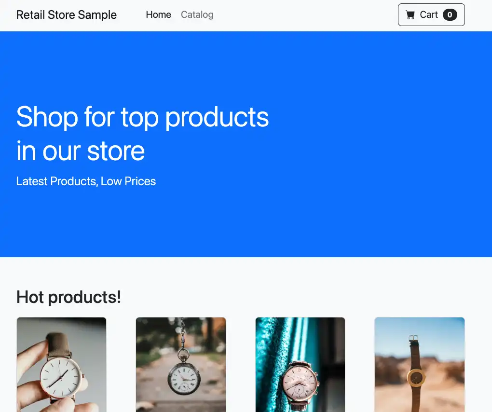

In this section, we'll troubleshoot why the Application Load Balancer (ALB) is not properly registering the Kubernetes service endpoints. Even though the ALB was successfully created, the application is not accessible due to backend service configuration issues.

### Step 1: Verify the Error

When accessing the application through the ALB, you'll see an error stating "Backend service does not exist":



Since the ingress was created successfully, this suggests an issue with the communication between the Kubernetes ingress and the service.

### Step 2: Examine Service Configuration

Let's inspect the service configuration:

```bash
$ kubectl -n ui get service/ui -o yaml
```

```yaml {24}
apiVersion: v1
kind: Service
metadata:
  annotations: ...
  labels:
    app.kubernetes.io/component: service
    app.kubernetes.io/created-by: eks-workshop
    app.kubernetes.io/instance: ui
    app.kubernetes.io/managed-by: Helm
    app.kubernetes.io/name: ui
    helm.sh/chart: ui-0.0.1
  name: ui
  namespace: ui
spec:
  ports:
    - name: http
      port: 80
      protocol: TCP
      targetPort: http
  selector:
    app.kubernetes.io/component: service
    app.kubernetes.io/instance: ui
    app.kubernetes.io/name: ui-app
  sessionAffinity: None
  type: ClusterIP
status:
  loadBalancer: {}
```

### Step 3: Check Ingress Configuration

Now examine the ingress configuration:

```bash
$ kubectl get ingress/ui -n ui -o yaml
```

```yaml {23}
apiVersion: networking.k8s.io/v1
kind: Ingress
metadata:
  annotations:
    alb.ingress.kubernetes.io/healthcheck-path: /actuator/health/liveness
    alb.ingress.kubernetes.io/scheme: internet-facing
    alb.ingress.kubernetes.io/target-type: ip
    ...
  finalizers:
  - ingress.k8s.aws/resources
  generation: 1
  name: ui
  namespace: ui
  resourceVersion: "4950883"
  uid: 327b899c-405e-431b-8d67-32578435f0b9
spec:
  ingressClassName: alb
  rules:
  - http:
      paths:
      - backend:
          service:
            name: service-ui
            port:
              number: 80
        path: /
        pathType: Prefix
...
```

Notice that the ingress is configured to use a service named `service-ui`, but our actual service is named `ui`.

### Step 4: Fix the Ingress Configuration

Let's update the ingress to point to the correct service name:

```bash
$ kubectl apply -k ~/environment/eks-workshop/modules/troubleshooting/alb/creating-alb/fix_ingress
```

The corrected configuration should look like this:

```yaml {10}
spec:
  ingressClassName: alb
  rules:
    - http:
        paths:
          - path: /
            pathType: Prefix
            backend:
              service:
                name: ui
                port:
                  number: 80
```

### Step 5: Verify Service Endpoints

After fixing the service name, we still see a 503 error:


This suggests an issue with the service's backend endpoints. Let's check the endpoints:

```bash
$ kubectl -n ui get endpoints ui
NAME   ENDPOINTS   AGE
ui     <none>     13d
```

The empty endpoints indicate that the service is not properly selecting any pod backends.

### Step 6: Compare Service and Pod Labels

Let's examine the deployment's pod labels:

```bash
$ kubectl -n ui get deploy/ui -o yaml
```

```yaml {34}
apiVersion: apps/v1
kind: Deployment
metadata:
  annotations:
    ...
  name: ui
  namespace: ui
  ..
spec:
  progressDeadlineSeconds: 600
  replicas: 1
  revisionHistoryLimit: 10
  selector:
    matchLabels:
      app.kubernetes.io/component: service
      app.kubernetes.io/instance: ui
      app.kubernetes.io/name: ui
  strategy:
    rollingUpdate:
      maxSurge: 25%
      maxUnavailable: 25%
    type: RollingUpdate
  template:
    metadata:
      annotations:
        prometheus.io/path: /actuator/prometheus
        prometheus.io/port: "8080"
        prometheus.io/scrape: "true"
      creationTimestamp: null
      labels:
        app.kubernetes.io/component: service
        app.kubernetes.io/created-by: eks-workshop
        app.kubernetes.io/instance: ui
        app.kubernetes.io/name: ui
    spec:
      containers:
...

```

Compare this with the service selector:

```bash
$ kubectl -n ui get svc ui -o yaml
```

```yaml {22}
apiVersion: v1
kind: Service
metadata:
  annotations:
    ...
  labels:
    app.kubernetes.io/component: service
    app.kubernetes.io/created-by: eks-workshop
    app.kubernetes.io/instance: ui
    app.kubernetes.io/managed-by: Helm
    app.kubernetes.io/name: ui
    helm.sh/chart: ui-0.0.1
  name: ui
  namespace: ui
  resourceVersion: "5000404"
  uid: dc832144-b2a1-41cd-b7a1-8979111da677
spec:
  ...
  selector:
    app.kubernetes.io/component: service
    app.kubernetes.io/instance: ui
    app.kubernetes.io/name: ui-app
  sessionAffinity: None
  type: ClusterIP
...
```

The service selector `app.kubernetes.io/name: ui-app` doesn't match the pod label `app.kubernetes.io/name: ui`.

:::tip
You can either update the service selector as follows:

```text
kubectl edit service <service-name> -n <namespace>
```

or

```text
kubectl patch service <service-name> -n <namespace> --type='json' -p='[{"op": "replace", "path": "/spec/selector", "value": {"key1": "value1", "key2": "value2"}}]'
```

:::

### Step 7: Fix the Service Selector

Let's update the service selector to match the pod labels:

```bash timeout=180 hook=fix-7 hookTimeout=840
$ kubectl apply -k ~/environment/eks-workshop/modules/troubleshooting/alb/creating-alb/fix_ui
```

After applying the fix, refresh your browser. You should now see the UI application:



:::tip
When troubleshooting service-to-pod connectivity:

1. Always verify the service selectors match pod labels exactly
2. Use `kubectl get endpoints` to verify pod selection
3. Check for typos in label names and values

:::

You've successfully fixed the service configuration issues and completed the ALB troubleshooting exercise! Take a well-deserved break.
