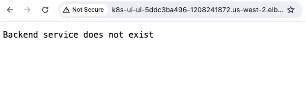

We are almost done, now let's troubleshoot a scenario where the ALB is not properly registering the Kubernetes service endpoints. Again, it offers detailed guidance and configuration samples to assist in identifying and fixing this type of issue.

### Step 7

Even though the ingress creation succeeded, when you try accessing the app in browser there is an error stating, "Backend service does not exist".



Since ingress is created, that would mean that there is an issue with communication from the Kubernetes ingress to the service. Check the deployment and service using:

```bash
$ kubectl -n ui get service/ui -o yaml
```

```yaml {27}
apiVersion: v1
kind: Service
metadata:
  annotations:
    ...
  labels:
    app.kubernetes.io/component: service
    app.kubernetes.io/created-by: eks-workshop
    app.kubernetes.io/instance: ui
    app.kubernetes.io/managed-by: Helm
    app.kubernetes.io/name: ui
    helm.sh/chart: ui-0.0.1
  name: ui
  namespace: ui
  resourceVersion: "4950875"
  uid: dc832144-b2a1-41cd-b7a1-8979111da677
spec:
  ...
  ports:
  - name: http
    port: 80
    protocol: TCP
    targetPort: http
  selector:
    app.kubernetes.io/component: service
    app.kubernetes.io/instance: ui
    app.kubernetes.io/name: ui-app
  sessionAffinity: None
  type: ClusterIP
status:
  loadBalancer: {}
```

And now check the ingress configuration:

```bash
$ kubectl  get ingress/ui -n ui -o yaml
```

```yaml {23}
apiVersion: networking.k8s.io/v1
kind: Ingress
metadata:
  annotations:
    alb.ingress.kubernetes.io/healthcheck-path: /actuator/health/liveness
    alb.ingress.kubernetes.io/scheme: internet-facing
    alb.ingress.kubernetes.io/target-type: ip
    ...
  finalizers:
  - ingress.k8s.aws/resources
  generation: 1
  name: ui
  namespace: ui
  resourceVersion: "4950883"
  uid: 327b899c-405e-431b-8d67-32578435f0b9
spec:
  ingressClassName: alb
  rules:
  - http:
      paths:
      - backend:
          service:
            name: service-ui
            port:
              number: 80
        path: /
        pathType: Prefix
...
```

From the outputs, observe the ingress spec and the service name `name: service-ui` that it is pointing to versus what the service name should be.

We will need to edit the ingress spec to point to correct service name using the command below, which contains the fix:

```bash
$ kubectl apply -k ~/environment/eks-workshop/modules/troubleshooting/alb/creating-alb/fix_ingress
```

To look like:

```yaml {10}
spec:
  ingressClassName: alb
  rules:
    - http:
        paths:
          - path: /
            pathType: Prefix
            backend:
              service:
                name: ui
                port:
                  number: 80
```

Try accessing the ALB again using the domain name shared in the get ingress output and check if you can access the app now?

### Step 8

Now we observe a 503 error when accessing the ALB:


503 would suggest a server-side issue, specifically with the service being unavailable. But we ensured that the service was running on the cluster when we ran get service command in _Step 7_.

In Kubernetes, a service is just a construct to expose deployments either externally or within the cluster. Services rely on selectors to be able to send traffic to the correct backend deployment. To verify that we have our service pointing to the correct deployment, check the endpoints that are dynamically configured by kube-proxy on service creation. Run the following command:

```bash
$ kubectl -n ui get endpoints ui
NAME   ENDPOINTS   AGE
ui     <none>      13d
```

The endpoints in command above should be pointing to IPs of the app pods running in _ui_ namespace. Can you identify if the selectors are setup correctly in service?

### Step 9

Taking a look at the deployment spec using command below, verify the selector value being used versus the one used in your service.

```bash
$ kubectl -n ui get deploy/ui -o yaml
```

```yaml {34}
apiVersion: apps/v1
kind: Deployment
metadata:
  annotations:
    ...
  name: ui
  namespace: ui
  ..
spec:
  progressDeadlineSeconds: 600
  replicas: 1
  revisionHistoryLimit: 10
  selector:
    matchLabels:
      app.kubernetes.io/component: service
      app.kubernetes.io/instance: ui
      app.kubernetes.io/name: ui
  strategy:
    rollingUpdate:
      maxSurge: 25%
      maxUnavailable: 25%
    type: RollingUpdate
  template:
    metadata:
      annotations:
        prometheus.io/path: /actuator/prometheus
        prometheus.io/port: "8080"
        prometheus.io/scrape: "true"
      creationTimestamp: null
      labels:
        app.kubernetes.io/component: service
        app.kubernetes.io/created-by: eks-workshop
        app.kubernetes.io/instance: ui
        app.kubernetes.io/name: ui
    spec:
      containers:
...

```

And

```bash
$ kubectl -n ui get svc ui -o yaml
```

```yaml {22}
apiVersion: v1
kind: Service
metadata:
  annotations:
    ...
  labels:
    app.kubernetes.io/component: service
    app.kubernetes.io/created-by: eks-workshop
    app.kubernetes.io/instance: ui
    app.kubernetes.io/managed-by: Helm
    app.kubernetes.io/name: ui
    helm.sh/chart: ui-0.0.1
  name: ui
  namespace: ui
  resourceVersion: "5000404"
  uid: dc832144-b2a1-41cd-b7a1-8979111da677
spec:
  ...
  selector:
    app.kubernetes.io/component: service
    app.kubernetes.io/instance: ui
    app.kubernetes.io/name: ui-app
  sessionAffinity: None
  type: ClusterIP
...
```

Notice what the `service/ui` selector is using and what the actual `deployment/ui` labels are. To fix the issue, we need to update the `service/ui` selector `app.kubernetes.io/name: ui-app` to `app.kubernetes.io/name: ui`.

:::tip
You can either update the service selector with:

- `kubectl edit service <service-name> -n <namespace>` or
- `kubectl patch service <service-name> -n <namespace> --type='json' -p='[{"op": "replace", "path": "/spec/selector", "value": {"key1": "value1", "key2": "value2"}}]'`

:::

for your convenience, we have added a kustomize script that update the selector, just execute the following command:

```bash timeout=180 hook=fix-7 hookTimeout=600
$ kubectl apply -k ~/environment/eks-workshop/modules/troubleshooting/alb/creating-alb/fix_ui
```

Now refresh the browsers and you should see the ui application:


### Go ahead and enjoy a break, you’ve earned it
