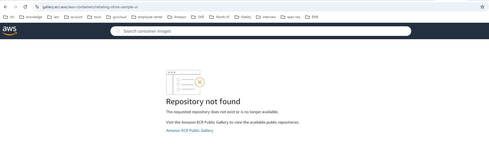
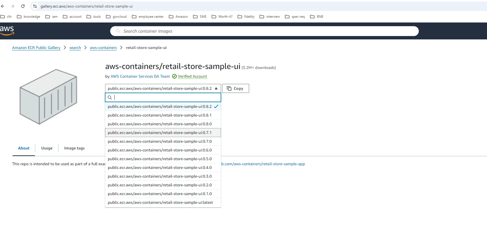

In this section we will learn how to troubleshoot the pod ImagePullBackOff error for a ECR public image.

:::tip Before you start
Prepare your environment for this section:

```bash timeout=600 wait=300
$ prepare-environment troubleshooting/pod/image
```

The preparation of the lab might take a couple of minutes and it will make the following changes to your lab environment:

- Create a new deployment named ui-new in default namespace
- Introduce an issue to the deployment spec, so we can learn how to troubleshoot these types of issues

:::

You can view the Terraform that applies these changes [here](https://github.com/VAR::MANIFESTS_OWNER/VAR::MANIFESTS_REPOSITORY/tree/VAR::MANIFESTS_REF/manifests/modules/troubleshooting/pod/image/.workshop/terraform).

Now let's verify if the deployment is created, so we can start troubleshooting the scenario.

```bash
$ kubectl get deployment ui-new -n default
NAME     READY   UP-TO-DATE   AVAILABLE   AGE
ui-new   0/1     1            0           75s
```

If you get the same output, it means you are ready to start the troubleshooting.

The task for you in this troubleshooting section is to find the cause for the deployment ui-new to be in 0/1 ready state and to fix it, so that the deployment will have one pod ready and running.

## Let's start the troubleshooting

### Step 1

First, we need to verify the status of our pods. To do so, we will use `kubectl` tool.

```bash
$ kubectl get pods
NAME                      READY   STATUS             RESTARTS   AGE
ui-new-5654dd8969-7w98k   0/1     ImagePullBackOff   0          13s
```

### Step 2

You can see that the pod status is showing as ImagePullBackOff. Lets describe the pod to see the events.

```bash expectError=true timeout=20
$ POD=`kubectl get pods -o jsonpath='{.items[*].metadata.name}'`
$ kubectl describe pod $POD | awk '/Events:/,/^$/'
Events:
  Type     Reason     Age                From               Message
  ----     ------     ----               ----               -------
  Normal   Scheduled  48s                default-scheduler  Successfully assigned default/ui-new-5654dd8969-7w98k to ip-10-42-33-232.us-west-2.compute.internal
  Normal   BackOff    23s (x2 over 47s)  kubelet            Back-off pulling image "public.ecr.aws/aws-containers/retailing-store-sample-ui:0.4.0"
  Warning  Failed     23s (x2 over 47s)  kubelet            Error: ImagePullBackOff
  Normal   Pulling    12s (x3 over 47s)  kubelet            Pulling image "public.ecr.aws/aws-containers/retailing-store-sample-ui:0.4.0"
  Warning  Failed     12s (x3 over 47s)  kubelet            Failed to pull image "public.ecr.aws/aws-containers/retailing-store-sample-ui:0.4.0": rpc error: code = NotFound desc = failed to pull and unpack image "public.ecr.aws/aws-containers/retailing-store-sample-ui:0.4.0": failed to resolve reference "public.ecr.aws/aws-containers/retailing-store-sample-ui:0.4.0": public.ecr.aws/aws-containers/retailing-store-sample-ui:0.4.0: not found
  Warning  Failed     12s (x3 over 47s)  kubelet            Error: ErrImagePull
```

### Step 3

From the events of the pod, we can see the Failed to pull image warning with error code NotFound. This gives us an idea that the referenced image in the pod/deployment spec was not able to be found at the path. Lets check the image used by the pod.

```bash
$ kubectl get pod $POD -o jsonpath='{.spec.containers[*].image}'
public.ecr.aws/aws-containers/retailing-store-sample-ui:0.4.0
```

### Step 4

From the image URI, we can see that the image is referenced from public ECR repository of aws. Lets check if image named retailing-store-sample-ui with tag 0.4.0 exists at https://gallery.ecr.aws/aws-containers . Search for the "retailing-store-sample-ui" and you will notice that no such image repository shows up. You can also easily verify the image existence in public ecr by using the image URI on browser. In our case https://gallery.ecr.aws/aws-containers/retailing-store-sample-ui and since the image does not exist we will see Repository not found message as shown below.



### Step 5

To resolve the issue, we will have to update the deployment/pod spec with correct image reference. In our case it is public.ecr.aws/aws-containers/retail-store-sample-ui:0.4.0. Before we update the deployment, lets verify if this image exists using above mentioned method i.e. to hit the URL https://gallery.ecr.aws/aws-containers/retail-store-sample-ui. You should be able to see the retail-store-sample-ui image with multiple tags available. Out of which we are going to use 0.4.0.



Update the image in the deployment with correct reference

```bash
$ kubectl patch deployment ui-new --patch '{"spec": {"template": {"spec": {"containers": [{"name": "ui", "image": "public.ecr.aws/aws-containers/retail-store-sample-ui:0.4.0"}]}}}}'
deployment.apps/ui-new patched
```

### Step 6

Check if the new pod is created and running successfully.

```bash timeout=180 hook=fix-1 hookTimeout=600
$ kubectl get pods
NAME                     READY   STATUS    RESTARTS   AGE
ui-new-77856467b-2z2s6   1/1     Running   0          13s
```

That concludes the public ECR ImagePullBackOff troubleshooting section.

## Wrapping it up

General troubleshooting workflow of the pod with ImagePullBackOff on public image includes:

- Check the pod events for a clue on cause of the issue such as not found, access denied or timeout.
- If not found, ensure that the image exists in the path referenced.
- For access denied, check the permissions on worker node role.
- For timeout on public images on ECR, ensure that the worker node is configured to reach the internet via IGW/TGW/NAT.

References:
- https://docs.aws.amazon.com/AmazonECR/latest/userguide/ECR_on_EKS.html
