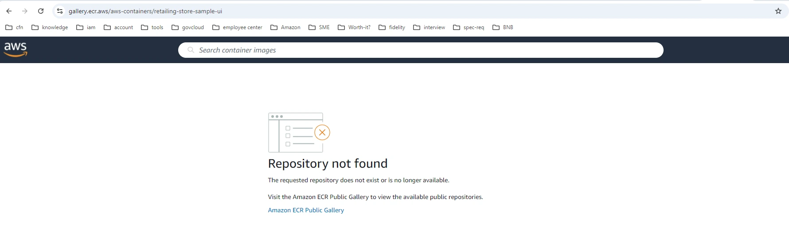
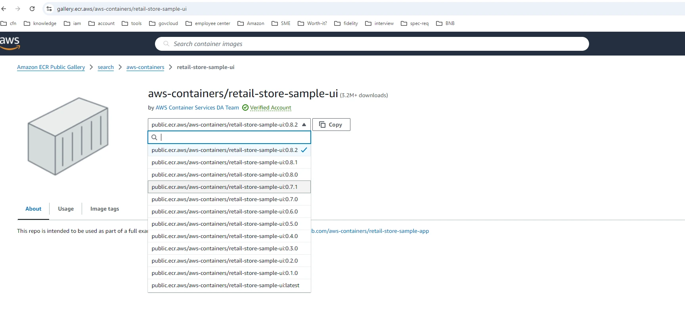

In this section we will learn how to troubleshoot the pod ImagePullBackOff error for a ECR public image. Now let's verify if the deployment is created, so we can start troubleshooting the scenario.

```bash
$ kubectl get deployment ui-new -n default
NAME     READY   UP-TO-DATE   AVAILABLE   AGE
ui-new   0/1     1            0           75s
```

:::info
If you get the same output, it means you are ready to start the troubleshooting.
:::

The task for you in this troubleshooting section is to find the cause for the deployment ui-new to be in 0/1 ready state and to fix it, so that the deployment will have one pod ready and running.

## Let's start the troubleshooting

### Step 1: Check pod status

First, we need to verify the status of our pods using `kubectl` tool.

```bash
$ kubectl get pods -l app=app-new
NAME                      READY   STATUS             RESTARTS   AGE
ui-new-5654dd8969-7w98k   0/1     ImagePullBackOff   0          13s
```

### Step 2: Describe the pod

You can see that the pod status is showing as ImagePullBackOff. Let's describe the pod to see the events.

```bash expectError=true timeout=20
$ POD=`kubectl get pods -l app=app-new -o jsonpath='{.items[*].metadata.name}'`
$ kubectl describe pod $POD | awk '/Events:/,/^$/'
Events:
  Type     Reason     Age                From               Message
  ----     ------     ----               ----               -------
  Normal   Scheduled  48s                default-scheduler  Successfully assigned default/ui-new-5654dd8969-7w98k to ip-10-42-33-232.us-west-2.compute.internal
  Normal   BackOff    23s (x2 over 47s)  kubelet            Back-off pulling image "public.ecr.aws/aws-containers/retailing-store-sample-ui:1.2.1"
  Warning  Failed     23s (x2 over 47s)  kubelet            Error: ImagePullBackOff
  Normal   Pulling    12s (x3 over 47s)  kubelet            Pulling image "public.ecr.aws/aws-containers/retailing-store-sample-ui:1.2.1"
  Warning  Failed     12s (x3 over 47s)  kubelet            Failed to pull image "public.ecr.aws/aws-containers/retailing-store-sample-ui:1.2.1": rpc error: code = NotFound desc = failed to pull and unpack image "public.ecr.aws/aws-containers/retailing-store-sample-ui:1.2.1": failed to resolve reference "public.ecr.aws/aws-containers/retailing-store-sample-ui:1.2.1": public.ecr.aws/aws-containers/retailing-store-sample-ui:1.2.1: not found
  Warning  Failed     12s (x3 over 47s)  kubelet            Error: ErrImagePull
```

From the events of the pod, we can see the "Failed to pull image" warning with error code NotFound. This indicates that the referenced image in the pod/deployment spec was not found at the path.

### Step 3: Check the image reference

Let's check the image used by the pod.

```bash
$ kubectl get pod $POD -o jsonpath='{.spec.containers[*].image}'
public.ecr.aws/aws-containers/retailing-store-sample-ui:1.2.1
```

From the image URI, we can see that the image is referenced from public ECR repository of AWS.

### Step 4: Verify image existence

Let's check if image named retailing-store-sample-ui with tag 1.2.1 exists at [aws-containers ECR](https://gallery.ecr.aws/aws-containers). Search for the "retailing-store-sample-ui" and you will notice that no such image repository shows up. You can also easily verify the image existence in public ECR by using the image URI in a browser. In our case [image-uri](https://gallery.ecr.aws/aws-containers/retailing-store-sample-ui) will show a "Repository not found" message.



### Step 5: Update the deployment with the correct image

To resolve the issue, we will have to update the deployment/pod spec with correct image reference. In our case it is public.ecr.aws/aws-containers/retail-store-sample-ui:1.2.1.

#### 5.1. Verify if image exists

Before we update the deployment, let's verify if this image exists using above mentioned method i.e. by visiting the [image-uri](https://gallery.ecr.aws/aws-containers/retail-store-sample-ui). You should be able to see the retail-store-sample-ui image with multiple tags available, including 1.2.1.



#### 5.1. Update image in the deployment with correct reference

```bash
$ kubectl patch deployment ui-new --patch '{"spec": {"template": {"spec": {"containers": [{"name": "ui", "image": "public.ecr.aws/aws-containers/retail-store-sample-ui:1.2.1"}]}}}}'
deployment.apps/ui-new patched
```

### Step 6: Verify the fix

Verify the new pod is created and running successfully.

```bash timeout=180 hook=fix-1 hookTimeout=600 wait=20
$ kubectl get pods -l app=app-new
NAME                     READY   STATUS    RESTARTS   AGE
ui-new-77856467b-2z2s6   1/1     Running   0          13s
```

## Wrapping it up

General troubleshooting workflow of the pod with ImagePullBackOff on public image includes:

- Check the pod events for a clue on cause of the issue such as "not found", "access denied" or "timeout".
- If "not found", ensure that the image exists in the path referenced.
- For "access denied", check the permissions on worker node role.
- For timeout on public images on ECR, ensure that the worker node networking is configured to reach the internet via IGW/TGW/NAT.
