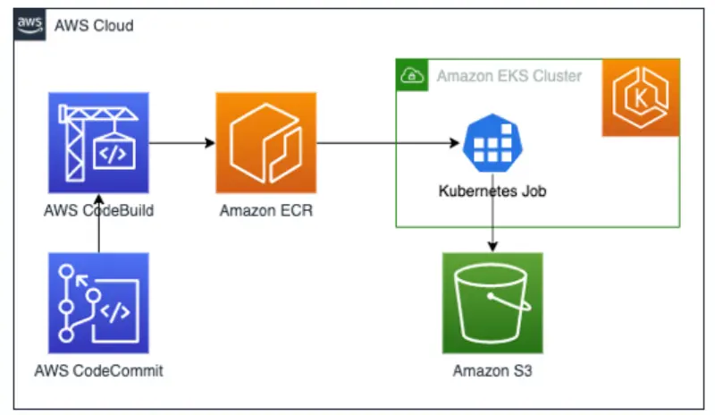
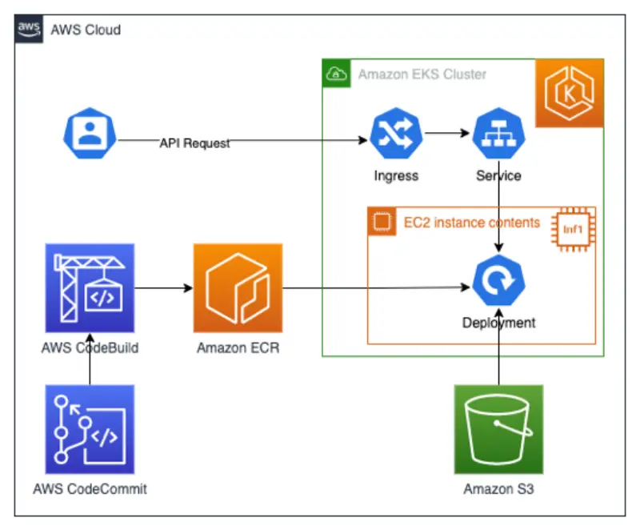

前のセクションでは、Amazon EKSを使用してAWS Inferentia用のモデルを構築し、Inferentiaノードを使用してEKS上にモデルをデプロイする方法を見てきました。これらの例では、コマンドラインからコンテナ内でPythonコードを実行しました。実際のシナリオでは、これらのコマンドを手動で実行するのではなく、コンテナに自動的にコマンドを実行させたいでしょう。

モデルを構築する場合、DLCコンテナをベースイメージとして使用し、そこにPythonコードを追加します。そして、このコンテナイメージをAmazon ECRなどのコンテナリポジトリに保存します。EKS上でこのコンテナイメージを実行するためにKubernetes Jobを使用し、生成されたモデルをS3に保存します。

モデルに対して推論を実行する場合は、他のアプリケーションやユーザーがモデルからの分類結果を取得できるようにコードを修正します。これはREST APIを作成して呼び出し、分類結果を返すことで実現できます。このアプリケーションはクラスター内でKubernetes Deploymentとして実行し、AWS Inferentiaリソース要件：`aws.amazon.com/neuron`を使用します。

