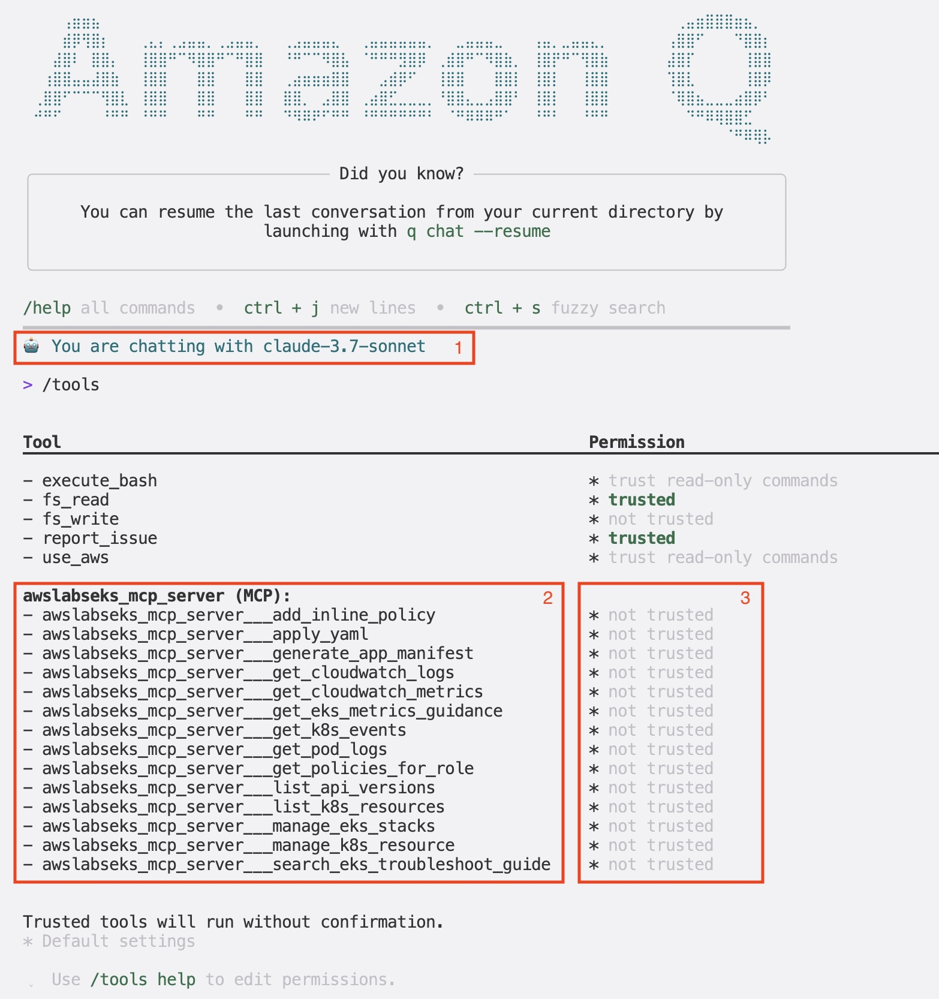

このセクションでは、自然言語コマンドを使ってEKSクラスターと連携するために、Amazon Q CLIと[Amazon EKS用MCPサーバー](https://awslabs.github.io/mcp/servers/eks-mcp-server/)を設定します。

:::info
Amazon Q CLIは、一般的な開発および運用タスク向けに生成AIの機能を活用しています。その機能は、専門知識のための特別に構築されたMCPサーバーを追加することで強化できます。このセクションでは、Amazon Q CLIとAmazon EKS MCPサーバーを使用します。[こちら](https://awslabs.github.io/mcp/)でAWSが提供するMCPサーバーのカタログを見つけることができます。これらはAmazon Q CLIと同様の方法で使用できます。
:::

まず、お使いのオペレーティングシステムとCPUアーキテクチャに適したAmazon Q CLIリリースをダウンロードします：

```bash
$ ARCH=$(arch)
$ curl --proto '=https' --tlsv1.2 \
  -sSf https://desktop-release.q.us-east-1.amazonaws.com/1.12.4/q-${ARCH}-linux.zip \
  -o /tmp/q.zip
```

Amazon Q CLIをインストールします：

```bash
$ unzip /tmp/q.zip -d /tmp
$ sudo Q_INSTALL_GLOBAL=true /tmp/q/install.sh --no-confirm
```

インストールを確認します：

```bash
$ q --version
q 1.12.4
```

次に、Amazon EKS MCPサーバーでAmazon Q CLIを設定します。使用する設定は次のとおりです：

```file
manifests/modules/aiml/q-cli/setup/eks-mcp.json
```

MCPサーバーを設定し、必要な`uvx`ツールをインストールします：

:::info
`uvxはuvパッケージマネージャーに付属するPythonパッケージランナーツールです。グローバルにインストールせずに、直接Pythonパッケージを実行します。Node.jsの`npx`に似ていますが、Pythonパッケージ用に、分離された環境でPythonツールをダウンロードして実行します。
:::

```bash
$ mkdir -p $HOME/.aws/amazonq
$ cp ~/environment/eks-workshop/modules/aiml/q-cli/setup/eks-mcp.json $HOME/.aws/amazonq/mcp.json
$ curl -LsSf https://astral.sh/uv/0.8.9/install.sh | sh
```

Amazon Q CLIを使用するには、AWS Builder IDかProライセンスサブスクリプションのいずれかで認証する必要があります。

:::tip
[こちらの手順](https://docs.aws.amazon.com/signin/latest/userguide/create-aws_builder_id.html)に従って、無料のAWS Builder IDを作成できます。このBuilder IDは、Amazon Q CLIの個人利用にも使用できます。
:::

```bash test=false
$ q login
? Select login method >
> Use for Free with Builder ID
  Use with Pro license
```

好みのオプションを選択し、プロンプトに従ってログインプロセスを完了してください。アカウントを使用してAmazon Q Developerの認可や、ログインするためのウェブページにリダイレクトされます。詳細なガイダンスについては、以下を参照してください：

- [AWS Builder IDでのサインイン](https://docs.aws.amazon.com/signin/latest/userguide/sign-in-aws_builder_id.html)
- [Amazon Q Developer Proサブスクリプションでのサインイン](https://docs.aws.amazon.com/amazonq/latest/qdeveloper-ug/q-admin-setup-subscribe-general.html)

MCPサーバーが利用可能かどうかをセッションを初期化して確認しましょう：

```bash test=false
$ q
0 of 1 mcp servers initialized. Servers still loading:
 - awslabseks_mcp_server
```

EKS MCPサーバーが提供するツールを確認するには、次のコマンドを実行します：

```text
/tools
```

以下のような出力が表示されるはずです：



この出力は次の内容を示しています：

1. Amazon Qによって選択されたデフォルトの大規模言語モデル（LLM）（`/model`コマンドで変更可能）
2. EKS MCPサーバーが提供するツールのリスト
3. 各ツールに対するAmazon Q CLIのデフォルト権限

:::info
ツールが`not trusted`とマークされている場合、Amazon Q CLIはそれを使用する前にあなたの許可を求めます。これは、特にリソースの作成、更新、削除ができるツールに対する安全対策です。LLMは間違いを起こす可能性があるため、潜在的に破壊的な行動が実行される前に確認する機会が与えられます。
:::

同じ手順で[AWS Labsの他のMCPサーバー](https://awslabs.github.io/mcp/)を追加し、追加機能を使用することもできます。このラボでは、設定したEKS MCPサーバーのみが必要です。

次のセクションでは、Amazon Q CLIを使用してEKSクラスターに関する情報を取得します。
