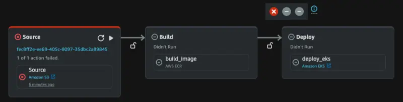

パイプラインを実行する前に、CodePipelineがクラスターにデプロイできるようにクラスターを構成しましょう。CodePipelineはクラスター上で操作（`kubectl`や`helm`）を実行するための権限が必要です。この操作を成功させるには、codepipelineパイプラインサービスロールをクラスターのアクセスエントリとして追加する必要があります：

```bash
$ aws eks create-access-entry --cluster-name ${EKS_CLUSTER_NAME} \
  --principal-arn "arn:aws:iam::${AWS_ACCOUNT_ID}:role/${EKS_CLUSTER_NAME}-codepipeline-role" \
  --type STANDARD
$ aws eks associate-access-policy --cluster-name ${EKS_CLUSTER_NAME} \
  --principal-arn "arn:aws:iam::${AWS_ACCOUNT_ID}:role/${EKS_CLUSTER_NAME}-codepipeline-role" \
  --policy-arn "arn:aws:eks::aws:cluster-access-policy/AmazonEKSClusterAdminPolicy" \
  --access-scope '{"type":"cluster"}'
```

私たちのために設定されたCodePipelineを調査し、それを作成するために使用されたCloudFormationを参照してみましょう。



以下のボタンを使用して、コンソールでパイプラインにアクセスできます：

<ConsoleButton
  url="https://console.aws.amazon.com/codesuite/codepipeline/pipelines/eks-workshop-retail-store-cd/view"
  service="codepipeline"
  label="CodePipelineコンソールを開く"
/>

### ソース

::yaml{file="manifests/modules/automation/continuousdelivery/codepipeline/.workshop/terraform/pipeline.yaml" zoomPath="Resources.CodePipeline.Properties.Stages.0"}

前述のとおり、このパイプラインはS3バケットからアプリケーションのソースコードを取得するように構成されています。ここでは、S3バケット名とソースファイルアーカイブが保存されているキーなどの情報を提供しています。

### ビルド

::yaml{file="manifests/modules/automation/continuousdelivery/codepipeline/.workshop/terraform/pipeline.yaml" zoomPath="Resources.CodePipeline.Properties.Stages.1"}

このステージでは、[ECRBuildAndPublishアクション](https://docs.aws.amazon.com/codepipeline/latest/userguide/action-reference-ECRBuildAndPublish.html)を使用してコンテナイメージを構築します。ソースリポジトリのルートに`Dockerfile`があることを前提としてデフォルトの場所を使用し、設定したECRリポジトリにプッシュします。S3バケット内のソースコードリポジトリアーカイブの[ETag](https://docs.aws.amazon.com/AmazonS3/latest/userguide/checking-object-integrity.html#ChecksumTypes)を使用してコンテナイメージにタグ付けされます。これはリポジトリファイルのハッシュであり、この場合はGitコミットIDに似た扱いをしています。

### デプロイ

::yaml{file="manifests/modules/automation/continuousdelivery/codepipeline/.workshop/terraform/pipeline.yaml" zoomPath="Resources.CodePipeline.Properties.Stages.2"}

最後に、パイプラインは[EKSDeployアクション](https://docs.aws.amazon.com/codepipeline/latest/userguide/action-reference-EKS.html)を使用してワークロードをEKSクラスターにデプロイします。ソースリポジトリの`chart`ディレクトリにあるHelmチャートを使用するように構成しています。

注目すべき重要な設定パラメータは`EnvironmentVariables`セクションで、構築されたコンテナイメージが使用されるように`IMAGE_TAG`値を提供します。「ビルド」ステージと同様に、S3内のリポジトリコードアーカイブのETag値を使用して、新しく構築されたイメージが使用されるようにしています。
