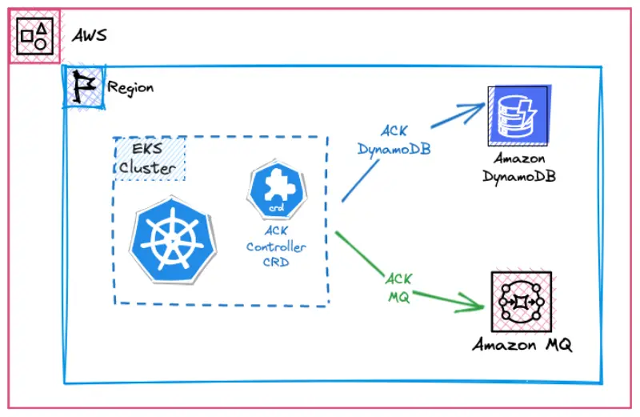

::required-time

:::tip 開始する前に
このセクションの環境を準備してください：

```bash timeout=300 wait=30
$ prepare-environment automation/controlplanes/ack
```

これにより、ラボ環境に以下の変更が適用されます：

- Amazon EKSクラスタにDynamoDB用のAWS Controllersをインストールします

これらの変更を適用するTerraformは[こちら](https://github.com/VAR::MANIFESTS_OWNER/VAR::MANIFESTS_REPOSITORY/tree/VAR::MANIFESTS_REF/manifests/modules/automation/controlplanes/ack/.workshop/terraform)で確認できます。

:::

[AWS Controllers for Kubernetes (ACK)](https://aws-controllers-k8s.github.io/community/)プロジェクトを使用すると、馴染みのあるYAMLコンストラクトを使用して、KubernetesからAWSサービスのリソースを直接定義し、使用することができます。

ACKを使用すると、データベース（[RDS](https://aws-controllers-k8s.github.io/community/docs/tutorials/rds-example/)や他のもの）やキュー（[SQS](https://aws-controllers-k8s.github.io/community/docs/tutorials/sqs-example/)など）などのAWSサービスをKubernetesアプリケーション用に活用できます。クラスター外部でリソースを手動で定義することなく、これによりアプリケーションの依存関係を管理する全体的な複雑さが軽減されます。

サンプルアプリケーションはデータベースやメッセージキューなどのステートフルなワークロードを含め、クラスター内で完全に実行できますが（開発に適しています）、テストや本番環境ではAmazon DynamoDBやAmazon MQなどのAWSマネージドサービスを使用することで、チームはデータベースやメッセージブローカーの管理ではなく、顧客やビジネスプロジェクトに集中できます。

このラボでは、ACKを使用してこれらのサービスをプロビジョニングし、アプリケーションをこれらのAWSマネージドサービスに接続するためのバインディング情報を含むシークレットとコンフィグマップを作成します。

学習目的のために、ACKコントローラーのインストールにはhelmを使用しています。もう一つの選択肢は、クラスターへのAWSサービスコントローラーの迅速なデプロイを可能にするTerraformを使用することです。詳細については、[ACK Terraformモジュールのドキュメント](https://registry.terraform.io/modules/aws-ia/eks-ack-addons/aws/latest#module_dynamodb)をご覧ください。


